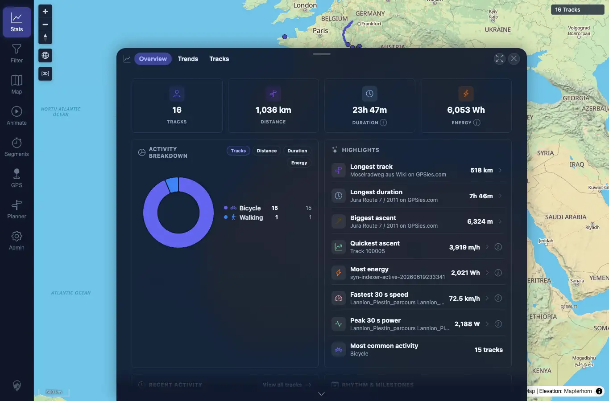

# Packet: APP_04

## Scope

- Coverage source: `documentation/testing/frontend-regression-test-plan.md`
- Coverage ID or run packet: APP_04
- In scope: Verify selected UI theme persists across reload and login.
- Out of scope: Auth behavior beyond the theme persistence path.

## Prerequisites

- Required previous coverage IDs or run packets: APP_01.
- Required app/data state: Dark theme selected through Settings.
- Required browser context: Desktop Chrome context.

## Allowed Mutations

- Allowed: Reload, log out, and log back in with README credentials.
- Not allowed: Clear local app preferences.

## Actions And Results

| Coverage ID | Action | Expected result | Actual result | Status | Evidence |
|---|---|---|---|---|---|
| APP_04 | Reloaded while dark theme was stored, then logged out, confirmed login screen visibility, and logged back in. | Selected dark theme persists across reload and login. | First reload and settled state kept `data-theme=dark`; login screen was visible and dark; after login, map remained dark with stored theme `dark` and 16-track map state visible. | PASS | [assets/APP_04-dark-after-reload.webp](../assets/APP_04-dark-after-reload.webp); [assets/APP_04-dark-after-login.webp](../assets/APP_04-dark-after-login.webp); [assets/APP_01_APP_05-theme-results.txt](../assets/APP_01_APP_05-theme-results.txt) |

## Issues

| ID | Severity | Summary | Reproduction | Expected | Actual | Evidence | Release impact |
|---|---|---|---|---|---|---|---|

## Evidence Files

| File | Purpose |
|---|---|
| [assets/APP_04-dark-after-reload.webp](../assets/APP_04-dark-after-reload.webp) | Dark theme after reload. |
| [assets/APP_04-dark-after-login.webp](../assets/APP_04-dark-after-login.webp) | Dark theme after login. |
| [assets/APP_01_APP_05-theme-results.txt](../assets/APP_01_APP_05-theme-results.txt) | Reload/login theme state summary. |

## Screenshot Evidence

## Timings

| Step | Timing |
|---|---:|
| Reload and login persistence check | ~3 min |

## Handoff Notes

- Completed: APP_04 passed.
- Remaining unfinished coverage: APP_05 onward.
- Blocked or not applicable: None.
- State left for the next packet: Dark theme selected.
