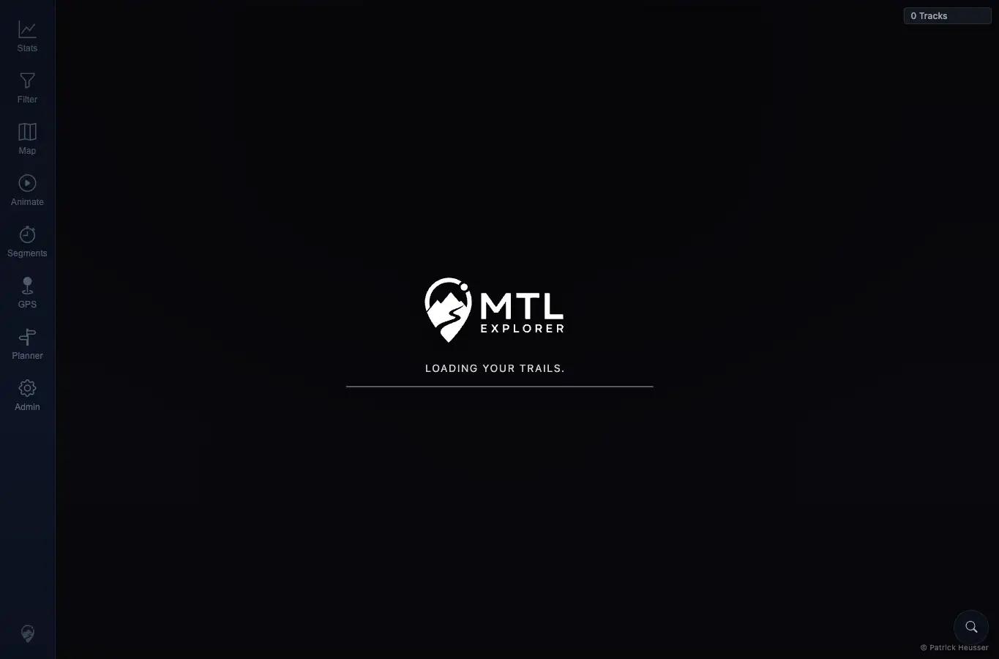
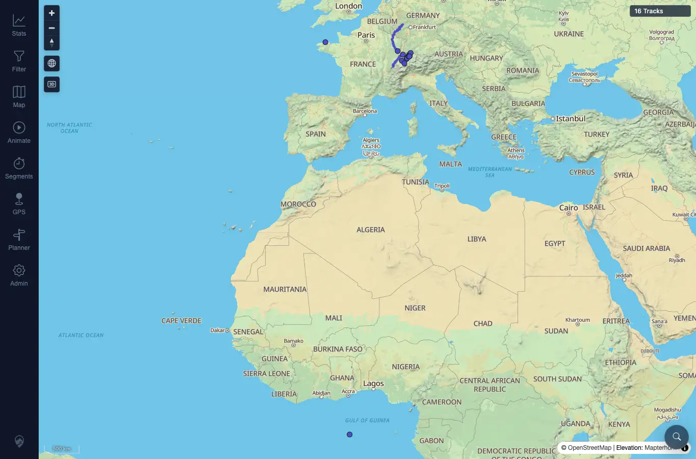

# Packet: APP_05

## Scope

- Coverage source: `documentation/testing/frontend-regression-test-plan.md`
- Coverage ID or run packet: APP_05
- In scope: Verify hard refresh in dark mode does not show an observable light-theme flash.
- Out of scope: Pixel-perfect video capture of frames before browser automation can observe the DOM.

## Prerequisites

- Required previous coverage IDs or run packets: APP_04.
- Required app/data state: Dark theme stored locally.
- Required browser context: Desktop Chrome context.

## Allowed Mutations

- Allowed: Hard/page reload.
- Not allowed: Clear local theme preference.

## Actions And Results

| Coverage ID | Action | Expected result | Actual result | Status | Evidence |
|---|---|---|---|---|---|
| APP_05 | Reloaded with dark theme stored, captured the first observable post-reload frame, then captured the settled map. | Hard refresh in dark mode does not flash the light theme first. | First observable frame had `data-theme=dark` and body background `rgb(10, 10, 15)` with dark loading UI. Settled state remained dark. No light-themed frame was observed. | PASS | [assets/APP_05-first-observed-dark-refresh.webp](../assets/APP_05-first-observed-dark-refresh.webp); [assets/APP_05-settled-dark-refresh.webp](../assets/APP_05-settled-dark-refresh.webp); [assets/APP_01_APP_05-theme-results.txt](../assets/APP_01_APP_05-theme-results.txt) |

## Issues

| ID | Severity | Summary | Reproduction | Expected | Actual | Evidence | Release impact |
|---|---|---|---|---|---|---|---|

## Evidence Files

| File | Purpose |
|---|---|
| [assets/APP_05-first-observed-dark-refresh.webp](../assets/APP_05-first-observed-dark-refresh.webp) | First observable dark loading frame. |
| [assets/APP_05-settled-dark-refresh.webp](../assets/APP_05-settled-dark-refresh.webp) | Settled dark map after reload. |
| [assets/APP_01_APP_05-theme-results.txt](../assets/APP_01_APP_05-theme-results.txt) | Hard refresh theme state summary. |

## Screenshot Evidence

## Timings

| Step | Timing |
|---|---:|
| Hard refresh observation | ~1 min |

## Handoff Notes

- Completed: APP_05 passed.
- Remaining unfinished coverage: APP_06 onward.
- Blocked or not applicable: None.
- State left for the next packet: Dark theme selected.
