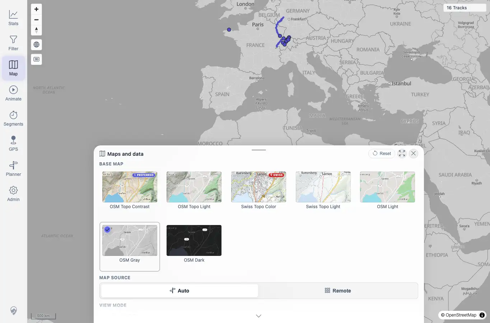
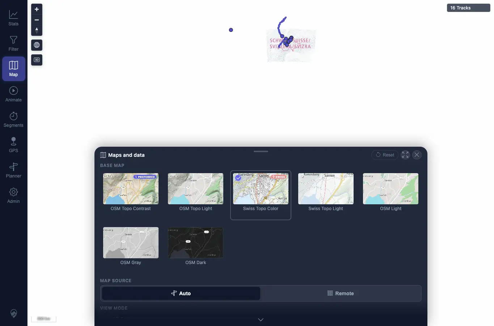

# Packet: APP_06

## Scope

- Coverage source: `documentation/testing/frontend-regression-test-plan.md`
- Coverage ID or run packet: APP_06
- In scope: Verify map theme selection is independent of the UI theme for all available map styles.
- Out of scope: Map style persistence and layer opacity.

## Prerequisites

- Required previous coverage IDs or run packets: APP_05.
- Required app/data state: Authenticated map with Maps and data panel available.
- Required browser context: Desktop Chrome context.

## Allowed Mutations

- Allowed: Change local UI theme and map style preferences.
- Not allowed: Change server map-provider configuration.

## Actions And Results

| Coverage ID | Action | Expected result | Actual result | Status | Evidence |
|---|---|---|---|---|---|
| APP_06 | Reset map settings, selected each style under Light UI and again under Dark UI: OSM Topo Contrast, OSM Topo Light, Swiss Topo Color, Swiss Topo Light, OSM Light, OSM Gray, OSM Dark. | Every available map style can be selected with either UI theme. | All seven styles were present and became the active tile under both light and dark UI themes; map remained usable with the 16-track count. | PASS | [assets/APP_06-light-osm-gray.webp](../assets/APP_06-light-osm-gray.webp); [assets/APP_06-dark-swiss-color.webp](../assets/APP_06-dark-swiss-color.webp); [assets/APP_06_APP_08-map-settings-results.txt](../assets/APP_06_APP_08-map-settings-results.txt) |

## Issues

| ID | Severity | Summary | Reproduction | Expected | Actual | Evidence | Release impact |
|---|---|---|---|---|---|---|---|

## Evidence Files

| File | Purpose |
|---|---|
| [assets/APP_06-light-osm-gray.webp](../assets/APP_06-light-osm-gray.webp) | Light UI with OSM Gray selected. |
| [assets/APP_06-dark-swiss-color.webp](../assets/APP_06-dark-swiss-color.webp) | Dark UI with Swiss Topo Color selected. |
| [assets/APP_06_APP_08-map-settings-results.txt](../assets/APP_06_APP_08-map-settings-results.txt) | Full style-selection matrix. |

## Screenshot Evidence

## Timings

| Step | Timing |
|---|---:|
| Full style matrix under light/dark themes | ~3 min |

## Handoff Notes

- Completed: APP_06 passed.
- Remaining unfinished coverage: APP_07 onward.
- Blocked or not applicable: None.
- State left for the next packet: Map style selections changed local preferences only.
