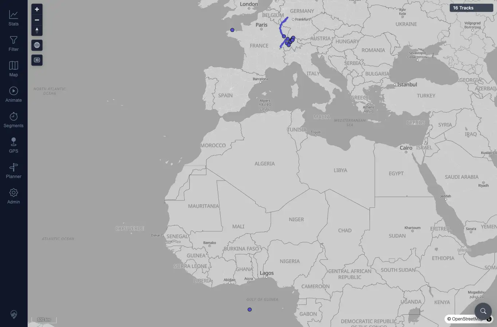
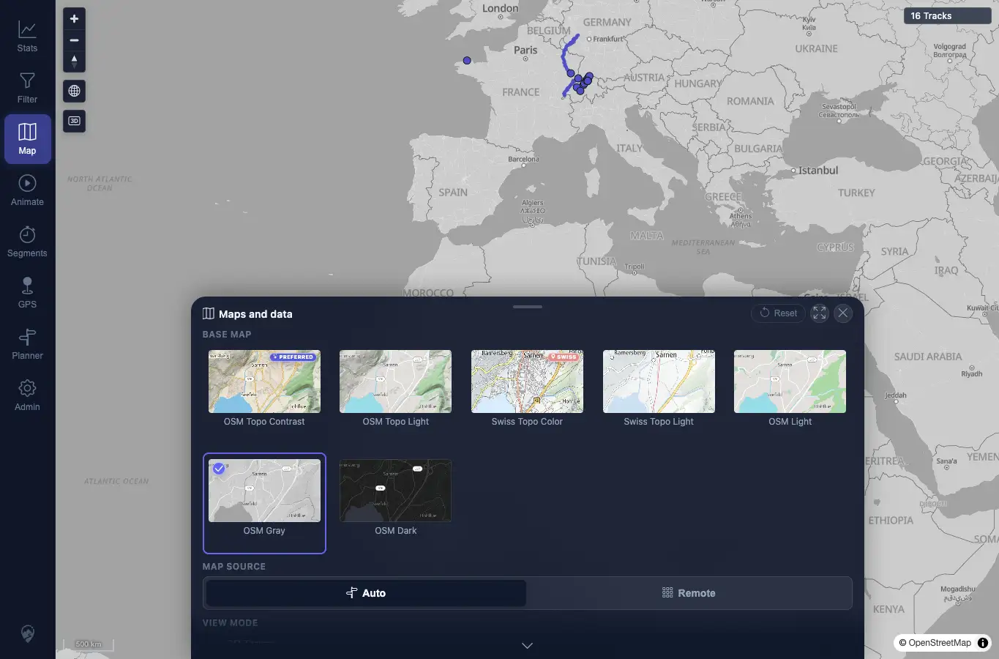

# Packet: APP_07

## Scope

- Coverage source: `documentation/testing/frontend-regression-test-plan.md`
- Coverage ID or run packet: APP_07
- In scope: Verify selected map style persists across reload.
- Out of scope: Full map-style matrix and opacity reset.

## Prerequisites

- Required previous coverage IDs or run packets: APP_06.
- Required app/data state: Maps and data panel available.
- Required browser context: Desktop Chrome context.

## Allowed Mutations

- Allowed: Select map style and reload.
- Not allowed: Reset map settings before the persistence check.

## Actions And Results

| Coverage ID | Action | Expected result | Actual result | Status | Evidence |
|---|---|---|---|---|---|
| APP_07 | Selected OSM Gray, reloaded the page, reopened Maps and data, and inspected the active style tile. | Selected map style persists across reload. | Before reload, stored map theme was `grayscale`; after reload, the map rendered and the Maps and data panel still showed OSM Gray as active. | PASS | [assets/APP_07-style-after-reload.webp](../assets/APP_07-style-after-reload.webp); [assets/APP_07-style-after-reload-tool.webp](../assets/APP_07-style-after-reload-tool.webp); [assets/APP_06_APP_08-map-settings-results.txt](../assets/APP_06_APP_08-map-settings-results.txt) |

## Issues

| ID | Severity | Summary | Reproduction | Expected | Actual | Evidence | Release impact |
|---|---|---|---|---|---|---|---|

## Evidence Files

| File | Purpose |
|---|---|
| [assets/APP_07-style-after-reload.webp](../assets/APP_07-style-after-reload.webp) | Map after reload with gray style persisted. |
| [assets/APP_07-style-after-reload-tool.webp](../assets/APP_07-style-after-reload-tool.webp) | Maps and data after reload with OSM Gray active. |
| [assets/APP_06_APP_08-map-settings-results.txt](../assets/APP_06_APP_08-map-settings-results.txt) | Before/after stored style state. |

## Screenshot Evidence

## Timings

| Step | Timing |
|---|---:|
| Style persistence reload | ~2 min |

## Handoff Notes

- Completed: APP_07 passed.
- Remaining unfinished coverage: APP_08.
- Blocked or not applicable: None.
- State left for the next packet: OSM Gray selected before APP_08 changed/reset local settings.
