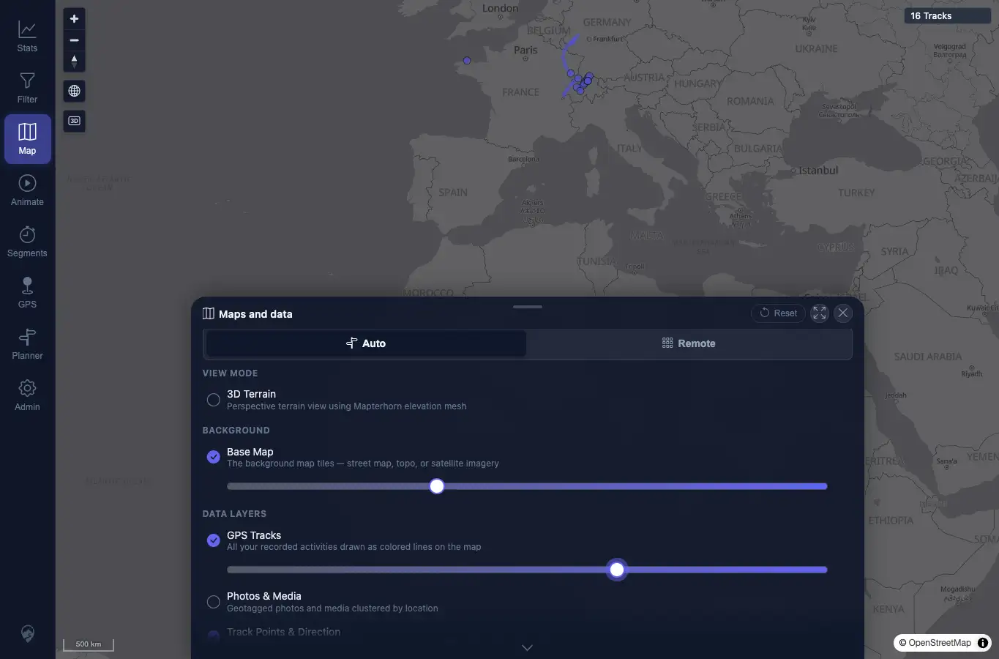
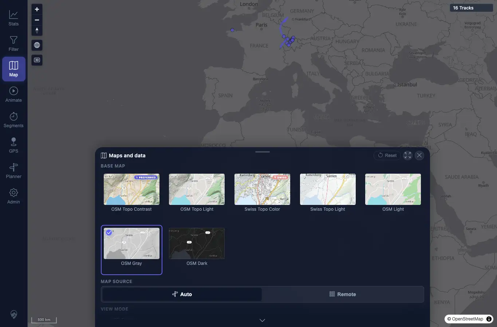
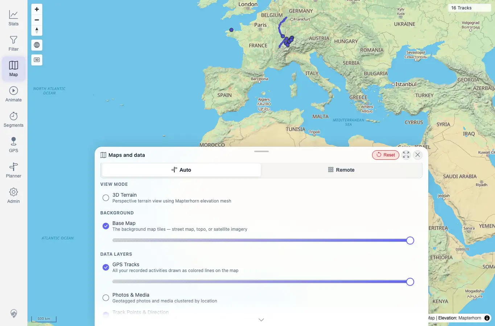
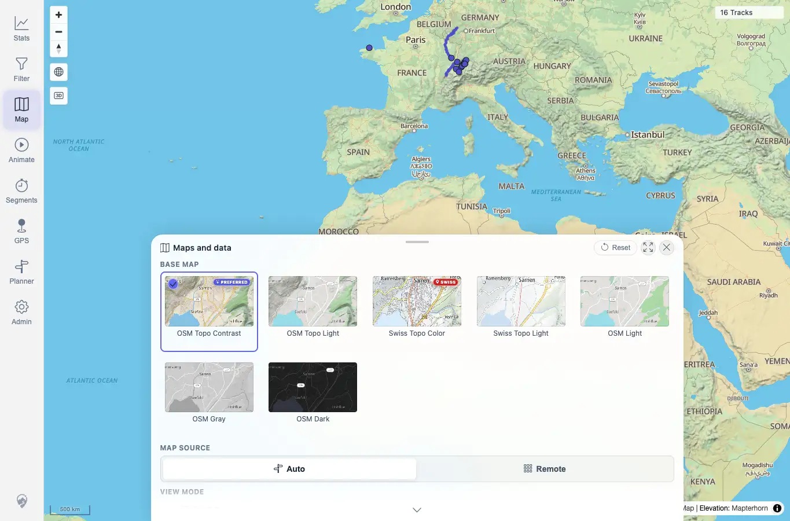

# Packet: APP_08

## Scope

- Coverage source: `documentation/testing/frontend-regression-test-plan.md`
- Coverage ID or run packet: APP_08
- In scope: Verify layer opacity sliders, basemap dimming, persistence, and reset-to-defaults.
- Out of scope: Overlay-specific opacity coverage already handled in HMO packets.

## Prerequisites

- Required previous coverage IDs or run packets: APP_07.
- Required app/data state: Maps and data panel available.
- Required browser context: Desktop Chrome context.

## Allowed Mutations

- Allowed: Change local layer opacity preferences, reload, and reset map settings.
- Not allowed: Change server data or provider configuration.

## Actions And Results

| Coverage ID | Action | Expected result | Actual result | Status | Evidence |
|---|---|---|---|---|---|
| APP_08 | Set Base Map opacity to 35 and GPS Tracks opacity to 65, reloaded, then clicked the Maps and data Reset button and reloaded again. | Opacity sliders and basemap dimming behave and persist; reset restores defaults and persists. | Slider handles moved to 35/65 and persisted after reload with stored layer opacities. Reset restored Base Map, GPS Tracks, and Track Points to 100, theme to OSM Topo Contrast, and those defaults persisted after another reload. | PASS | [assets/APP_08-opacity-changed.webp](../assets/APP_08-opacity-changed.webp); [assets/APP_08-opacity-after-reload.webp](../assets/APP_08-opacity-after-reload.webp); [assets/APP_08-after-reset.webp](../assets/APP_08-after-reset.webp); [assets/APP_08-reset-after-reload.webp](../assets/APP_08-reset-after-reload.webp); [assets/APP_06_APP_08-map-settings-results.txt](../assets/APP_06_APP_08-map-settings-results.txt); [assets/APP_08-reset-retry-results.txt](../assets/APP_08-reset-retry-results.txt) |

## Issues

| ID | Severity | Summary | Reproduction | Expected | Actual | Evidence | Release impact |
|---|---|---|---|---|---|---|---|

## Evidence Files

| File | Purpose |
|---|---|
| [assets/APP_08-opacity-changed.webp](../assets/APP_08-opacity-changed.webp) | Base Map and GPS Tracks opacity changed. |
| [assets/APP_08-opacity-after-reload.webp](../assets/APP_08-opacity-after-reload.webp) | Changed opacity persisted after reload. |
| [assets/APP_08-after-reset.webp](../assets/APP_08-after-reset.webp) | Reset restored defaults. |
| [assets/APP_08-reset-after-reload.webp](../assets/APP_08-reset-after-reload.webp) | Reset defaults persisted after reload. |
| [assets/APP_06_APP_08-map-settings-results.txt](../assets/APP_06_APP_08-map-settings-results.txt) | Opacity, persistence, and reset summary. |
| [assets/APP_08-reset-retry-results.txt](../assets/APP_08-reset-retry-results.txt) | Explicit reset proof after changing sliders in one context. |

## Screenshot Evidence

## Timings

| Step | Timing |
|---|---:|
| Opacity, reload, reset, and reset-persistence checks | ~4 min |

## Handoff Notes

- Completed: APP_08 passed.
- Remaining unfinished coverage: LOC_01 onward.
- Blocked or not applicable: None.
- State left for the next packet: Map settings reset to defaults; UI theme remained dark in the browser context used for APP, but future contexts may start from stored/default preferences.
