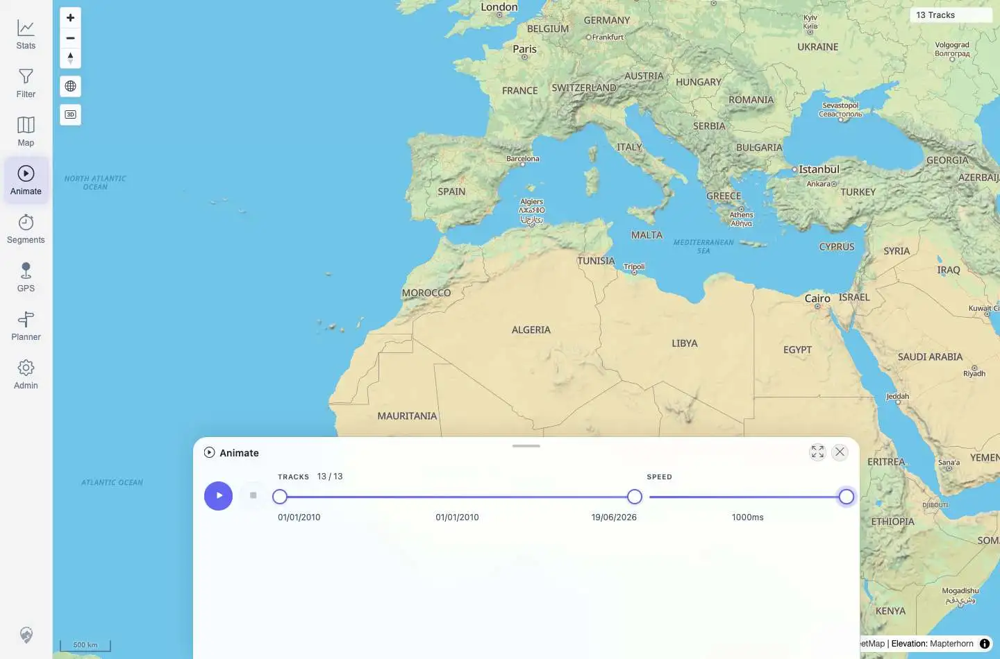
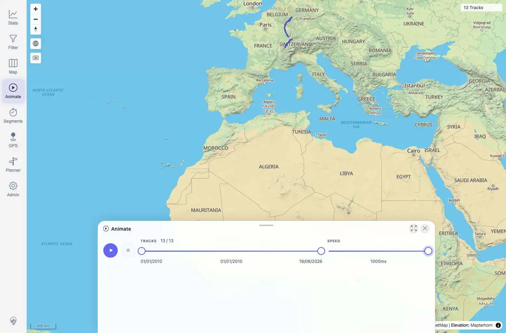

# Packet: AVR_01

## Scope

- Coverage source: `documentation/testing/frontend-regression-test-plan.md`
- Coverage ID or run packet: AVR_01
- In scope: Standalone Animate tool playback, pause, stop/reset, and speed control.
- Out of scope: Segment-based virtual race covered by AVR_02 and AVR_04.

## Prerequisites

- Required previous coverage IDs or run packets: MCT_06
- Required app/data state: Map has 13 visible tracks available for animation.
- Required browser context: Authenticated desktop Playwright context.

## Allowed Mutations

- Allowed: Open Animate, change temporary animation speed, start/pause/resume/stop playback.
- Not allowed: Modify imported tracks or persisted application data.

## Actions And Results

| Coverage ID | Action | Expected result | Actual result | Status | Evidence |
|---|---|---|---|---|---|
| AVR_01 | Opened Animate, set playback speed to `1000ms`, clicked Play, Pause, Play again, and Stop. | Tracks play back smoothly; pause, reset/stop, and speed controls work. | Animate opened with `13 / 13` tracks. Speed changed from default to `1000ms`. Play changed the button to `Pause animation`, enabled Stop, advanced visible count to `2 / 13`, and showed playhead `left: 8.33333%`. Pause returned the button to `Play animation`; resume advanced to `3 / 13` and playhead `left: 16.6667%`; Stop reset to full `13 / 13`, removed the playhead, and disabled Stop. | PASS | [assets/AVR_01-animation-controls.txt](../assets/AVR_01-animation-controls.txt); [assets/AVR_01-speed-slow.webp](../assets/AVR_01-speed-slow.webp); [assets/AVR_01-playing.webp](../assets/AVR_01-playing.webp); [assets/AVR_01-paused.webp](../assets/AVR_01-paused.webp); [assets/AVR_01-stopped-reset.webp](../assets/AVR_01-stopped-reset.webp) |

## Issues

| ID | Severity | Summary | Reproduction | Expected | Actual | Evidence | Release impact |
|---|---|---|---|---|---|---|---|

## Evidence Files

| File | Purpose |
|---|---|
| [assets/AVR_01-animation-controls.txt](../assets/AVR_01-animation-controls.txt) | Control-state log and assertions for speed/play/pause/resume/stop. |
| [assets/AVR_01-speed-slow.webp](../assets/AVR_01-speed-slow.webp) | Animate open with speed set to `1000ms`. |
| [assets/AVR_01-playing.webp](../assets/AVR_01-playing.webp) | Playback running with visible playhead. |
| [assets/AVR_01-paused.webp](../assets/AVR_01-paused.webp) | Playback paused. |
| [assets/AVR_01-stopped-reset.webp](../assets/AVR_01-stopped-reset.webp) | Playback stopped/reset to full range. |

## Screenshot Evidence

## Timings

| Step | Timing |
|---|---:|
| Open Animate and set speed | ~2.5 s |
| Play/pause/resume/stop sequence | ~4 s |

## Handoff Notes

- Completed: Animate playback controls and speed control verified.
- Remaining unfinished coverage: AVR_02 onward.
- Blocked or not applicable: None.
- State left for the next packet: Animate is open and stopped on `/mtl/animate`.
