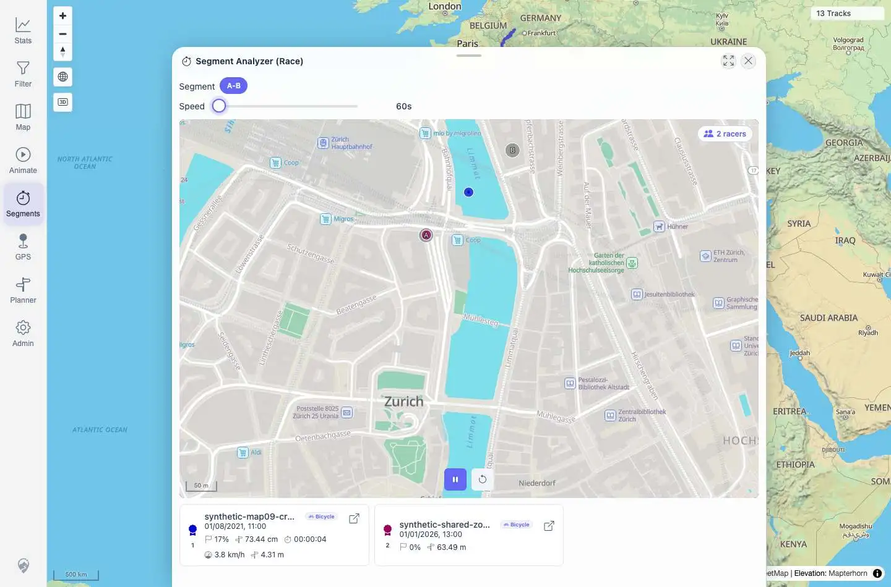

# Packet: AVR_02

## Scope

- Coverage source: `documentation/testing/frontend-regression-test-plan.md`
- Coverage ID or run packet: AVR_02
- In scope: Segment Analyzer virtual race with multiple racers, playback, ranking, racer-card progress updates, and mini-map rendering.
- Out of scope: Standalone Animate tool covered by AVR_01; post-stop usability covered by AVR_03; race geometry regression covered by AVR_04.

## Prerequisites

- Required previous coverage IDs or run packets: AVR_01, MCT_04
- Required app/data state: Synthetic A-B Segment Analyzer result can be recreated with tracks `100021` and `100023`.
- Required browser context: Authenticated desktop Playwright context.

## Allowed Mutations

- Allowed: Recreate temporary Segment Analyzer zones, open Race, adjust race playback speed, start/pause race.
- Not allowed: Modify imported track metadata or delete tracks.

## Actions And Results

| Coverage ID | Action | Expected result | Actual result | Status | Evidence |
|---|---|---|---|---|---|
| AVR_02 | Recreated the two-track A-B Segment Analyzer result, opened Race, slowed playback to `60s`, started the race, sampled running state twice, then paused. | Multiple racers move together; ranking and racer cards update in real time. | Race opened on segment `A-B` with `2 racers`, a `937x638` mini-map, and two racer cards. Starting switched the play icon to pause. Racer-card progress updated from `0%/0%` to `17%/0%`, then to `42%/1%`; ranking reordered `synthetic-map09-cross-zone-c.gpx` above `synthetic-shared-zone-a.gpx`. Pausing kept the race visible with the play icon restored. | PASS | [assets/AVR_02-virtual-race.txt](../assets/AVR_02-virtual-race.txt); [assets/AVR_02-results-before-race.jpg](../assets/AVR_02-results-before-race.jpg); [assets/AVR_02-race-ready.webp](../assets/AVR_02-race-ready.webp); [assets/AVR_02-race-running.webp](../assets/AVR_02-race-running.webp); [assets/AVR_02-race-paused.webp](../assets/AVR_02-race-paused.webp) |

## Issues

| ID | Severity | Summary | Reproduction | Expected | Actual | Evidence | Release impact |
|---|---|---|---|---|---|---|---|

## Evidence Files

| File | Purpose |
|---|---|
| [assets/AVR_02-virtual-race.txt](../assets/AVR_02-virtual-race.txt) | Race ready/running/paused state log and assertions. |
| [assets/AVR_02-results-before-race.jpg](../assets/AVR_02-results-before-race.jpg) | Segment Analyzer result before opening Race. |
| [assets/AVR_02-race-ready.webp](../assets/AVR_02-race-ready.webp) | Race ready with two racers. |
| [assets/AVR_02-race-running.webp](../assets/AVR_02-race-running.webp) | Race running with progress. |
| [assets/AVR_02-race-paused.webp](../assets/AVR_02-race-paused.webp) | Race paused with progress preserved. |

## Screenshot Evidence

## Timings

| Step | Timing |
|---|---:|
| Recreate Segment Analyzer result and open Race | ~8 s |
| Slow playback, start, sample, pause | ~3 s |

## Handoff Notes

- Completed: Virtual Race playback, ranking, racer-card progress, and mini-map rendering verified with two racers.
- Remaining unfinished coverage: AVR_03 onward.
- Blocked or not applicable: None.
- State left for the next packet: Race overlay is open and paused on `/mtl/segments`.
