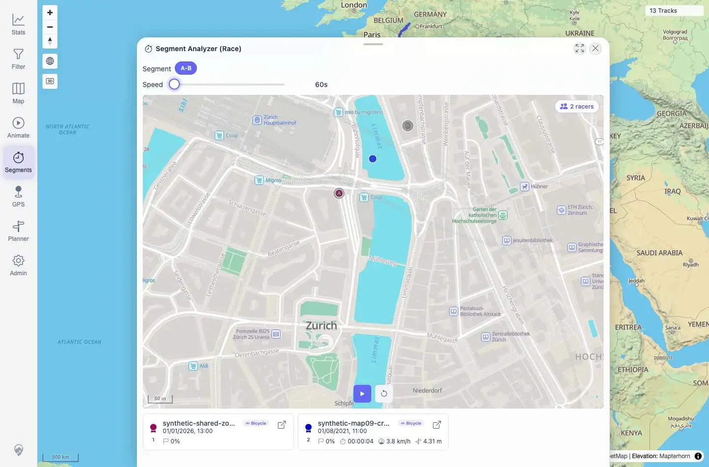
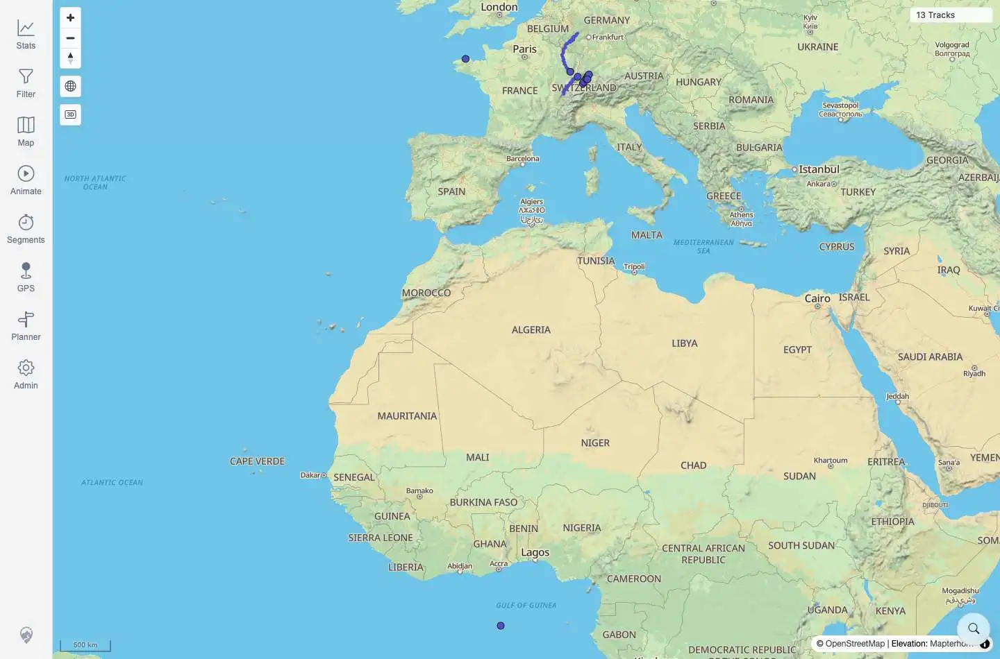
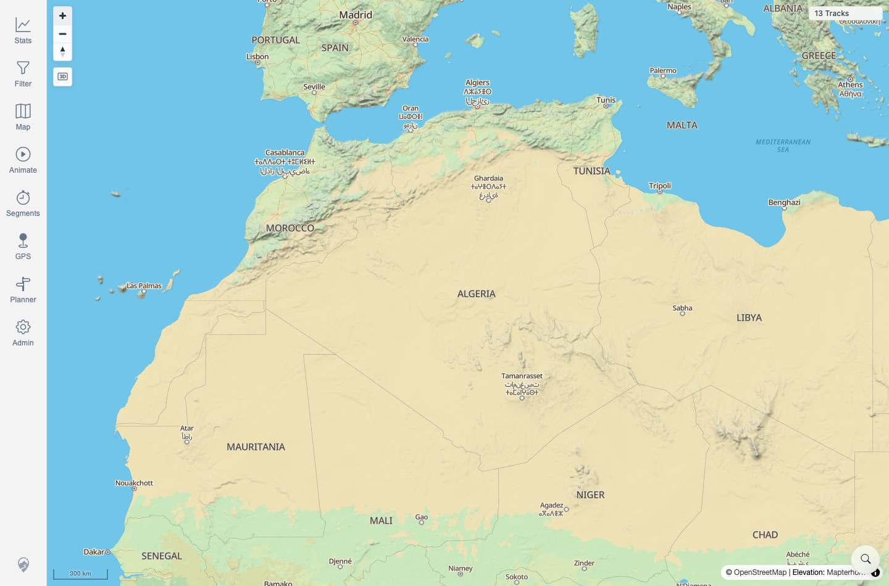
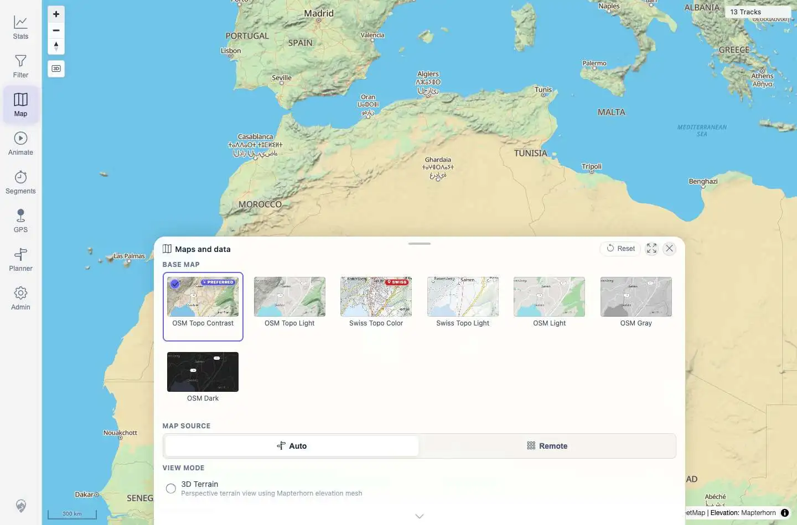

# Packet: AVR_03

## Scope

- Coverage source: `documentation/testing/frontend-regression-test-plan.md`
- Coverage ID or run packet: AVR_03
- In scope: Verify stopping/resetting/closing a virtual race leaves map controls and other tools usable.
- Out of scope: Race playback/ranking behavior covered by AVR_02 and geometry-specific race regression covered by AVR_04.

## Prerequisites

- Required previous coverage IDs or run packets: AVR_02
- Required app/data state: Virtual Race overlay is open and paused from AVR_02.
- Required browser context: Authenticated desktop Playwright context.

## Allowed Mutations

- Allowed: Reset/close race sheets, zoom the map, and open another tool panel.
- Not allowed: Modify imported track metadata or delete tracks.

## Actions And Results

| Coverage ID | Action | Expected result | Actual result | Status | Evidence |
|---|---|---|---|---|---|
| AVR_03 | Reset the paused virtual race, closed Race and Segment Analyzer result sheets, clicked map Zoom In, then opened the Map tool. | Stopping/finishing animation/race leaves map gestures and tools usable with no stuck state. | Reset returned both racer cards to `0%`. Closing the race sheets returned to `/mtl/` with no race open. Zoom In changed the map scale labels from `500 km` to `300 km`. Opening Map navigated to `/mtl/map-settings`, marked the Map nav active, and displayed Maps/Data controls. | PASS | [assets/AVR_03-post-race-usability.txt](../assets/AVR_03-post-race-usability.txt); [assets/AVR_03-race-reset.webp](../assets/AVR_03-race-reset.webp); [assets/AVR_03-sheets-closed.webp](../assets/AVR_03-sheets-closed.webp); [assets/AVR_03-map-zoomed.jpg](../assets/AVR_03-map-zoomed.jpg); [assets/AVR_03-map-tool-opened.webp](../assets/AVR_03-map-tool-opened.webp) |

## Issues

| ID | Severity | Summary | Reproduction | Expected | Actual | Evidence | Release impact |
|---|---|---|---|---|---|---|---|

## Evidence Files

| File | Purpose |
|---|---|
| [assets/AVR_03-post-race-usability.txt](../assets/AVR_03-post-race-usability.txt) | Reset, close, zoom, and Map-tool state assertions. |
| [assets/AVR_03-race-reset.webp](../assets/AVR_03-race-reset.webp) | Race reset state with racer progress back to zero. |
| [assets/AVR_03-sheets-closed.webp](../assets/AVR_03-sheets-closed.webp) | Race/result sheets closed. |
| [assets/AVR_03-map-zoomed.jpg](../assets/AVR_03-map-zoomed.jpg) | Map zoom control changed scale. |
| [assets/AVR_03-map-tool-opened.webp](../assets/AVR_03-map-tool-opened.webp) | Map tool opened after race cleanup. |

## Screenshot Evidence

## Timings

| Step | Timing |
|---|---:|
| Reset and close race sheets | ~2.5 s |
| Zoom map and open Map tool | ~2.2 s |

## Handoff Notes

- Completed: Race cleanup left map zoom and tool navigation usable.
- Remaining unfinished coverage: AVR_04 onward.
- Blocked or not applicable: None.
- State left for the next packet: Map tool is open on `/mtl/map-settings`.
