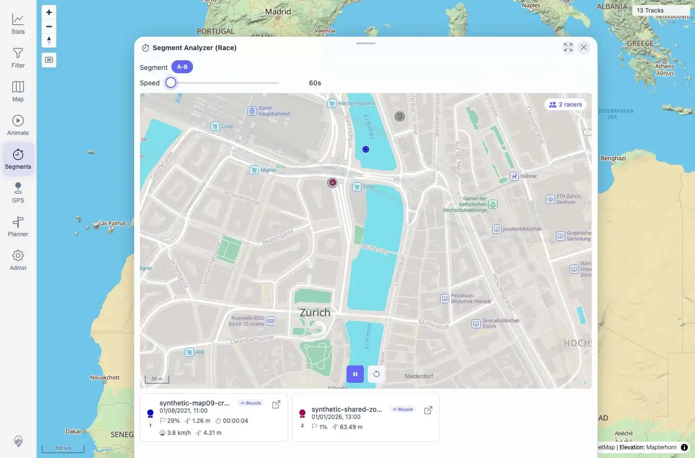

# Packet: AVR_04

## Scope

- Coverage source: `documentation/testing/frontend-regression-test-plan.md`
- Coverage ID or run packet: AVR_04
- In scope: Virtual race GPS geometry regression for a measured segment with multiple racers.
- Out of scope: General race playback/ranking covered by AVR_02 and post-race cleanup covered by AVR_03.

## Prerequisites

- Required previous coverage IDs or run packets: AVR_02, AVR_03, MCT_05, MCT_06
- Required app/data state: Synthetic A-B measured segment is available with two racers/tracks.
- Required browser context: Authenticated desktop Playwright context.

## Allowed Mutations

- Allowed: Recreate temporary Segment Analyzer Race, start/pause race playback, read live sub-track geometry.
- Not allowed: Modify imported track metadata or delete tracks.

## Actions And Results

| Coverage ID | Action | Expected result | Actual result | Status | Evidence |
|---|---|---|---|---|---|
| AVR_04 | Recreated the measured A-B Segment Analyzer Race, started playback, captured the running UI, and revalidated the sub-track geometry used by the race. | Racer markers and trails stay on the actual selected segment; no world-scale zoom, long straight line away from the route, `[0,0]`, or South-Africa/off-continent artifact. | Race ran with `2 racers`, local progress (`29%` and `1%`), and a `937x613` mini-map. Combined geometry bounds stayed in Zurich at `lng 8.541500001454787..8.543299998442606`, `lat 47.37680000096986..47.377999998961734`; both slices had at least two points, max step `0.0007211176159515061` degrees, no zero-like coordinates, and no off-continent/South-Africa-like coordinates. | PASS | [assets/AVR_04-race-geometry.txt](../assets/AVR_04-race-geometry.txt); [assets/AVR_04-race-geometry.webp](../assets/AVR_04-race-geometry.webp) |

## Issues

| ID | Severity | Summary | Reproduction | Expected | Actual | Evidence | Release impact |
|---|---|---|---|---|---|---|---|

## Evidence Files

| File | Purpose |
|---|---|
| [assets/AVR_04-race-geometry.txt](../assets/AVR_04-race-geometry.txt) | Race UI state, geometry bounds, per-track slice checks, and assertions. |
| [assets/AVR_04-race-geometry.webp](../assets/AVR_04-race-geometry.webp) | Running virtual race mini-map and racer cards. |

## Screenshot Evidence

## Timings

| Step | Timing |
|---|---:|
| Recreate measured race and start playback | ~10 s |
| Geometry validation and screenshot | ~1 s |

## Handoff Notes

- Completed: Virtual race geometry stayed local to the measured A-B segment with no global/off-continent artifacts.
- Remaining unfinished coverage: MED_01 onward.
- Blocked or not applicable: None.
- State left for the next packet: Race overlay is open and paused on `/mtl/segments`.
