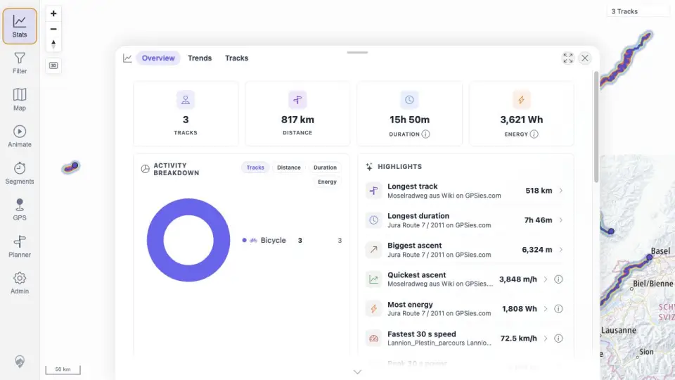

# Packet: DEL_03

## Scope

- Coverage source: `documentation/testing/frontend-regression-test-plan.md`
- Coverage ID or run packet: DEL_03
- In scope: Verify the two deleted tracks disappear from map, track browser, filter results, selection/related-track surfaces, heatmap, statistics totals, and details navigation surfaces.
- Out of scope: Direct stale deleted-track API URL behavior; DEL_05 explicitly excludes that as pass/fail criteria.

## Prerequisites

- Required previous coverage IDs or run packets: DEL_02.
- Required app/data state: two imported source files removed and delete processing settled.
- Required browser context: authenticated desktop browser context.

## Allowed Mutations

- Allowed: Reload browser state and navigate read-only user-facing surfaces.
- Not allowed: Delete additional files or alter remaining tracks.

## Actions And Results

| Coverage ID | Action | Expected result | Actual result | Status | Evidence |
|---|---|---|---|---|---|
| DEL_03 | Reloaded the browser after delete processing, captured map/stats/browser/filter/heatmap surfaces, searched for deleted and remaining filenames, and queried related-track API responses for remaining tracks. | Deleted tracks are absent from user-visible map, browser, filter, heatmap, related-track, detail, and statistics surfaces. | Map and heatmap show 3 Tracks; Stats shows 3 tracks / 817 km / 15h 50m; deleted filename/name searches return no track rows; remaining filename searches return rows; related responses for remaining IDs do not contain deleted IDs 100000/100001; filter panel opens over 3-track map. | PASS | [assets/DEL_03-deletion-surfaces.txt](../assets/DEL_03-deletion-surfaces.txt); [assets/DEL_03-browser-search-results.txt](../assets/DEL_03-browser-search-results.txt); [assets/DEL_03-map-after-delete.webp](../assets/DEL_03-map-after-delete.webp); [assets/DEL_03-stats-after-delete.webp](../assets/DEL_03-stats-after-delete.webp); [assets/DEL_03-browser-after-delete.webp](../assets/DEL_03-browser-after-delete.webp); [assets/DEL_03-filter-after-delete.webp](../assets/DEL_03-filter-after-delete.webp) |

## Issues

| ID | Severity | Summary | Reproduction | Expected | Actual | Evidence | Release impact |
|---|---|---|---|---|---|---|---|

## Evidence Files

| File | Purpose |
|---|---|
| [assets/DEL_03-deletion-surfaces.txt](../assets/DEL_03-deletion-surfaces.txt) | Evidence for DEL_03. |
| [assets/DEL_03-browser-search-results.txt](../assets/DEL_03-browser-search-results.txt) | Evidence for DEL_03. |
| [assets/DEL_03-map-after-delete.webp](../assets/DEL_03-map-after-delete.webp) | Evidence for DEL_03. |
| [assets/DEL_03-stats-after-delete.webp](../assets/DEL_03-stats-after-delete.webp) | Evidence for DEL_03. |
| [assets/DEL_03-browser-after-delete.webp](../assets/DEL_03-browser-after-delete.webp) | Evidence for DEL_03. |
| [assets/DEL_03-filter-after-delete.webp](../assets/DEL_03-filter-after-delete.webp) | Evidence for DEL_03. |

## Screenshot Evidence

## Timings

| Step | Timing |
|---|---:|
| Deletion surface verification | ~3 min |

## Handoff Notes

- Completed: DEL_03.
- Remaining unfinished coverage: DEL_04 onward.
- Blocked or not applicable: none.
- State left for the next packet: three GPX tracks remain after deletion.
