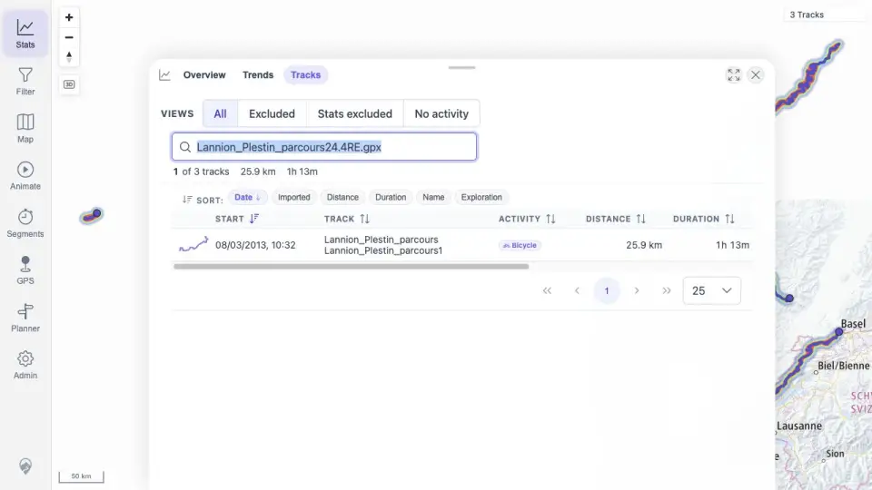

# Packet: DEL_05

## Scope

- Coverage source: `documentation/testing/frontend-regression-test-plan.md`
- Coverage ID or run packet: DEL_05
- In scope: Confirm the deletion flow is judged on user-visible absence rather than stale deleted-track API URLs.
- Out of scope: Direct stale deleted-track API URL behavior; DEL_05 explicitly excludes that as pass/fail criteria.

## Prerequisites

- Required previous coverage IDs or run packets: DEL_02.
- Required app/data state: two imported source files removed and delete processing settled.
- Required browser context: authenticated desktop browser context.

## Allowed Mutations

- Allowed: Reload browser state and navigate read-only user-facing surfaces.
- Not allowed: Delete additional files or alter remaining tracks.

## Actions And Results

| Coverage ID | Action | Expected result | Actual result | Status | Evidence |
|---|---|---|---|---|---|
| DEL_05 | Verified deleted tracks are absent from user-visible map/browser/filter/heatmap/related/statistics surfaces without using stale deleted-track URL probes as pass/fail criteria. | Deleted-track API probes or stale URLs are not pass/fail criteria; user-visible surfaces must no longer show deleted tracks. | User-visible surfaces no longer show Vitry or VoieVerte after deletion; the evidence does not rely on direct stale deleted-track URL behavior. | PASS | [assets/DEL_03-deletion-surfaces.txt](../assets/DEL_03-deletion-surfaces.txt); [assets/DEL_03-browser-search-results.txt](../assets/DEL_03-browser-search-results.txt); [assets/DEL_03-map-after-delete.webp](../assets/DEL_03-map-after-delete.webp); [assets/DEL_03-browser-after-delete.webp](../assets/DEL_03-browser-after-delete.webp) |

## Issues

| ID | Severity | Summary | Reproduction | Expected | Actual | Evidence | Release impact |
|---|---|---|---|---|---|---|---|

## Evidence Files

| File | Purpose |
|---|---|
| [assets/DEL_03-deletion-surfaces.txt](../assets/DEL_03-deletion-surfaces.txt) | Evidence for DEL_05. |
| [assets/DEL_03-browser-search-results.txt](../assets/DEL_03-browser-search-results.txt) | Evidence for DEL_05. |
| [assets/DEL_03-map-after-delete.webp](../assets/DEL_03-map-after-delete.webp) | Evidence for DEL_05. |
| [assets/DEL_03-browser-after-delete.webp](../assets/DEL_03-browser-after-delete.webp) | Evidence for DEL_05. |

## Screenshot Evidence

## Timings

| Step | Timing |
|---|---:|
| Deletion surface verification | ~3 min |

## Handoff Notes

- Completed: DEL_05.
- Remaining unfinished coverage: FIT_01 onward.
- Blocked or not applicable: none.
- State left for the next packet: three GPX tracks remain after deletion.
