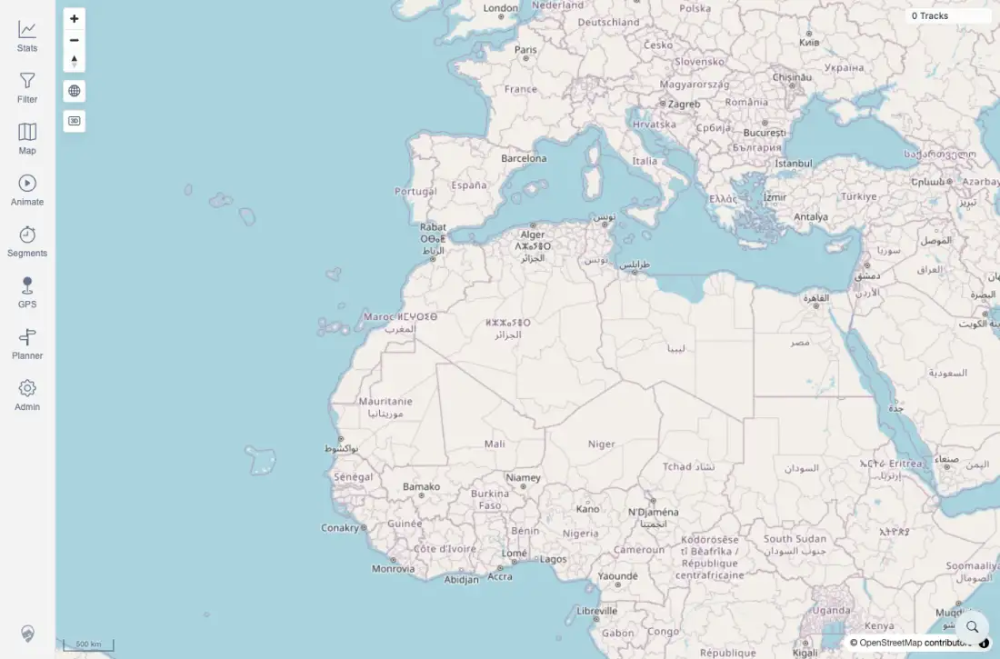

# Packet: ERR_01

## Scope

- Coverage source: `documentation/testing/frontend-regression-test-plan.md`
- Coverage ID or run packet: ERR_01
- In scope: Error recovery for failed track/map/API load, planner route failure, expired session, and failed media applicability.
- Out of scope: Installed-PWA offline reload behavior, covered by NET_01.

## Prerequisites

- Required previous coverage IDs or run packets: NET_02, NET_03, PLN_09, PLN_10, MED_05.
- Required app/data state: Current beta stack with isolated browser contexts used for simulated failures.
- Required browser context: Desktop Chromium contexts with request interception where needed.

## Allowed Mutations

- Allowed: Reuse completed failure-simulation evidence from this run.
- Not allowed: Seed media fixtures or mutate server-side data.

## Actions And Results

| Coverage ID | Action | Expected result | Actual result | Status | Evidence |
|---|---|---|---|---|---|
| ERR_01 | Collated direct failure-path evidence: NET_02 failed track/map/API load, NET_03 expired session, PLN_09/PLN_10 planner route failures, and MED_05 failed-media availability. | Each triggered/simulated error path shows an actionable retry, re-login, dismiss, or recovery message rather than freezing or going blank. | Expired session and planner route failures showed actionable recovery. Failed media could not be seeded in this run. Failed track/map/API load did not blank the app, but showed only `0 Tracks` with no retry/offline/error message; therefore this coverage failed in the original beta run. | FIXED | [assets/ERR_01-error-recovery.txt](../assets/ERR_01-error-recovery.txt); [assets/NET_02-network-recovery.txt](../assets/NET_02-network-recovery.txt); [assets/NET_02-network-recovery.webp](../assets/NET_02-network-recovery.webp); [assets/NET_03-auth-redirect.txt](../assets/NET_03-auth-redirect.txt); [assets/PLN_09-segment-downloading-results.txt](../assets/PLN_09-segment-downloading-results.txt); [assets/PLN_10-existing-route-failure-results.txt](../assets/PLN_10-existing-route-failure-results.txt); [assets/FIXED-issues-local-verification.txt](../assets/FIXED-issues-local-verification.txt) |

## Issues

| ID | Severity | Summary | Reproduction | Expected | Actual | Evidence | Release impact |
|---|---|---|---|---|---|---|---|
| NET-02-P2 | P2 | API outage without cached tracks renders an empty map without a recoverable message. | In an authenticated browser context, clear CacheStorage/IndexedDB while keeping the JWT, abort `/mtl/api/**`, and reload `/mtl/`. | MTL Explorer shows an actionable offline/retry/error state while keeping the shell usable. | The shell stayed usable, but only `0 Tracks` appeared; no retry/offline/error message was visible. | [assets/NET_02-network-recovery.txt](../assets/NET_02-network-recovery.txt); [assets/NET_02-network-recovery.webp](../assets/NET_02-network-recovery.webp) | Users on a flaky connection can mistake an outage for an empty archive and have no visible recovery action. |

## Evidence Files

| File | Purpose |
|---|---|
| [assets/FIXED-issues-local-verification.txt](../assets/FIXED-issues-local-verification.txt) | Local implementation and verification evidence for FIXED status. |
| [assets/ERR_01-error-recovery.txt](../assets/ERR_01-error-recovery.txt) | Cross-path error recovery summary. |
| [assets/NET_02-network-recovery.txt](../assets/NET_02-network-recovery.txt) | Failed track/map/API load evidence. |
| [assets/NET_02-network-recovery.webp](../assets/NET_02-network-recovery.webp) | Empty map shell after API abort. |
| [assets/NET_03-auth-redirect.txt](../assets/NET_03-auth-redirect.txt) | Expired/invalid session recovery. |
| [assets/PLN_09-segment-downloading-results.txt](../assets/PLN_09-segment-downloading-results.txt) | Planner segment-downloading notice and auto-retry. |
| [assets/PLN_10-existing-route-failure-results.txt](../assets/PLN_10-existing-route-failure-results.txt) | Planner route-unavailable preservation of existing route. |

## Screenshot Evidence

## Timings

| Step | Timing |
|---|---:|
| Error-recovery collation | Reused direct packet evidence |

## Handoff Notes

- Fix status: FIXED locally: failed track/map/API recovery issue resolved through NET_02 startup recovery fix. Evidence: [assets/FIXED-issues-local-verification.txt](../assets/FIXED-issues-local-verification.txt).

- Completed: ERR_01 marked FIXED because the NET_02 recovery path was fixed locally.
- Remaining unfinished coverage: ERR_02 at packet creation time.
- Blocked or not applicable: Failed media remains blocked by the no-media/no-filesystem-access constraint already recorded in MED_05.
- State left for the next packet: No active failure mocks or browser contexts remain.
