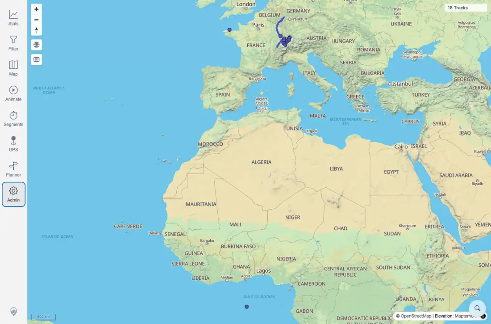

# Packet: ERR_02

## Scope

- Coverage source: `documentation/testing/frontend-regression-test-plan.md`
- Coverage ID or run packet: ERR_02
- In scope: Rapid switching between tools and cleanup of visible markers, listeners, toolbars, sheets, dialogs, and cursor state.
- Out of scope: Deep per-tool functional behavior already covered by tool-specific packets.

## Prerequisites

- Required previous coverage IDs or run packets: ERR_01.
- Required app/data state: Current beta stack with map loaded.
- Required browser context: Desktop Chromium context.

## Allowed Mutations

- Allowed: Rapidly open/close tools and inspect transient DOM state.
- Not allowed: Save routes, import/delete data, or leave mocks active.

## Actions And Results

| Coverage ID | Action | Expected result | Actual result | Status | Evidence |
|---|---|---|---|---|---|
| ERR_02 | Rapidly clicked Stats, Filter, Map, Animate, Segments, Planner, Admin, then repeated several tools, pressed Escape to close the stack, and inspected final DOM/map state. | Rapid switching does not leave previous tool markers, listeners, cursors, or visible panels behind. | Final URL returned to `/mtl/`; `16 Tracks` map and canvas stayed visible; active sheets/dialogs were 0; cursor was `auto`; no geo draw toolbar, measure results, planner shell, animate sheet, admin workspace, stats root, or location marker remained visible. The Filter root remained mounted but not visible, matching component structure. | PASS | [assets/ERR_02-rapid-switch.txt](../assets/ERR_02-rapid-switch.txt); [assets/ERR_02-rapid-switch-final.webp](../assets/ERR_02-rapid-switch-final.webp) |

## Issues

| ID | Severity | Summary | Reproduction | Expected | Actual | Evidence | Release impact |
|---|---|---|---|---|---|---|---|

## Evidence Files

| File | Purpose |
|---|---|
| [assets/ERR_02-rapid-switch.txt](../assets/ERR_02-rapid-switch.txt) | Tool sequence and final-state inspection. |
| [assets/ERR_02-rapid-switch-final.webp](../assets/ERR_02-rapid-switch-final.webp) | Final map after rapid switching. |

## Screenshot Evidence

## Timings

| Step | Timing |
|---|---:|
| Rapid switch sequence and final inspection | ~10 s |

## Handoff Notes

- Completed: ERR_02 passed.
- Remaining unfinished coverage: All plan coverage IDs are now terminal; finalization gate must pass before RUN_CLEANUP.
- Blocked or not applicable: None.
- State left for the next packet: No visible tool sheets/dialogs remain; server-side data unchanged.
