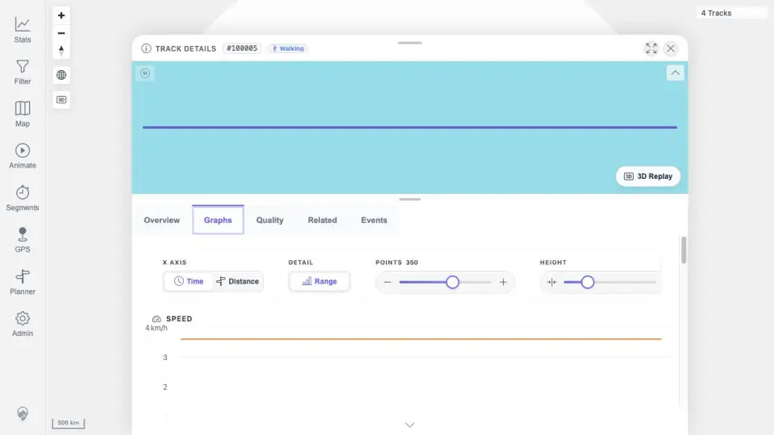
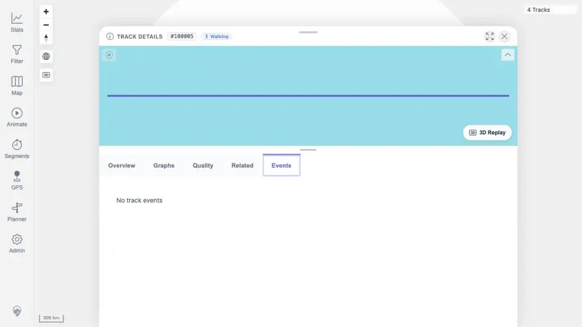

# Packet: FIT_03

## Scope

- Coverage source: `documentation/testing/frontend-regression-test-plan.md`
- Coverage ID or run packet: FIT_03
- In scope: Open the FIT-backed track details and verify Overview, Graphs, Quality, Events, Related, mini-map, and point popups render similarly to GPX-backed tracks.
- Out of scope: Download checksum/export validation; covered by FIT_04 and FIT_05.

## Prerequisites

- Required previous coverage IDs or run packets: FIT_02.
- Required app/data state: `Activity.fit` indexed as track `100005`.
- Required browser context: desktop browser authenticated as the README quick-start user.

## Allowed Mutations

- Allowed: Navigate tabs, click the FIT detail mini-map, and open a point popup.
- Not allowed: Change track metadata, activity type, statistics state, or source files.

## Actions And Results

| Coverage ID | Action | Expected result | Actual result | Status | Evidence |
|---|---|---|---|---|---|
| FIT_03 | Opened `Track 100005` from the track browser search result, navigated Overview, Graphs, Quality, Related, and Events, and clicked the detail mini-map track line. | FIT-backed details render the same core detail surfaces as GPX-backed tracks, including graph controls/charts, diagnostics, related/events sections, mini-map, and point popup. | Overview rendered `Activity.fit`, Walking, included-in-statistics controls, mini-map, and download controls. Graphs rendered Time/Distance, Range, point-count and graph-height controls plus Speed, Elevation, Elevation Gain Rate, Distance over Time, Energy, and Power charts. Quality rendered `SUCCESS`, `UNIQUE`, and 3,600 points. Related rendered previous/current track context. Events rendered `No track events`. Mini-map click opened a track-point popup with point, time, distance, elevation, speed, and elapsed values. | PASS | [assets/FIT_03-detail-summary.txt](../assets/FIT_03-detail-summary.txt); [assets/FIT_03-overview.webp](../assets/FIT_03-overview.webp); [assets/FIT_03-graphs.webp](../assets/FIT_03-graphs.webp); [assets/FIT_03-quality.webp](../assets/FIT_03-quality.webp); [assets/FIT_03-related.webp](../assets/FIT_03-related.webp); [assets/FIT_03-events.webp](../assets/FIT_03-events.webp); [assets/FIT_03-point-popup.webp](../assets/FIT_03-point-popup.webp) |

## Issues

| ID | Severity | Summary | Reproduction | Expected | Actual | Evidence | Release impact |
|---|---|---|---|---|---|---|---|

## Evidence Files

| File | Purpose |
|---|---|
| [assets/FIT_03-detail-summary.txt](../assets/FIT_03-detail-summary.txt) | Compact tab and popup verification summary. |
| [assets/FIT_03-overview.webp](../assets/FIT_03-overview.webp) | FIT detail Overview with mini-map and summary controls. |
| [assets/FIT_03-graphs.webp](../assets/FIT_03-graphs.webp) | FIT graph tab with chart controls and charts. |
| [assets/FIT_03-quality.webp](../assets/FIT_03-quality.webp) | FIT quality tab showing successful unique load and point metrics. |
| [assets/FIT_03-related.webp](../assets/FIT_03-related.webp) | FIT related tab with prior/current track context. |
| [assets/FIT_03-events.webp](../assets/FIT_03-events.webp) | FIT events tab empty state. |
| [assets/FIT_03-point-popup.webp](../assets/FIT_03-point-popup.webp) | Detail mini-map track-point popup for the FIT track. |

## Screenshot Evidence

## Timings

| Step | Timing |
|---|---:|
| Open FIT detail from track browser | <1 min |
| Navigate detail tabs and capture evidence | 3 min |
| Mini-map point-popup check | <1 min |

## Handoff Notes

- Completed: FIT_03.
- Remaining unfinished coverage: FIT_04 onward.
- Blocked or not applicable: none.
- State left for the next packet: Browser is on FIT track `100005` Overview with a point popup open.
