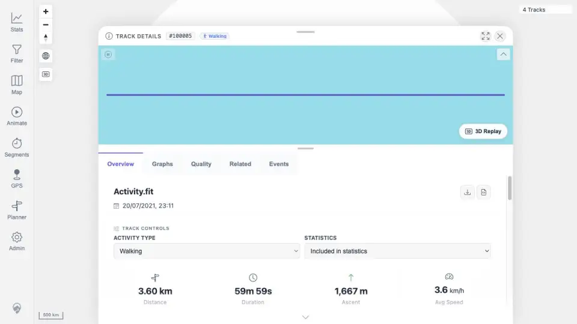

# Packet: FIT_04

## Scope

- Coverage source: `documentation/testing/frontend-regression-test-plan.md`
- Coverage ID or run packet: FIT_04
- In scope: Verify the FIT-backed track's original source download remains FIT and matches the uploaded checksum.
- Out of scope: GPX export validation.

## Prerequisites

- Required previous coverage IDs or run packets: FIT_03 and DAT_05.
- Required app/data state: track `100005` imported from `Activity.fit`.
- Required browser context: desktop browser authenticated as the README quick-start user.

## Allowed Mutations

- Allowed: Trigger/read original download.
- Not allowed: Change track files or metadata.

## Actions And Results

| Coverage ID | Action | Expected result | Actual result | Status | Evidence |
|---|---|---|---|---|---|
| FIT_04 | Verified the FIT detail page exposes the visible `Download original` control, then downloaded `/mtl/api/tracks/100005/source-file` with the same authenticated app user and compared bytes to the staged public FIT checksum. | Downloaded original source file remains FIT and matches the uploaded checksum. | Response was `200`, attachment filename `Activity.fit`, `application/octet-stream`, 94,096 bytes, first bytes include `.FIT`, and SHA-256 matched the uploaded source checksum `949a238e1bb75c3684479785f76fa9a16888bb394518844248f488171d591387`. | PASS | [assets/FIT_04-source-download.txt](../assets/FIT_04-source-download.txt); [assets/DAT_05-fit-file.txt](../assets/DAT_05-fit-file.txt); [assets/FIT_03-overview.webp](../assets/FIT_03-overview.webp) |

## Issues

| ID | Severity | Summary | Reproduction | Expected | Actual | Evidence | Release impact |
|---|---|---|---|---|---|---|---|

## Evidence Files

| File | Purpose |
|---|---|
| [assets/FIT_04-source-download.txt](../assets/FIT_04-source-download.txt) | Original download headers, size, magic bytes, and checksum comparison. |
| [assets/DAT_05-fit-file.txt](../assets/DAT_05-fit-file.txt) | Staged public FIT source checksum. |
| [assets/FIT_03-overview.webp](../assets/FIT_03-overview.webp) | FIT detail Overview showing the visible Download original control. |

## Screenshot Evidence

## Timings

| Step | Timing |
|---|---:|
| Original download and checksum verification | <1 min |

## Handoff Notes

- Completed: FIT_04.
- Remaining unfinished coverage: FIT_05 onward.
- Blocked or not applicable: none.
- State left for the next packet: Track `100005` remains imported; no data mutations made.
