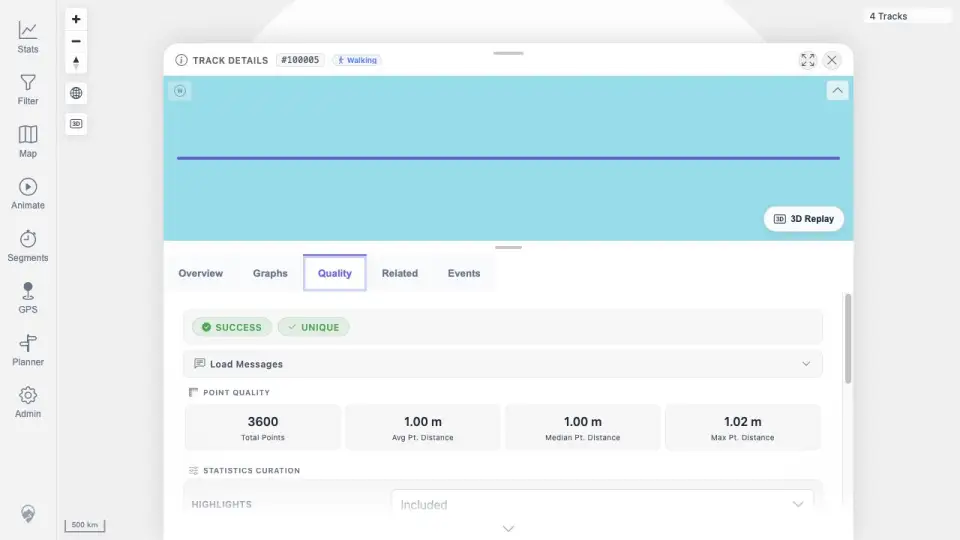

# Packet: FIT_06

## Scope

- Coverage source: `documentation/testing/frontend-regression-test-plan.md`
- Coverage ID or run packet: FIT_06
- In scope: Determine whether the unavailable GPSBabel/FIT-conversion error path applies to this configured run.
- Out of scope: Retesting successful FIT conversion behavior; covered by FIT_02 through FIT_05.

## Prerequisites

- Required previous coverage IDs or run packets: FIT_02 and FIT_03.
- Required app/data state: `Activity.fit` imported successfully as track `100005`.
- Required browser context: none.

## Allowed Mutations

- Allowed: None.
- Not allowed: Disable GPSBabel or break the installed stack to force an artificial conversion failure.

## Actions And Results

| Coverage ID | Action | Expected result | Actual result | Status | Evidence |
|---|---|---|---|---|---|
| FIT_06 | Reviewed the FIT import and detail evidence for whether GPSBabel/FIT conversion was unavailable. | If conversion is unavailable, UI shows a clear conversion/indexing error and the failure is blocking for FIT support. | Conversion was available: FIT_02 recorded successful index/load status for `Activity.fit`, and FIT_03 rendered the FIT-backed detail quality surface. The unavailable-conversion error path did not apply to this run. | NOT APPLICABLE | [assets/FIT_06-applicability.txt](../assets/FIT_06-applicability.txt); [assets/FIT_02-import-monitor.txt](../assets/FIT_02-import-monitor.txt); [assets/FIT_03-quality.webp](../assets/FIT_03-quality.webp) |

## Issues

| ID | Severity | Summary | Reproduction | Expected | Actual | Evidence | Release impact |
|---|---|---|---|---|---|---|---|

## Evidence Files

| File | Purpose |
|---|---|
| [assets/FIT_06-applicability.txt](../assets/FIT_06-applicability.txt) | Applicability rationale for unavailable-conversion path. |
| [assets/FIT_02-import-monitor.txt](../assets/FIT_02-import-monitor.txt) | Successful FIT import/index evidence. |
| [assets/FIT_03-quality.webp](../assets/FIT_03-quality.webp) | FIT quality page showing successful conversion/load. |

## Screenshot Evidence

## Timings

| Step | Timing |
|---|---:|
| Applicability review | <1 min |

## Handoff Notes

- Completed: FIT_06.
- Remaining unfinished coverage: FMT_01 onward.
- Blocked or not applicable: FIT_06 is not applicable because FIT conversion is available and successful in this run.
- State left for the next packet: Track `100005` remains imported; no data mutations made.
