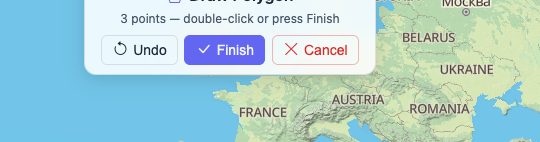
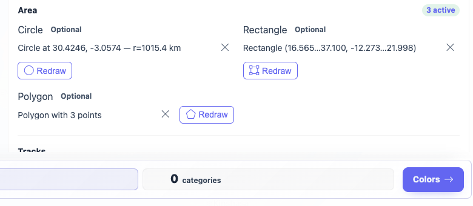
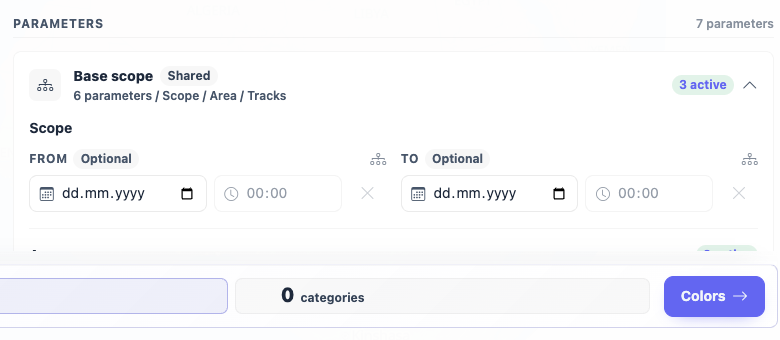
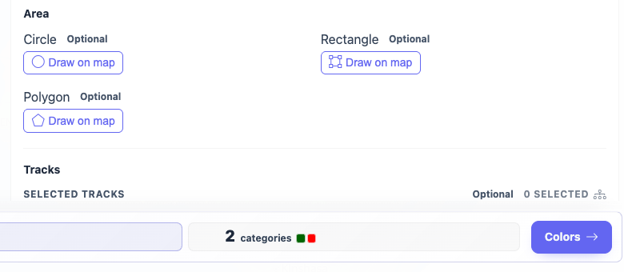

# Packet: FLT_05

## Scope

- Coverage source: `documentation/testing/frontend-regression-test-plan.md`
- Coverage ID or run packet: FLT_05
- In scope: Geo drawing for circle, rectangle, and polygon; undo, cancel, finish, clear, and reload persistence.
- Out of scope: Filter-driven stats/legend updates beyond the visible count, covered by FLT_06 and FLT_07.

## Prerequisites

- Required previous coverage IDs or run packets: FLT_04.
- Required app/data state: Filter parameters reset; full `13 / 13 Tracks` result visible.
- Required browser context: clean isolated Chrome context.

## Allowed Mutations

- Allowed: Temporarily create and clear client-side geo filter shapes.
- Not allowed: Change server data or imported files.

## Actions And Results

| Coverage ID | Action | Expected result | Actual result | Status | Evidence |
|---|---|---|---|---|---|
| FLT_05 | Started Circle draw and canceled it; drew and saved Circle and Rectangle; drew Polygon, used Undo, added a replacement point, clicked Finish; reloaded to verify saved shapes; cleared all three shape controls and reloaded to verify cleanup. | Circle, rectangle, and polygon drawing work; undo, cancel, finish, and clear all work; saved shapes reappear next time. | Cancel closed the toolbar and saved no shape. Circle and Rectangle auto-finished on second click and showed summaries. Polygon enabled Finish at 3 points; Undo returned to 2 points and disabled Finish; adding a replacement third point re-enabled Finish and saved `Polygon with 3 points`. After reload, all three summaries and persisted geo parameter maps reappeared with the same `0 / 13 Tracks` result. Clearing all three shape controls removed summaries and restored `13 / 13 Tracks`, and the cleared state persisted after reload. | PASS | [assets/FLT_05-geo-drawing-results.txt](../assets/FLT_05-geo-drawing-results.txt); [assets/FLT_05-circle-cancel-toolbar.png](../assets/FLT_05-circle-cancel-toolbar.png); [assets/FLT_05-polygon-undo-finish-toolbar.png](../assets/FLT_05-polygon-undo-finish-toolbar.png); [assets/FLT_05-all-shapes-before-reload.png](../assets/FLT_05-all-shapes-before-reload.png); [assets/FLT_05-shapes-reappeared-after-reload.png](../assets/FLT_05-shapes-reappeared-after-reload.png); [assets/FLT_05-shapes-cleared.png](../assets/FLT_05-shapes-cleared.png) |

## Issues

| ID | Severity | Summary | Reproduction | Expected | Actual | Evidence | Release impact |
|---|---|---|---|---|---|---|---|

## Evidence Files

| File | Purpose |
|---|---|
| [assets/FLT_05-geo-drawing-results.txt](../assets/FLT_05-geo-drawing-results.txt) | Toolbar, storage, persistence, and cleanup observations. |
| [assets/FLT_05-circle-cancel-toolbar.png](../assets/FLT_05-circle-cancel-toolbar.png) | Circle draw toolbar before Cancel. |
| [assets/FLT_05-polygon-undo-finish-toolbar.png](../assets/FLT_05-polygon-undo-finish-toolbar.png) | Polygon toolbar with Finish available after Undo and replacement point. |
| [assets/FLT_05-all-shapes-before-reload.png](../assets/FLT_05-all-shapes-before-reload.png) | All saved shape summaries before reload. |
| [assets/FLT_05-shapes-reappeared-after-reload.png](../assets/FLT_05-shapes-reappeared-after-reload.png) | Shape summaries after reload. |
| [assets/FLT_05-shapes-cleared.png](../assets/FLT_05-shapes-cleared.png) | Geo controls after clearing all shapes. |

## Screenshot Evidence

## Timings

| Step | Timing |
|---|---:|
| Geo drawing, reload persistence, and cleanup | ~18 min |

## Handoff Notes

- Completed: FLT_05.
- Remaining unfinished coverage: FLT_06 onward.
- Blocked or not applicable: none.
- State left for the next packet: Filter page open; `Activities by keyword` selected; client-side date/text/geo parameter maps empty; full `13 / 13 Tracks` visible set restored.
