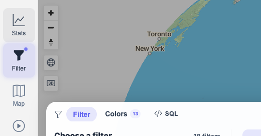
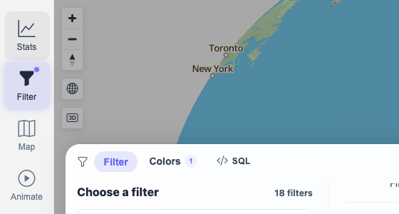
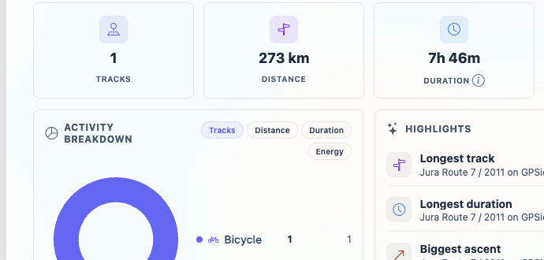

# Packet: FLT_06

## Scope

- Coverage source: `documentation/testing/frontend-regression-test-plan.md`
- Coverage ID or run packet: FLT_06
- In scope: Applied filter updates visible track count, map color indicators, legend, and stats without a full page reload.
- Out of scope: Reload persistence, covered by FLT_04 and FLT_05.

## Prerequisites

- Required previous coverage IDs or run packets: FLT_05.
- Required app/data state: No active date/text/geo params; full `13 / 13 Tracks` set restored.
- Required browser context: clean isolated Chrome context.

## Allowed Mutations

- Allowed: Temporarily enter and clear a keyword parameter on `Activities by keyword`.
- Not allowed: Leave the narrowed keyword active after the packet.

## Actions And Results

| Coverage ID | Action | Expected result | Actual result | Status | Evidence |
|---|---|---|---|---|---|
| FLT_06 | Set a browser marker, entered Keyword `Jura`, verified count/colors/legend update on the map/filter page, opened Stats through in-app navigation, then returned to Filter and cleared the keyword. | Applied filter updates visible track count, map colors, legend, and stats without a full page reload. | The no-reload marker persisted throughout. Keyword `Jura` changed `13 / 13 Tracks` to `1 / 13 Tracks`, `Colors 13` to `Colors 1`, and legend `CYCLING 12 / ON_FOOT 1` to `CYCLING 1`. Stats opened without losing the marker and showed `Showing 1 of 13 tracks`, `273 km`, `7h 46m`, and `1,808 Wh` for the Jura track. Clearing the keyword restored `13 / 13 Tracks`, `Colors 13`, and the two-category legend. | PASS | [assets/FLT_06-live-filter-update-results.txt](../assets/FLT_06-live-filter-update-results.txt); [assets/FLT_06-baseline-full-map.png](../assets/FLT_06-baseline-full-map.png); [assets/FLT_06-filtered-map-live.png](../assets/FLT_06-filtered-map-live.png); [assets/FLT_06-filtered-stats-live.png](../assets/FLT_06-filtered-stats-live.png); [assets/FLT_06-restored-map-live.png](../assets/FLT_06-restored-map-live.png) |

## Issues

| ID | Severity | Summary | Reproduction | Expected | Actual | Evidence | Release impact |
|---|---|---|---|---|---|---|---|

## Evidence Files

| File | Purpose |
|---|---|
| [assets/FLT_06-live-filter-update-results.txt](../assets/FLT_06-live-filter-update-results.txt) | Baseline, live apply, stats, restore, and no-full-reload marker observations. |
| [assets/FLT_06-baseline-full-map.png](../assets/FLT_06-baseline-full-map.png) | Full 13-track baseline before applying keyword. |
| [assets/FLT_06-filtered-map-live.png](../assets/FLT_06-filtered-map-live.png) | Keyword applied in place with count, colors, and legend changed. |
| [assets/FLT_06-filtered-stats-live.png](../assets/FLT_06-filtered-stats-live.png) | Stats reflecting the same active filter without marker loss. |
| [assets/FLT_06-restored-map-live.png](../assets/FLT_06-restored-map-live.png) | Keyword cleared and full map result restored. |

## Screenshot Evidence

## Timings

| Step | Timing |
|---|---:|
| Baseline, live keyword apply, stats check, and restore | ~10 min |

## Handoff Notes

- Completed: FLT_06.
- Remaining unfinished coverage: FLT_07 onward.
- Blocked or not applicable: none.
- State left for the next packet: Browser on `/mtl/filter`; selected filter is `Activities by keyword`; keyword/date/geo params are empty; count is `13 / 13 Tracks`.
