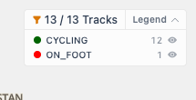
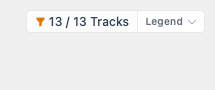
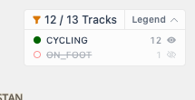
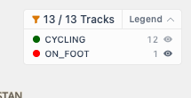

# Packet: FLT_07

## Scope

- Coverage source: `documentation/testing/frontend-regression-test-plan.md`
- Coverage ID or run packet: FLT_07
- In scope: Active-filter legend categories, Colors preview mapping, map legend collapse, group hide/restore, and immediate map count update.
- Out of scope: Clearing the whole filter, covered by FLT_08.

## Prerequisites

- Required previous coverage IDs or run packets: FLT_06.
- Required app/data state: Filter active, keyword/date/geo params clear, full `13 / 13 Tracks` result visible.
- Required browser context: clean isolated Chrome context.

## Allowed Mutations

- Allowed: Collapse/expand map legend and temporarily hide/show one legend group.
- Not allowed: Leave any legend group hidden for the next packet.

## Actions And Results

| Coverage ID | Action | Expected result | Actual result | Status | Evidence |
|---|---|---|---|---|---|
| FLT_07 | Verified the active filter legend on the map and in the Colors tab, collapsed and expanded the map legend, hid `ON_FOOT`, then restored it. | Legend reflects the active filter; collapsing/hiding groups updates the map immediately. | Colors preview and map legend both showed `CYCLING 12` and `ON_FOOT 1`. Collapsing the map legend hid row text while preserving `13 / 13 Tracks`. Hiding `ON_FOOT` immediately changed the visible count to `12 / 13 Tracks`, disabled that row, and changed its icon to eye-slash. Clicking it again restored `13 / 13 Tracks`, the enabled row state, and the eye-fill icon. | PASS | [assets/FLT_07-legend-group-results.txt](../assets/FLT_07-legend-group-results.txt); [assets/FLT_07-legend-baseline.png](../assets/FLT_07-legend-baseline.png); [assets/FLT_07-legend-collapsed.png](../assets/FLT_07-legend-collapsed.png); [assets/FLT_07-on-foot-hidden.png](../assets/FLT_07-on-foot-hidden.png); [assets/FLT_07-on-foot-restored.png](../assets/FLT_07-on-foot-restored.png) |

## Issues

| ID | Severity | Summary | Reproduction | Expected | Actual | Evidence | Release impact |
|---|---|---|---|---|---|---|---|

## Evidence Files

| File | Purpose |
|---|---|
| [assets/FLT_07-legend-group-results.txt](../assets/FLT_07-legend-group-results.txt) | Colors preview, map legend collapse, hide, restore, and cleanup observations. |
| [assets/FLT_07-legend-baseline.png](../assets/FLT_07-legend-baseline.png) | Expanded baseline map legend. |
| [assets/FLT_07-legend-collapsed.png](../assets/FLT_07-legend-collapsed.png) | Collapsed map legend card. |
| [assets/FLT_07-on-foot-hidden.png](../assets/FLT_07-on-foot-hidden.png) | ON_FOOT hidden and map count reduced. |
| [assets/FLT_07-on-foot-restored.png](../assets/FLT_07-on-foot-restored.png) | ON_FOOT restored and map count returned. |

## Screenshot Evidence

## Timings

| Step | Timing |
|---|---:|
| Legend preview, collapse, hide, restore, and cleanup | ~12 min |

## Handoff Notes

- Completed: FLT_07.
- Remaining unfinished coverage: FLT_08 onward.
- Blocked or not applicable: none.
- State left for the next packet: Browser on `/mtl/filter`; filter sheet open; all legend groups visible; count is `13 / 13 Tracks`.
