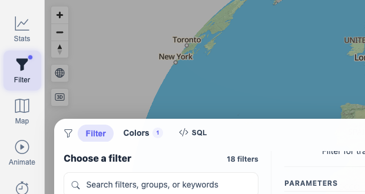
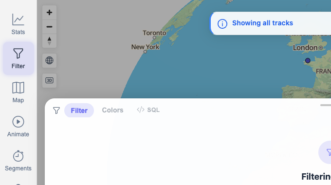
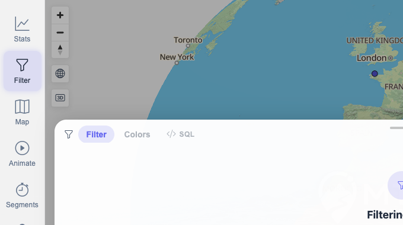

# Packet: FLT_08

## Scope

- Coverage source: `documentation/testing/frontend-regression-test-plan.md`
- Coverage ID or run packet: FLT_08
- In scope: Clearing/disabling an active filter restores all tracks.
- Out of scope: Later stats/browser behavior with filters off, covered by TBS and later sections.

## Prerequisites

- Required previous coverage IDs or run packets: FLT_07.
- Required app/data state: Active filter available; all legend groups visible; full `13 / 13 Tracks` result restored.
- Required browser context: clean isolated Chrome context.

## Allowed Mutations

- Allowed: Temporarily narrow the active filter, then disable filtering.
- Not allowed: Leave a narrowed filter or hidden legend group active.

## Actions And Results

| Coverage ID | Action | Expected result | Actual result | Status | Evidence |
|---|---|---|---|---|---|
| FLT_08 | Narrowed `Activities by keyword` with Keyword `Jura`, then clicked the filter header On/Off switch. | Clearing the filter restores all tracks. | `Jura` narrowed the map to `1 / 13 Tracks`, `Colors 1`, and legend `CYCLING 1`. Clicking the header switch changed it to `Off`, showed the `Filtering is off` card, removed category legend rows, and restored the unfiltered `13 Tracks` state. Reopening `/mtl/filter` kept filtering Off with all tracks visible. | PASS | [assets/FLT_08-clear-filter-results.txt](../assets/FLT_08-clear-filter-results.txt); [assets/FLT_08-keyword-narrowed-before-clear.png](../assets/FLT_08-keyword-narrowed-before-clear.png); [assets/FLT_08-filter-disabled-restored.png](../assets/FLT_08-filter-disabled-restored.png); [assets/FLT_08-final-clean-filter-off.png](../assets/FLT_08-final-clean-filter-off.png) |

## Issues

| ID | Severity | Summary | Reproduction | Expected | Actual | Evidence | Release impact |
|---|---|---|---|---|---|---|---|

## Evidence Files

| File | Purpose |
|---|---|
| [assets/FLT_08-clear-filter-results.txt](../assets/FLT_08-clear-filter-results.txt) | Narrowed, disabled/restored, and final cleanup observations. |
| [assets/FLT_08-keyword-narrowed-before-clear.png](../assets/FLT_08-keyword-narrowed-before-clear.png) | Keyword filter narrowed the map to 1/13. |
| [assets/FLT_08-filter-disabled-restored.png](../assets/FLT_08-filter-disabled-restored.png) | Header switch disabled filtering and restored all tracks. |
| [assets/FLT_08-final-clean-filter-off.png](../assets/FLT_08-final-clean-filter-off.png) | Final clean state: filtering Off and all tracks visible. |

## Screenshot Evidence

## Timings

| Step | Timing |
|---|---:|
| Narrow, disable, verify restore, and cleanup | ~9 min |

## Handoff Notes

- Completed: FLT_08.
- Remaining unfinished coverage: TBS_01 onward.
- Blocked or not applicable: none.
- State left for the next packet: Browser on `/mtl/filter`; filtering is Off; map shows `13 Tracks`.
