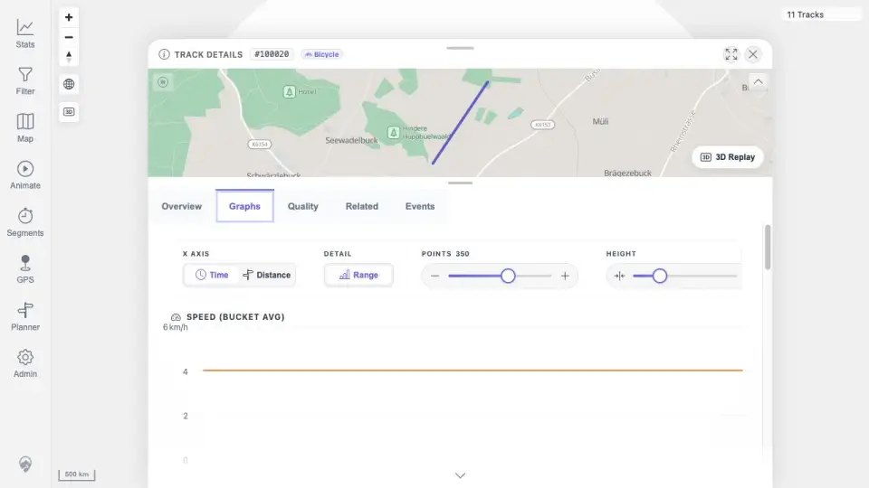

# Packet: FMT_02

## Scope

- Coverage source: `documentation/testing/frontend-regression-test-plan.md`
- Coverage ID or run packet: FMT_02
- In scope: For each non-GPX format tested, verify upload/import acceptance, GPSBabel conversion, map display, details/charts, statistics inclusion, Download original source file, and Download as GPX.
- Out of scope: GPX and FIT-specific flows already covered by import/FIT packets.

## Prerequisites

- Required previous coverage IDs or run packets: FMT_01.
- Required app/data state: Seven unique non-GPX tracks imported as ids 100014-100020.
- Required browser context: desktop browser authenticated as the README quick-start user.

## Allowed Mutations

- Allowed: Refresh browser, search track browser, open detail pages, click Graphs tabs, and download/read original/GPX exports.
- Not allowed: Modify imported track metadata or remove files.

## Actions And Results

| Coverage ID | Action | Expected result | Actual result | Status | Evidence |
|---|---|---|---|---|---|
| FMT_02 | Refreshed the app, searched Stats > Tracks for `fmt_`, opened each non-GPX format detail page, verified Graphs, and downloaded original plus GPX export for each. | Each tested non-GPX format is accepted, converted, displayed on map, visible in statistics, has details/charts, preserves original download, and exports GPX with real trackpoints. | Track browser showed `7 of 11` format tracks and map header showed `11 Tracks`. Each format detail page exposed mini-map, Download original, Download GPX, and Graphs with Highcharts plus Speed, Elevation, Distance over Time, and graph controls. Original downloads matched source checksums; GPX exports parsed with 10 `trkpt` elements per format. | PASS | [assets/FMT_02-detail-download-summary.txt](../assets/FMT_02-detail-download-summary.txt); [assets/FMT_02-track-browser-formats.webp](../assets/FMT_02-track-browser-formats.webp); [assets/FMT_02-gdb-graphs.webp](../assets/FMT_02-gdb-graphs.webp); [assets/FMT_01-format-import.txt](../assets/FMT_01-format-import.txt) |

## Issues

| ID | Severity | Summary | Reproduction | Expected | Actual | Evidence | Release impact |
|---|---|---|---|---|---|---|---|

## Evidence Files

| File | Purpose |
|---|---|
| [assets/FMT_02-detail-download-summary.txt](../assets/FMT_02-detail-download-summary.txt) | Per-format detail/graphs, statistics, original download, and GPX export summary. |
| [assets/FMT_02-track-browser-formats.webp](../assets/FMT_02-track-browser-formats.webp) | Track browser search showing 7 non-GPX format rows and 11 total tracks. |
| [assets/FMT_02-gdb-graphs.webp](../assets/FMT_02-gdb-graphs.webp) | Representative non-GPX detail Graphs tab with Highcharts and controls. |
| [assets/FMT_01-format-import.txt](../assets/FMT_01-format-import.txt) | Final unique format import mapping and checksums. |

## Screenshot Evidence

## Timings

| Step | Timing |
|---|---:|
| Browser refresh and `fmt_` search | <1 min |
| Seven detail/graphs checks | 45.7 s |
| Seven original and GPX download checks | <1 min |

## Handoff Notes

- Completed: FMT_02.
- Remaining unfinished coverage: SGN_01 onward.
- Blocked or not applicable: none.
- State left for the next packet: 11 visible/stat-included tracks are imported: three GPX, one FIT, and seven unique non-GPX format tracks.
