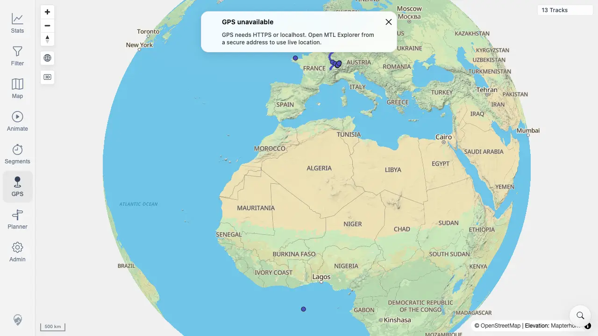

# Packet: GPS_02

## Scope

- Coverage source: `documentation/testing/frontend-regression-test-plan.md`
- Coverage ID or run packet: GPS_02
- In scope: Determine whether the GPS permission-acceptance and locate-marker flow can be tested on this target.
- Out of scope: HTTPS/localhost live geolocation behavior.

## Prerequisites

- Required previous coverage IDs or run packets: GPS_01
- Required app/data state: Authenticated map view on the remote quick-install target.
- Required browser context: Fresh desktop Chrome context against `http://188.245.169.80:18080/mtl/`.

## Allowed Mutations

- Allowed: Click the GPS control.
- Not allowed: Override geolocation permission or change the app origin to HTTPS/localhost.

## Actions And Results

| Coverage ID | Action | Expected result | Actual result | Status | Evidence |
|---|---|---|---|---|---|
| GPS_02 | Attempted to enable GPS on the configured target by clicking the GPS control. | On a secure origin, the browser permission prompt can be accepted and the locate marker should appear. On remote plain HTTP, the row is not applicable per GPS_01 coverage guidance. | No permission prompt was available because the target was plain HTTP with `window.isSecureContext=false`; clicking GPS showed the secure-origin warning instead of starting a GPS watch or marker. | NOT APPLICABLE | [assets/GPS-geolocation-insecure-context.webp](../assets/GPS-geolocation-insecure-context.webp); [assets/GPS-geolocation-insecure-context.txt](../assets/GPS-geolocation-insecure-context.txt) |

## Issues

| ID | Severity | Summary | Reproduction | Expected | Actual | Evidence | Release impact |
|---|---|---|---|---|---|---|---|

## Evidence Files

| File | Purpose |
|---|---|
| [assets/GPS-geolocation-insecure-context.webp](../assets/GPS-geolocation-insecure-context.webp) | GPS control on the remote plain-HTTP target showing the secure-origin message. |
| [assets/GPS-geolocation-insecure-context.txt](../assets/GPS-geolocation-insecure-context.txt) | Origin, permission state, and visible GPS warning facts. |

## Screenshot Evidence

## Timings

| Step | Timing |
|---|---:|
| Reused GPS applicability evidence | 2026-06-20T00:54 CEST |

## Handoff Notes

- Completed: GPS_02 is terminal as not applicable for this remote plain-HTTP run.
- Remaining unfinished coverage: GPS_03.
- Blocked or not applicable: Browser permission acceptance and live marker checks require HTTPS or localhost.
- State left for the next packet: Map state unchanged.
