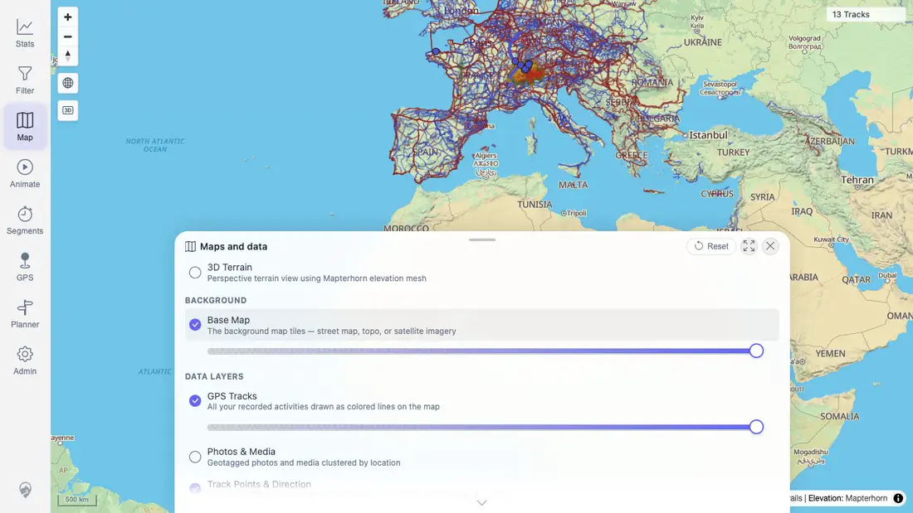
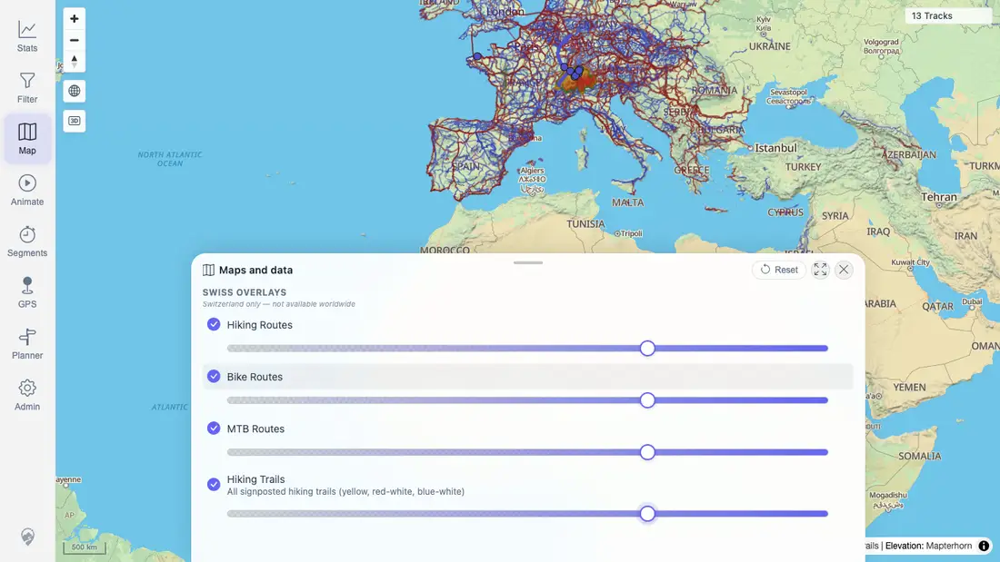

# Packet: HMO_02

## Scope

- Coverage source: `documentation/testing/frontend-regression-test-plan.md`
- Coverage ID or run packet: HMO_02
- In scope: Waymarked Trails and Swiss overlay toggles, independent overlay opacity sliders, and track-layer visibility while overlays are active.
- Out of scope: Heatmap filter refresh, covered by HMO_03.

## Prerequisites

- Required previous coverage IDs or run packets: HMO_01 PASS.
- Required app/data state: Quick-install beta stack running with imported GPS tracks.
- Required browser context: Fresh authenticated desktop context.

## Allowed Mutations

- Allowed: Toggle overlay rows, change overlay opacities, capture screenshot/text evidence, update packet/run-state.
- Not allowed: Change server data.

## Actions And Results

| Coverage ID | Action | Expected result | Actual result | Status | Evidence |
|---|---|---|---|---|---|
| HMO_02 | Opened Map settings, enabled all three Waymarked Trails overlays and all four Swiss overlays independently, changed each overlay opacity slider from 100 to 70, and verified GPS Tracks/track count remained active. | Each map overlay toggles independently; opacity sliders work; overlays do not hide the track layer. | PASS: all seven overlay rows showed enabled icons, each overlay slider reported `70`, persisted settings contained all seven `activeOverlays` with opacity `70`, GPS Tracks stayed enabled, and the map still showed `13 Tracks`. Swiss WMTS returned some 400 tile responses at the broad all-track overview, consistent with the UI hint that Swiss overlays are Switzerland-only; this did not block the controls or persisted state. | PASS | [assets/HMO_02-waymarked-overlays.webp](../assets/HMO_02-waymarked-overlays.webp); [assets/HMO_02-swiss-overlays.webp](../assets/HMO_02-swiss-overlays.webp); [assets/HMO_02-overlay-toggles.txt](../assets/HMO_02-overlay-toggles.txt) |

## Issues

| ID | Severity | Summary | Reproduction | Expected | Actual | Evidence | Release impact |
|---|---|---|---|---|---|---|---|

## Evidence Files

| File | Purpose |
|---|---|
| [assets/HMO_02-waymarked-overlays.webp](../assets/HMO_02-waymarked-overlays.webp) | Waymarked Trails overlay controls enabled with opacity sliders active. |
| [assets/HMO_02-swiss-overlays.webp](../assets/HMO_02-swiss-overlays.webp) | Swiss overlay controls enabled with opacity sliders active. |
| [assets/HMO_02-overlay-toggles.txt](../assets/HMO_02-overlay-toggles.txt) | Browser evidence for all overlay row states, persisted active overlays/opacities, GPS Tracks state, and track count. |

## Screenshot Evidence

## Timings

| Step | Timing |
|---|---:|
| Overlay toggles and opacity checks | <1 min |

## Handoff Notes

- Completed: HMO_02 PASS.
- Remaining unfinished coverage: HMO_03 onward.
- Blocked or not applicable: none.
- State left for the next packet: Browser context closed; no server data changed.
