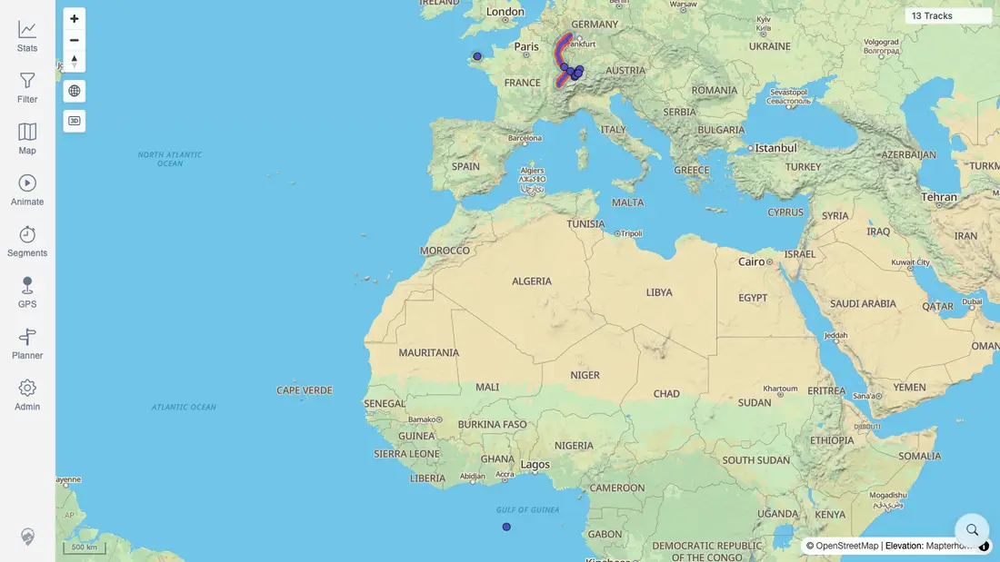
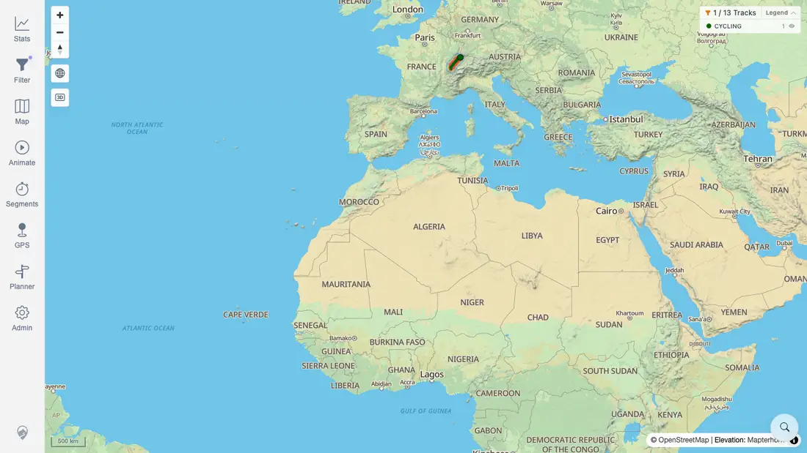

# Packet: HMO_03

## Scope

- Coverage source: `documentation/testing/frontend-regression-test-plan.md`
- Coverage ID or run packet: HMO_03
- In scope: Heatmap behavior after changing an active filter.
- Out of scope: General filter parameter coverage, already covered by FLT IDs.

## Prerequisites

- Required previous coverage IDs or run packets: HMO_02 PASS.
- Required app/data state: Quick-install beta stack running with imported GPS tracks.
- Required browser context: Fresh authenticated desktop context.

## Allowed Mutations

- Allowed: Toggle Heatmap, enable a temporary keyword filter, capture screenshot/text evidence, update packet/run-state.
- Not allowed: Change server data.

## Actions And Results

| Coverage ID | Action | Expected result | Actual result | Status | Evidence |
|---|---|---|---|---|---|
| HMO_03 | Enabled Heatmap, captured the all-track map, enabled filtering, selected `Activities by keyword`, entered keyword `Jura`, then returned to the map and verified the filtered heatmap-enabled state. | After changing filters, the heatmap updates accordingly. | PASS: baseline map showed `13 Tracks` with `heatmapVisible:true`; the `Jura` keyword filter changed the filter page to `1 / 13 Tracks`; returning to the map still showed `1 / 13 Tracks` with `heatmapVisible:true`. Before/after screenshots differed by 9,826 pixels, confirming the visible map state changed with the filter. | PASS | [assets/HMO_03-heatmap-before-filter.webp](../assets/HMO_03-heatmap-before-filter.webp); [assets/HMO_03-heatmap-after-filter.webp](../assets/HMO_03-heatmap-after-filter.webp); [assets/HMO_03-heatmap-filter-update.txt](../assets/HMO_03-heatmap-filter-update.txt) |

## Issues

| ID | Severity | Summary | Reproduction | Expected | Actual | Evidence | Release impact |
|---|---|---|---|---|---|---|---|

## Evidence Files

| File | Purpose |
|---|---|
| [assets/HMO_03-heatmap-before-filter.webp](../assets/HMO_03-heatmap-before-filter.webp) | Heatmap-enabled baseline map before applying the keyword filter. |
| [assets/HMO_03-heatmap-after-filter.webp](../assets/HMO_03-heatmap-after-filter.webp) | Heatmap-enabled map after applying keyword `Jura`. |
| [assets/HMO_03-heatmap-filter-update.txt](../assets/HMO_03-heatmap-filter-update.txt) | Count transition, heatmap settings persistence, assertions, and screenshot diff metric. |

## Screenshot Evidence

## Timings

| Step | Timing |
|---|---:|
| Heatmap filter update check | <1 min |

## Handoff Notes

- Completed: HMO_03 PASS.
- Remaining unfinished coverage: GPS_01 onward.
- Blocked or not applicable: none.
- State left for the next packet: Browser context closed; no server data changed.
