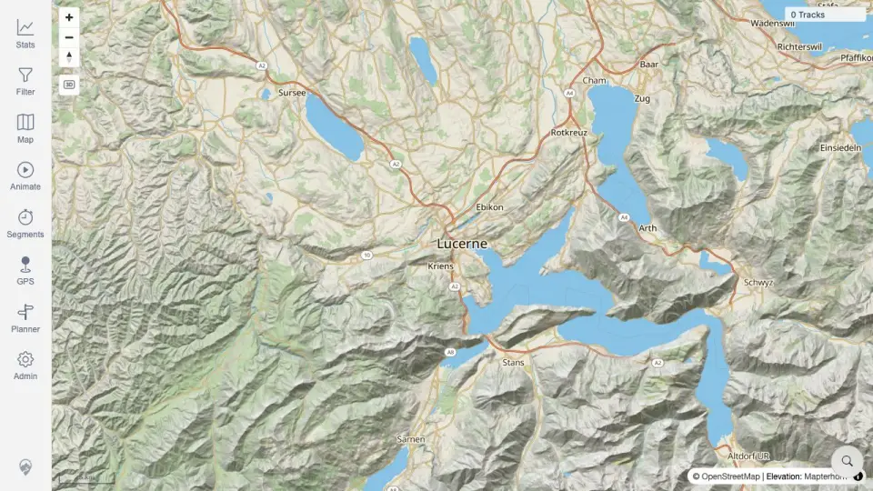
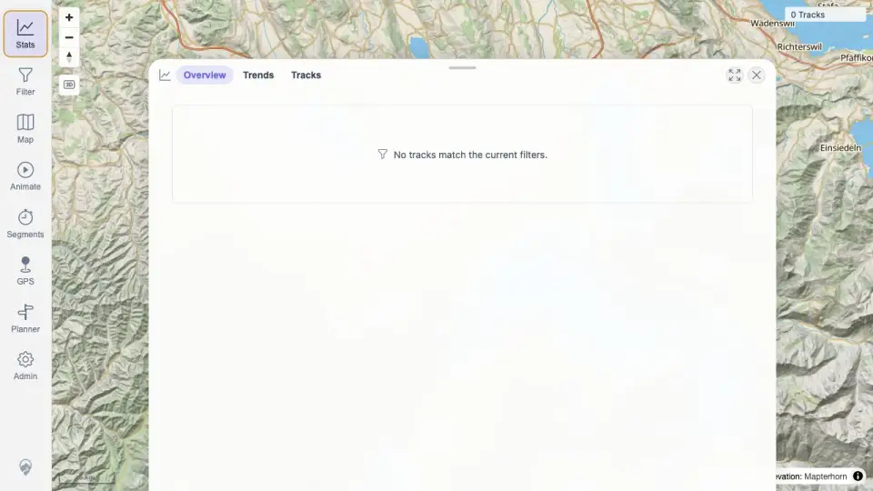
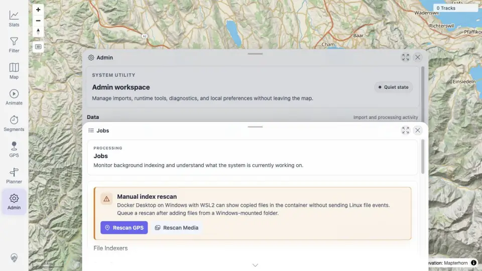

# Packet: IMP_01

## Scope

- Coverage source: `documentation/testing/frontend-regression-test-plan.md`
- Coverage ID or run packet: IMP_01
- In scope: Baseline map count, track-browser/API count, statistics empty state, data freshness token, and GPS/indexer/background job state before import.
- Out of scope: Importing files or verifying imported tracks.

## Prerequisites

- Required previous coverage IDs or run packets: DAT_07.
- Required app/data state: Fresh quick-install stack with no imported tracks; staged files still outside watched import folder.
- Required browser context: Signed-in desktop browser context.

## Allowed Mutations

- Allowed: Sign in, open map/stats/admin views, call read-only APIs.
- Not allowed: Place files in the watched import folder.

## Actions And Results

| Coverage ID | Action | Expected result | Actual result | Status | Evidence |
|---|---|---|---|---|---|
| IMP_01 | Signed into the app, captured empty map/stats/Admin Jobs, and queried track list, simplified tracks, statistics overview, data freshness, indexer status, jobs, and map config APIs. | Baseline map count, track-browser count, statistics totals, data-freshness token, and GPS indexer status are recorded before import. | Map shows `0 Tracks`; API track count and simplified filtered count are 0; Stats shows no tracks; overview summary has trackCount 0, distance 0, duration 0; freshness token includes `tracks:0` and `track_geometry:0`; indexer status is empty; jobs are idle/done at 0/0. | PASS | [assets/IMP_01-baseline-api.txt](../assets/IMP_01-baseline-api.txt); [assets/IMP_01-empty-map.webp](../assets/IMP_01-empty-map.webp); [assets/IMP_01-empty-stats.webp](../assets/IMP_01-empty-stats.webp); [assets/IMP_01-admin-jobs.webp](../assets/IMP_01-admin-jobs.webp) |

## Issues

| ID | Severity | Summary | Reproduction | Expected | Actual | Evidence | Release impact |
|---|---|---|---|---|---|---|---|

## Evidence Files

| File | Purpose |
|---|---|
| [assets/IMP_01-baseline-api.txt](../assets/IMP_01-baseline-api.txt) | Read-only baseline API counts, freshness token, indexer/jobs, and map config summary. |
| [assets/IMP_01-empty-map.webp](../assets/IMP_01-empty-map.webp) | Empty signed-in map with `0 Tracks`. |
| [assets/IMP_01-empty-stats.webp](../assets/IMP_01-empty-stats.webp) | Empty statistics view. |
| [assets/IMP_01-admin-jobs.webp](../assets/IMP_01-admin-jobs.webp) | Admin Jobs baseline readiness. |

## Screenshot Evidence

## Timings

| Step | Timing |
|---|---:|
| Browser login, screenshots, API probes | ~3 min |

## Handoff Notes

- Completed: Baseline count/freshness/indexer/job evidence captured.
- Remaining unfinished coverage: IMP_02 onward; DAT_03 still needs imported ID/name mapping after IMP_06.
- Blocked or not applicable: none.
- State left for the next packet: App remains signed in in the browser; import folder is still empty.
