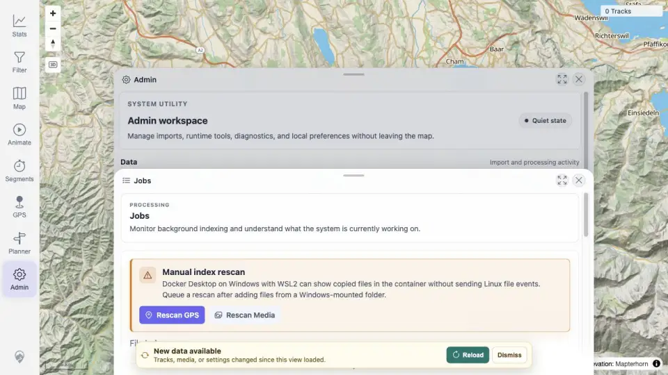

# Packet: IMP_04

## Scope

- Coverage source: `documentation/testing/frontend-regression-test-plan.md`
- Coverage ID or run packet: IMP_04
- In scope: Upload/index status, no unexpected GPS failures, data freshness change, and background job settlement after five-GPX import.
- Out of scope: Fresh client reload and per-track UI verification.

## Prerequisites

- Required previous coverage IDs or run packets: IMP_03.
- Required app/data state: Five public GPX files indexed.
- Required browser context: authenticated desktop Admin context.

## Allowed Mutations

- Allowed: Open Admin Jobs/Freshness-related UI and query read-only status APIs.
- Not allowed: Add, delete, or rescan files.

## Actions And Results

| Coverage ID | Action | Expected result | Actual result | Status | Evidence |
|---|---|---|---|---|---|
| IMP_04 | Captured Admin Jobs after import and freshness-banner evidence, using API monitor data for the completed counts. | All five source files reach completed state, no unexpected GPS index failures appear, data freshness changes, and Duplicate Finder/Exploration Score jobs settle. | GPS indexer reached 5 total / 5 completed / 0 failed; Duplicate Finder, Activity Classifier, and Exploration Score reached 5 total and 100%; freshness token changed from baseline `tracks:0` to imported revisions; UI showed `New data available` with Reload/Dismiss. | PASS | [assets/IMP_03-index-monitor.txt](../assets/IMP_03-index-monitor.txt); [assets/IMP_04-jobs-after-import.webp](../assets/IMP_04-jobs-after-import.webp); [assets/IMP_04-freshness-out-of-sync.webp](../assets/IMP_04-freshness-out-of-sync.webp) |

## Issues

| ID | Severity | Summary | Reproduction | Expected | Actual | Evidence | Release impact |
|---|---|---|---|---|---|---|---|

## Evidence Files

| File | Purpose |
|---|---|
| [assets/IMP_03-index-monitor.txt](../assets/IMP_03-index-monitor.txt) | API monitor with completed indexer and settled job counts. |
| [assets/IMP_04-jobs-after-import.webp](../assets/IMP_04-jobs-after-import.webp) | Admin Jobs after import. |
| [assets/IMP_04-freshness-out-of-sync.webp](../assets/IMP_04-freshness-out-of-sync.webp) | Freshness banner after import before client reload. |

## Screenshot Evidence

## Timings

| Step | Timing |
|---|---:|
| Admin/freshness UI capture | <1 min |

## Handoff Notes

- Completed: IMP_04.
- Remaining unfinished coverage: IMP_05 onward; DAT_03 imported mapping pending IMP_06.
- Blocked or not applicable: none.
- State left for the next packet: client is stale with freshness banner visible; server-side imported dataset has five tracks.
