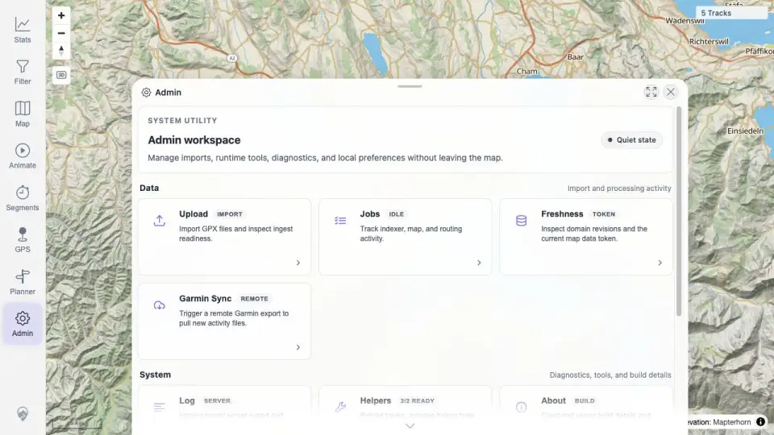
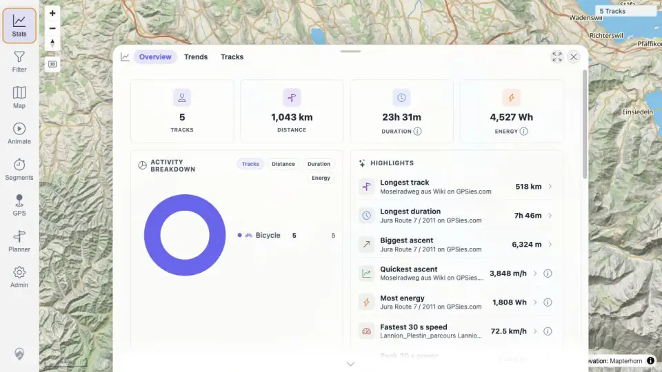
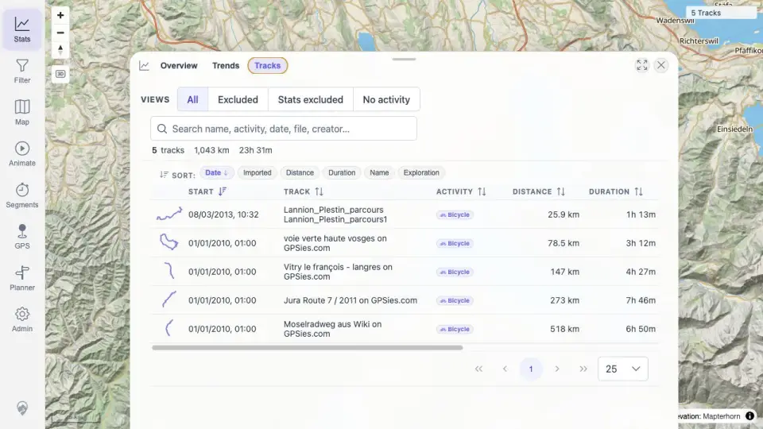
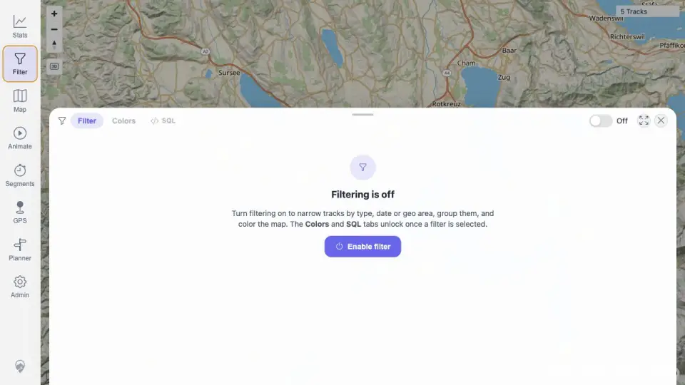

# Packet: IMP_05

## Scope

- Coverage source: `documentation/testing/frontend-regression-test-plan.md`
- Coverage ID or run packet: IMP_05
- In scope: Reload from the freshness banner/helper reload action and verify map, track browser, filters, and statistics show the new data.
- Out of scope: Per-file search/map/detail checks handled by later IMP rows.

## Prerequisites

- Required previous coverage IDs or run packets: IMP_04.
- Required app/data state: Freshness banner visible after five-GPX import; server-side dataset has five tracks.
- Required browser context: authenticated desktop browser context.

## Allowed Mutations

- Allowed: Click freshness banner Reload; navigate among map/stats/filter views.
- Not allowed: Add/delete files or perform workaround reload before testing the banner action.

## Actions And Results

| Coverage ID | Action | Expected result | Actual result | Status | Evidence |
|---|---|---|---|---|---|
| IMP_05 | Clicked the visible `New data available` banner Reload action, then checked refreshed map count, Stats overview, Stats Tracks browser, Filter panel, and API counts. | Reload action refreshes cached client data so map, track browser, filters, and statistics all show the five imported GPX tracks. | Banner Reload refreshed the client: map changed to `5 Tracks`; Stats overview showed 5 tracks / 1,043 km / 23h 31m; Stats Tracks table listed the imported tracks; Filter panel opened over a 5-track map; API showed 5 tracks, 5 simplified tracks, and stats summary trackCount 5. | PASS | [assets/IMP_05-refresh-surfaces.txt](../assets/IMP_05-refresh-surfaces.txt); [assets/IMP_05-after-banner-reload.webp](../assets/IMP_05-after-banner-reload.webp); [assets/IMP_05-map-after-reload.webp](../assets/IMP_05-map-after-reload.webp); [assets/IMP_05-stats-after-reload.webp](../assets/IMP_05-stats-after-reload.webp); [assets/IMP_05-browser-after-reload.webp](../assets/IMP_05-browser-after-reload.webp); [assets/IMP_05-filter-after-reload.webp](../assets/IMP_05-filter-after-reload.webp) |

## Issues

| ID | Severity | Summary | Reproduction | Expected | Actual | Evidence | Release impact |
|---|---|---|---|---|---|---|---|

## Evidence Files

| File | Purpose |
|---|---|
| [assets/IMP_05-refresh-surfaces.txt](../assets/IMP_05-refresh-surfaces.txt) | API/UI summary after freshness reload. |
| [assets/IMP_05-after-banner-reload.webp](../assets/IMP_05-after-banner-reload.webp) | Immediate state after banner Reload. |
| [assets/IMP_05-map-after-reload.webp](../assets/IMP_05-map-after-reload.webp) | Refreshed map count. |
| [assets/IMP_05-stats-after-reload.webp](../assets/IMP_05-stats-after-reload.webp) | Refreshed Stats overview. |
| [assets/IMP_05-browser-after-reload.webp](../assets/IMP_05-browser-after-reload.webp) | Refreshed Stats Tracks browser. |
| [assets/IMP_05-filter-after-reload.webp](../assets/IMP_05-filter-after-reload.webp) | Refreshed Filter panel over 5-track map. |

## Screenshot Evidence

## Timings

| Step | Timing |
|---|---:|
| Banner reload and surface checks | ~3 min |

## Handoff Notes

- Completed: IMP_05.
- Remaining unfinished coverage: IMP_06 onward; DAT_03 imported mapping pending IMP_06.
- Blocked or not applicable: none.
- State left for the next packet: refreshed client shows five imported GPX tracks.
