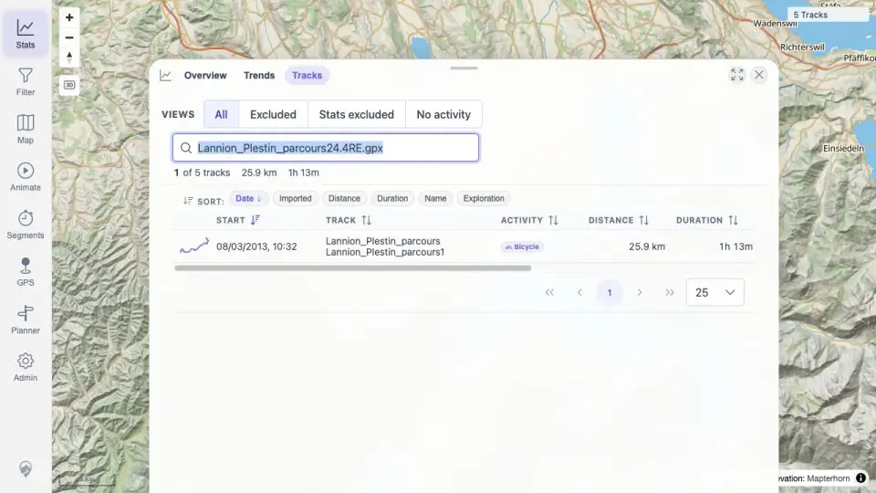

# Packet: IMP_06

## Scope

- Coverage source: `documentation/testing/frontend-regression-test-plan.md`
- Coverage ID or run packet: IMP_06
- In scope: Verify each imported public GPX file by name in track-browser search/listing, map-loaded dataset, statistics summaries, and at least one filter result.
- Out of scope: Map click/detail opening for each imported track; covered by IMP_07.

## Prerequisites

- Required previous coverage IDs or run packets: IMP_05.
- Required app/data state: Five GPX-backed tracks loaded in client after freshness reload.
- Required browser context: authenticated desktop browser context.

## Allowed Mutations

- Allowed: Read UI/API state, use the Stats Tracks search box, open filter/stats surfaces.
- Not allowed: Add/delete files.

## Actions And Results

| Coverage ID | Action | Expected result | Actual result | Status | Evidence |
|---|---|---|---|---|---|
| IMP_06 | Built imported source-file mapping from installed API, searched the Stats Tracks browser once per source filename, and compared map-loaded simplified dataset, Stats summary, and Filter-panel evidence. | Each imported file appears by name in track browser search, on the map, in statistics summaries, and in at least one filter result. | All five source files map to successful track IDs 100000-100004; each filename search returned its corresponding visible track row; simplified map/filter dataset is 5/5; Stats summary for imported IDs is trackCount 5; Filter panel opens over the 5-track map. | PASS | [assets/IMP_06-imported-track-mapping.txt](../assets/IMP_06-imported-track-mapping.txt); [assets/IMP_06-track-browser-search.webp](../assets/IMP_06-track-browser-search.webp); [assets/IMP_05-stats-after-reload.webp](../assets/IMP_05-stats-after-reload.webp); [assets/IMP_05-filter-after-reload.webp](../assets/IMP_05-filter-after-reload.webp) |

## Issues

| ID | Severity | Summary | Reproduction | Expected | Actual | Evidence | Release impact |
|---|---|---|---|---|---|---|---|

## Evidence Files

| File | Purpose |
|---|---|
| [assets/IMP_06-imported-track-mapping.txt](../assets/IMP_06-imported-track-mapping.txt) | File-to-track mapping, per-file browser-search rows, map/filter dataset count, and stats summary. |
| [assets/IMP_06-track-browser-search.webp](../assets/IMP_06-track-browser-search.webp) | Track browser after per-file search loop restored to all tracks. |
| [assets/IMP_05-stats-after-reload.webp](../assets/IMP_05-stats-after-reload.webp) | Stats overview after import. |
| [assets/IMP_05-filter-after-reload.webp](../assets/IMP_05-filter-after-reload.webp) | Filter surface over the five-track loaded dataset. |

## Screenshot Evidence

## Timings

| Step | Timing |
|---|---:|
| Mapping/search/surface verification | ~3 min |

## Handoff Notes

- Completed: IMP_06 and the imported ID/name portion needed to close DAT_03.
- Remaining unfinished coverage: IMP_07 onward.
- Blocked or not applicable: none.
- State left for the next packet: Five imported tracks loaded; browser is on the Stats Tracks tab.
