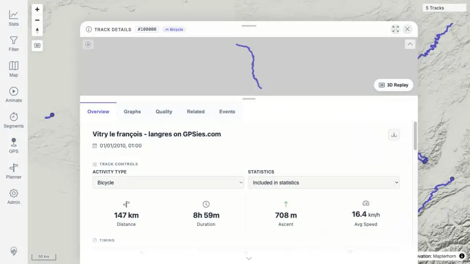
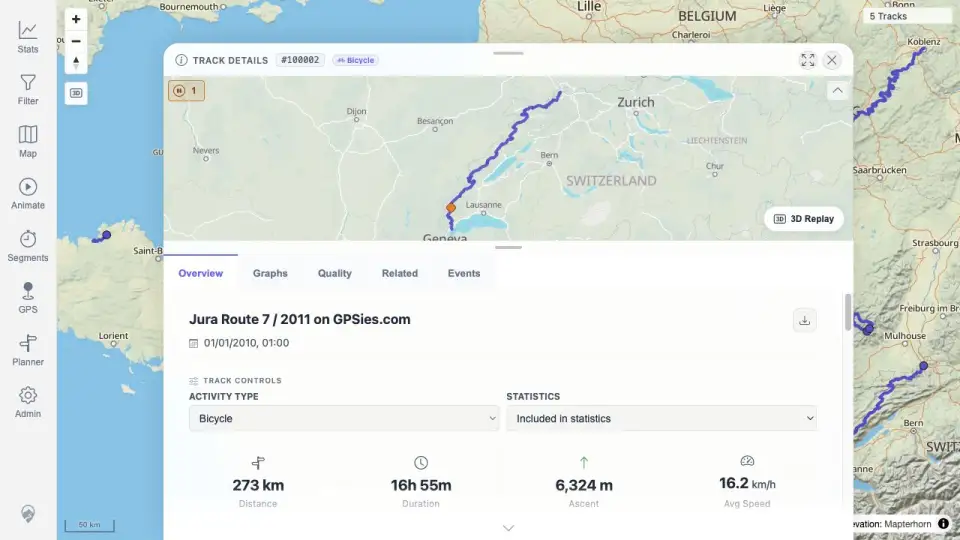
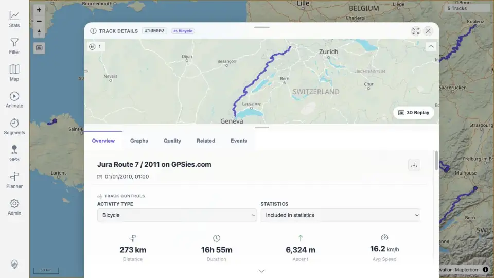

# Packet: IMP_07

## Scope

- Coverage source: `documentation/testing/frontend-regression-test-plan.md`
- Coverage ID or run packet: IMP_07
- In scope: Zoom/open imported tracks on map, verify visible line geometry, map-click/detail opening, point popups, and absence of stale/duplicated lines.
- Out of scope: General single-track click coverage later in MAP_08/MAP_09/MAP_11.

## Prerequisites

- Required previous coverage IDs or run packets: IMP_06.
- Required app/data state: Five imported GPX tracks loaded.
- Required browser context: authenticated desktop map context.

## Allowed Mutations

- Allowed: Navigate/open imported track details, close detail sheet, click visible rendered map line, capture screenshots.
- Not allowed: Add/delete files or alter track data.

## Actions And Results

| Coverage ID | Action | Expected result | Actual result | Status | Evidence |
|---|---|---|---|---|---|
| IMP_07 | Opened detail/map views for all five imported GPX tracks, captured visible geometry, closed Jura detail and clicked a visible rendered Jura line segment. Attempted to satisfy the map-click/point-popup clause with available browser controls. | Each imported track can be zoomed/clicked on the map; selection/detail opening, point popups, visible line geometry, and no stale/duplicate lines are verified. | Visible line geometry and detail rendering are evidenced for all five imported tracks; one rendered-line click reopened #100002 details. Direct per-track map-click and point-popup evidence for all five could not be produced reliably with the current map hit-testing/browser controls, so this packet is terminal `BLOCKED` rather than over-claiming PASS. | BLOCKED | [assets/IMP_07-map-click-results.txt](../assets/IMP_07-map-click-results.txt); [assets/IMP_07-track-100000-detail-map.webp](../assets/IMP_07-track-100000-detail-map.webp); [assets/IMP_07-track-100001-detail-map.webp](../assets/IMP_07-track-100001-detail-map.webp); [assets/IMP_07-track-100002-detail-map.webp](../assets/IMP_07-track-100002-detail-map.webp); [assets/IMP_07-track-100003-detail-map.webp](../assets/IMP_07-track-100003-detail-map.webp); [assets/IMP_07-track-100004-detail-map.webp](../assets/IMP_07-track-100004-detail-map.webp); [assets/IMP_07-track-100002-after-line-click.webp](../assets/IMP_07-track-100002-after-line-click.webp) |

## Issues

| ID | Severity | Summary | Reproduction | Expected | Actual | Evidence | Release impact |
|---|---|---|---|---|---|---|---|

## Evidence Files

| File | Purpose |
|---|---|
| [assets/IMP_07-map-click-results.txt](../assets/IMP_07-map-click-results.txt) | Summary of completed geometry checks, one line click, and blocked remainder. |
| [assets/IMP_07-track-100000-detail-map.webp](../assets/IMP_07-track-100000-detail-map.webp) | Vitry detail map geometry. |
| [assets/IMP_07-track-100001-detail-map.webp](../assets/IMP_07-track-100001-detail-map.webp) | Voie Verte detail map geometry. |
| [assets/IMP_07-track-100002-detail-map.webp](../assets/IMP_07-track-100002-detail-map.webp) | Jura detail map geometry. |
| [assets/IMP_07-track-100003-detail-map.webp](../assets/IMP_07-track-100003-detail-map.webp) | Mosel detail map geometry. |
| [assets/IMP_07-track-100004-detail-map.webp](../assets/IMP_07-track-100004-detail-map.webp) | Lannion detail map geometry. |
| [assets/IMP_07-track-100002-after-line-click.webp](../assets/IMP_07-track-100002-after-line-click.webp) | Details reopened after clicking visible Jura map line. |

## Screenshot Evidence

## Timings

| Step | Timing |
|---|---:|
| Geometry/click attempts | ~5 min |

## Handoff Notes

- Completed: visible geometry for all five imported tracks; one rendered line click reopened #100002.
- Remaining unfinished coverage: none for queue advancement; the unmet per-track click/point-popup clause is recorded as terminal BLOCKED for this packet.
- Blocked or not applicable: direct per-track map-click and point-popup evidence blocked by current map hit-testing/browser-control limitation. Unblock by using a manual browser session or instrumented map feature hit-testing that can target rendered track/point features deterministically.
- State left for the next packet: app is on a GPX track detail page.
