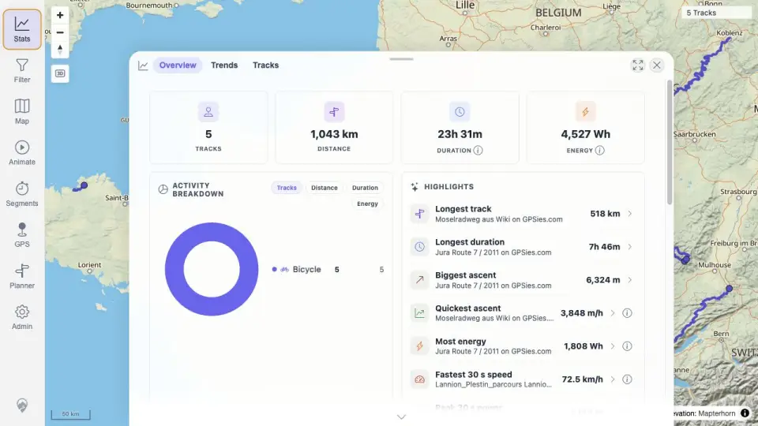
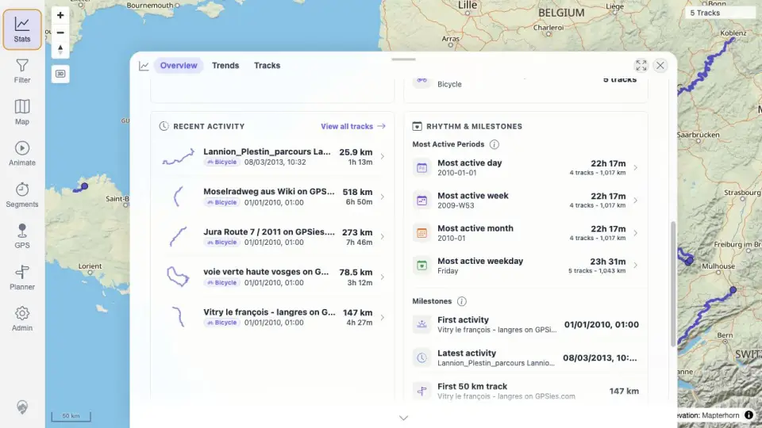
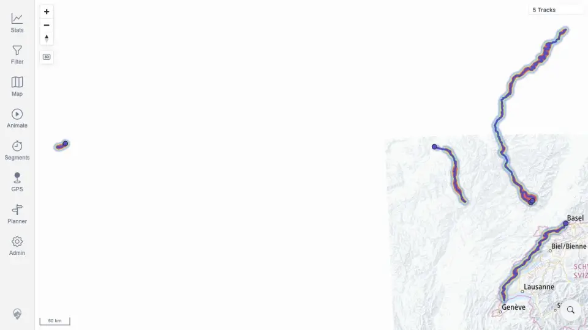

# Packet: IMP_09

## Scope

- Coverage source: `documentation/testing/frontend-regression-test-plan.md`
- Coverage ID or run packet: IMP_09
- In scope: Verify totals changed in the correct direction after five-GPX import: distance, duration, ascent/descent, activity breakdown, period charts, rankings, heatmap density, and track-browser summary.
- Out of scope: Deletion-driven total changes, covered by DEL/TBS/SYN rows.

## Prerequisites

- Required previous coverage IDs or run packets: IMP_08.
- Required app/data state: Five imported GPX tracks loaded.
- Required browser context: authenticated desktop browser context.

## Allowed Mutations

- Allowed: Open Stats, scroll statistics sections, open Maps/data and toggle heatmap for visual density evidence.
- Not allowed: Add/delete files or change track data.

## Actions And Results

| Coverage ID | Action | Expected result | Actual result | Status | Evidence |
|---|---|---|---|---|---|
| IMP_09 | Compared baseline to post-import API totals, opened Stats overview/lower period sections/Tracks browser, and toggled heatmap in Maps/data. | Totals change in the correct direction for distance, duration, ascent/descent, activity breakdown, period charts, rankings, heatmap density, and browser summary. | Baseline zero totals increased to 5 tracks, 1,042,712.01 m distance, 84,660 s moving duration, 12,936.09 m ascent, 13,086.28 m descent; activity breakdown is Bicycle 5; Stats overview/highlights/recent activity/periods/milestones are visible; track browser summary shows 5 tracks / 1,043 km / 23h 31m; heatmap density visibly draws over imported tracks. | PASS | [assets/IMP_09-post-import-totals.txt](../assets/IMP_09-post-import-totals.txt); [assets/IMP_09-stats-overview.webp](../assets/IMP_09-stats-overview.webp); [assets/IMP_09-stats-periods.webp](../assets/IMP_09-stats-periods.webp); [assets/IMP_05-browser-after-reload.webp](../assets/IMP_05-browser-after-reload.webp); [assets/IMP_09-heatmap-after-import.webp](../assets/IMP_09-heatmap-after-import.webp) |

## Issues

| ID | Severity | Summary | Reproduction | Expected | Actual | Evidence | Release impact |
|---|---|---|---|---|---|---|---|

## Evidence Files

| File | Purpose |
|---|---|
| [assets/IMP_09-post-import-totals.txt](../assets/IMP_09-post-import-totals.txt) | Baseline-to-post-import totals and API summaries. |
| [assets/IMP_09-stats-overview.webp](../assets/IMP_09-stats-overview.webp) | Stats overview with totals, activity breakdown, and rankings. |
| [assets/IMP_09-stats-periods.webp](../assets/IMP_09-stats-periods.webp) | Recent activity, active periods, and milestones section. |
| [assets/IMP_05-browser-after-reload.webp](../assets/IMP_05-browser-after-reload.webp) | Track-browser summary after import. |
| [assets/IMP_09-heatmap-after-import.webp](../assets/IMP_09-heatmap-after-import.webp) | Heatmap density over imported tracks. |

## Screenshot Evidence

## Timings

| Step | Timing |
|---|---:|
| Totals/statistics/heatmap verification | ~5 min |

## Handoff Notes

- Completed: IMP_09.
- Remaining unfinished coverage: DEL_01 onward.
- Blocked or not applicable: none.
- State left for the next packet: five GPX tracks imported; heatmap may be enabled in the current browser state.
