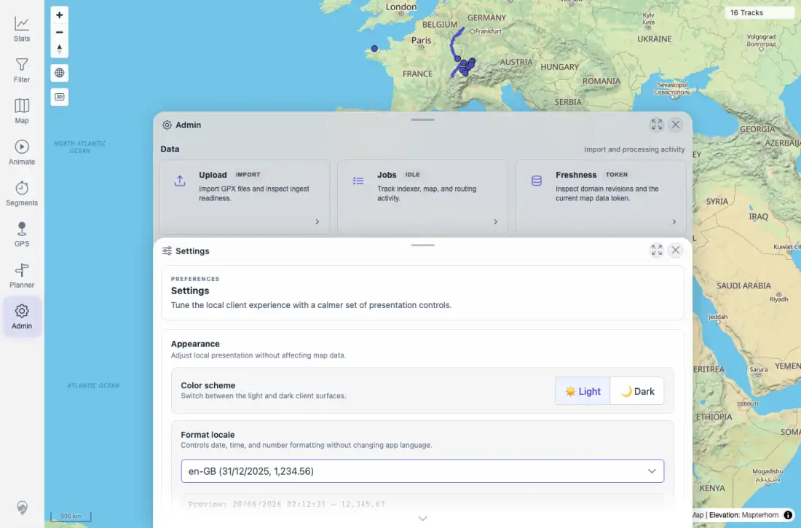
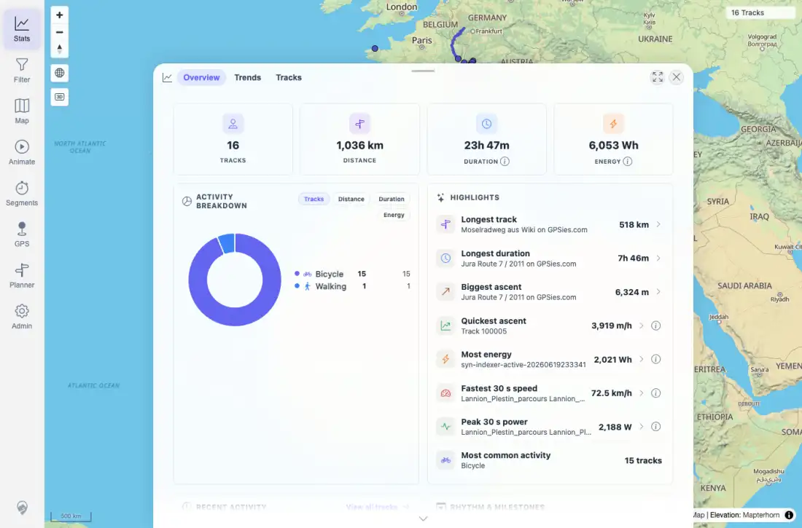
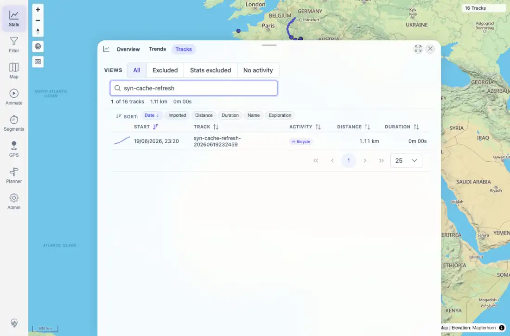

# Packet: LOC_01

## Scope

- Coverage source: `documentation/testing/frontend-regression-test-plan.md`
- Coverage ID or run packet: LOC_01
- In scope: Locale-aware numbers, distances, durations, and dates in Settings, Stats overview, and Stats > Tracks.
- Out of scope: Locale persistence and locale switching behavior, covered by LOC_02 and LOC_03.

## Prerequisites

- Required previous coverage IDs or run packets: APP_08.
- Required app/data state: Current beta stack with imported public, synthetic, FIT, and admin-upload tracks.
- Required browser context: Desktop Chromium context using `en-GB` browser locale and Europe/Zurich timezone.

## Allowed Mutations

- Allowed: Open Settings and Stats; set locale to `en-GB` if not already selected.
- Not allowed: Import, delete, or alter track data.

## Actions And Results

| Coverage ID | Action | Expected result | Actual result | Status | Evidence |
|---|---|---|---|---|---|
| LOC_01 | Opened Admin > Settings with `en-GB`, then opened Stats overview and Stats > Tracks search for `syn-cache-refresh`. | Numbers, distances, durations, and dates render in the expected `en-GB` locale format. | Settings preview showed `20/06/2026 ... 12,345.67`; Stats showed `1,036 km`, `6,053 Wh`, and dates like `20/06/2026, 02:00`; Tracks showed `1.11 km`, `0m 00s`, and `19/06/2026, 23:20`. | PASS | [assets/LOC-locale-results.txt](../assets/LOC-locale-results.txt); [assets/LOC_01-en-gb-settings.webp](../assets/LOC_01-en-gb-settings.webp); [assets/LOC_01-en-gb-stats.webp](../assets/LOC_01-en-gb-stats.webp); [assets/LOC_01-en-gb-tracks.webp](../assets/LOC_01-en-gb-tracks.webp) |

## Issues

| ID | Severity | Summary | Reproduction | Expected | Actual | Evidence | Release impact |
|---|---|---|---|---|---|---|---|

## Evidence Files

| File | Purpose |
|---|---|
| [assets/LOC-locale-results.txt](../assets/LOC-locale-results.txt) | Locale sweep text summary and exact sampled strings. |
| [assets/LOC_01-en-gb-settings.webp](../assets/LOC_01-en-gb-settings.webp) | Settings locale selector and preview in `en-GB`. |
| [assets/LOC_01-en-gb-stats.webp](../assets/LOC_01-en-gb-stats.webp) | Stats overview with `en-GB` formatted totals. |
| [assets/LOC_01-en-gb-tracks.webp](../assets/LOC_01-en-gb-tracks.webp) | Stats > Tracks search result with `en-GB` date and distance formatting. |

## Screenshot Evidence

## Timings

| Step | Timing |
|---|---:|
| Login/main map ready | 4.5 s |
| LOC_01 baseline capture | 14.1 s cumulative |

## Handoff Notes

- Completed: LOC_01 passed with direct Settings, Stats overview, and Tracks table evidence.
- Remaining unfinished coverage: LOC_02 onward at packet creation time.
- Blocked or not applicable: None.
- State left for the next packet: Locale switch testing continued in the same sweep; final state restored to `en-GB`.
