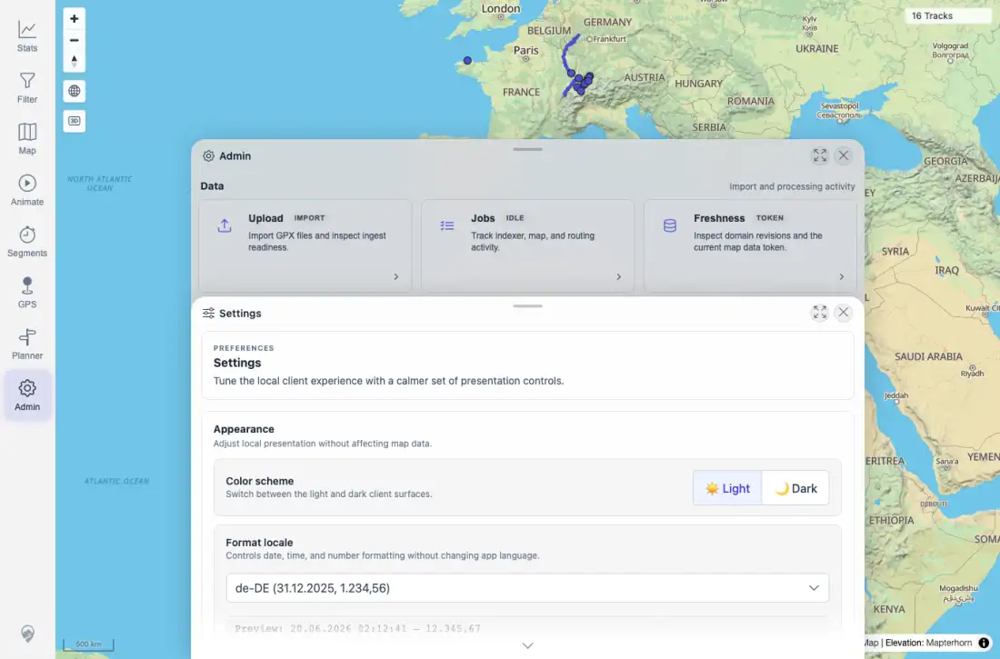
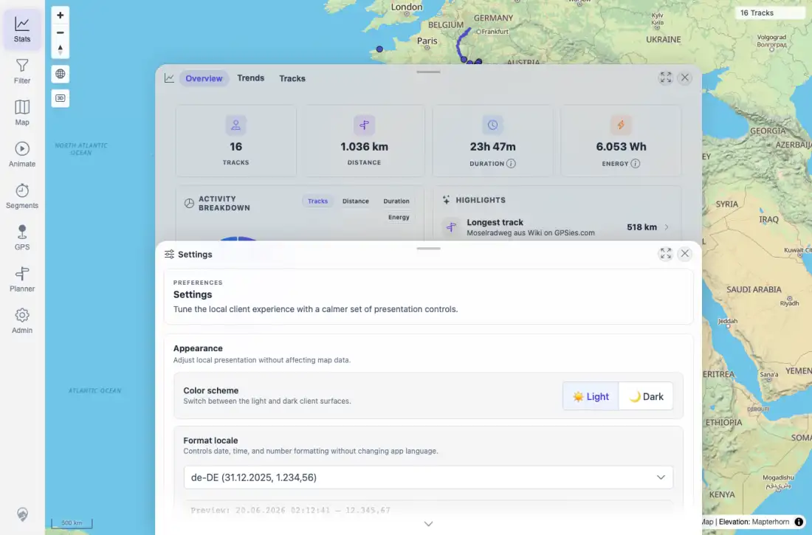
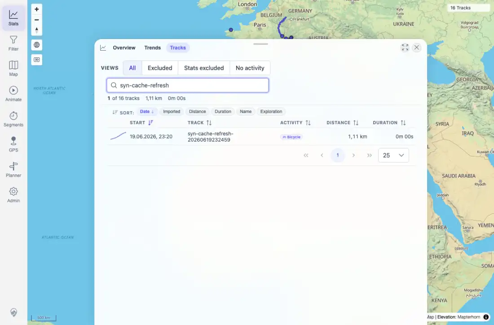

# Packet: LOC_02

## Scope

- Coverage source: `documentation/testing/frontend-regression-test-plan.md`
- Coverage ID or run packet: LOC_02
- In scope: Changing the user-selected format locale and checking immediate cross-app formatting updates.
- Out of scope: Persistence across reload, covered by LOC_03.

## Prerequisites

- Required previous coverage IDs or run packets: LOC_01.
- Required app/data state: `en-GB` baseline captured; app authenticated and map loaded.
- Required browser context: Desktop Chromium context.

## Allowed Mutations

- Allowed: Change local client format locale to `de-DE`, then restore after LOC packets.
- Not allowed: Import, delete, or alter track data.

## Actions And Results

| Coverage ID | Action | Expected result | Actual result | Status | Evidence |
|---|---|---|---|---|---|
| LOC_02 | Changed Admin > Settings format locale from `en-GB` to `de-DE`, then opened Stats overview and Stats > Tracks without reloading. | Formatting updates across the app without reload artifacts. | Settings preview changed to `20.06.2026 ... 12.345,67`; Stats updated to `1.036 km`, `6.053 Wh`, `72,5 km/h`; Tracks updated to `1,11 km`, `100,0%`, and `19.06.2026, 23:20`. URL stayed `/mtl/admin` during the setting change and no loading splash was observed. | PASS | [assets/LOC-locale-results.txt](../assets/LOC-locale-results.txt); [assets/LOC_02-de-de-settings.webp](../assets/LOC_02-de-de-settings.webp); [assets/LOC_02-de-de-stats.webp](../assets/LOC_02-de-de-stats.webp); [assets/LOC_02-de-de-tracks.webp](../assets/LOC_02-de-de-tracks.webp) |

## Issues

| ID | Severity | Summary | Reproduction | Expected | Actual | Evidence | Release impact |
|---|---|---|---|---|---|---|---|

## Evidence Files

| File | Purpose |
|---|---|
| [assets/LOC-locale-results.txt](../assets/LOC-locale-results.txt) | Locale switch text summary and sampled strings. |
| [assets/LOC_02-de-de-settings.webp](../assets/LOC_02-de-de-settings.webp) | `de-DE` Settings preview. |
| [assets/LOC_02-de-de-stats.webp](../assets/LOC_02-de-de-stats.webp) | Stats overview immediately after locale change. |
| [assets/LOC_02-de-de-tracks.webp](../assets/LOC_02-de-de-tracks.webp) | Tracks table immediately after locale change. |

## Screenshot Evidence

## Timings

| Step | Timing |
|---|---:|
| LOC_02 immediate locale switch capture | 24.3 s cumulative |

## Handoff Notes

- Completed: LOC_02 passed; format updates were visible without a reload.
- Remaining unfinished coverage: LOC_03 onward at packet creation time.
- Blocked or not applicable: None.
- State left for the next packet: Locale remained `de-DE` for reload persistence testing, then was restored to `en-GB` after LOC_04.
