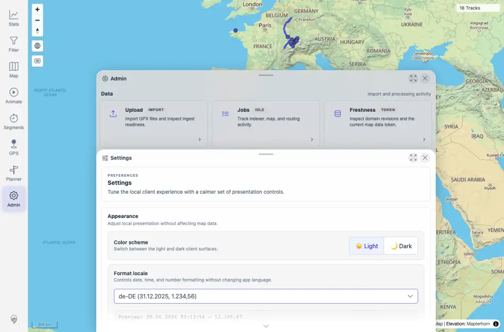
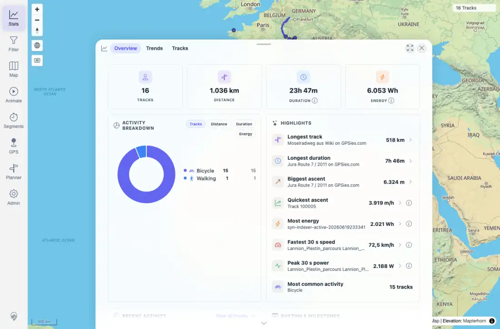

# Packet: LOC_03

## Scope

- Coverage source: `documentation/testing/frontend-regression-test-plan.md`
- Coverage ID or run packet: LOC_03
- In scope: User-selected format locale persistence after browser reload.
- Out of scope: Initial locale detection and immediate locale switching, covered by LOC_01 and LOC_02.

## Prerequisites

- Required previous coverage IDs or run packets: LOC_02.
- Required app/data state: Format locale set to `de-DE`.
- Required browser context: Desktop Chromium context.

## Allowed Mutations

- Allowed: Reload the app with `de-DE` selected, then restore locale after LOC packets.
- Not allowed: Import, delete, or alter track data.

## Actions And Results

| Coverage ID | Action | Expected result | Actual result | Status | Evidence |
|---|---|---|---|---|---|
| LOC_03 | Reloaded the app after selecting `de-DE`, reopened Settings, and checked Stats overview. | Selected locale persists and formatting remains consistent after reload. | Local storage still held `de-DE`; Settings combo showed `de-DE (31.12.2025, 1.234,56)` and preview `20.06.2026 ... 12.345,67`; reloaded Stats still showed `1.036 km`, `6.053 Wh`, and de-DE date/decimal formatting. | PASS | [assets/LOC-locale-results.txt](../assets/LOC-locale-results.txt); [assets/LOC_03-de-de-after-reload-settings.webp](../assets/LOC_03-de-de-after-reload-settings.webp); [assets/LOC_03-de-de-after-reload-stats.webp](../assets/LOC_03-de-de-after-reload-stats.webp) |

## Issues

| ID | Severity | Summary | Reproduction | Expected | Actual | Evidence | Release impact |
|---|---|---|---|---|---|---|---|

## Evidence Files

| File | Purpose |
|---|---|
| [assets/LOC-locale-results.txt](../assets/LOC-locale-results.txt) | Reload persistence text summary and sampled strings. |
| [assets/LOC_03-de-de-after-reload-settings.webp](../assets/LOC_03-de-de-after-reload-settings.webp) | Settings after reload still selected `de-DE`. |
| [assets/LOC_03-de-de-after-reload-stats.webp](../assets/LOC_03-de-de-after-reload-stats.webp) | Stats overview after reload still using `de-DE`. |

## Screenshot Evidence

## Timings

| Step | Timing |
|---|---:|
| LOC_03 reload persistence capture | 35.0 s cumulative |

## Handoff Notes

- Completed: LOC_03 passed; selected locale persisted through reload.
- Remaining unfinished coverage: LOC_04 at packet creation time.
- Blocked or not applicable: None.
- State left for the next packet: Locale remained `de-DE` for boundary formatting checks, then was restored to `en-GB` after LOC_04.
