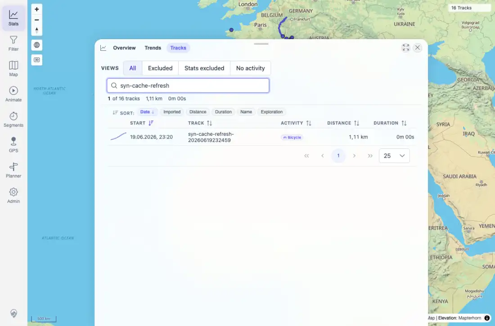
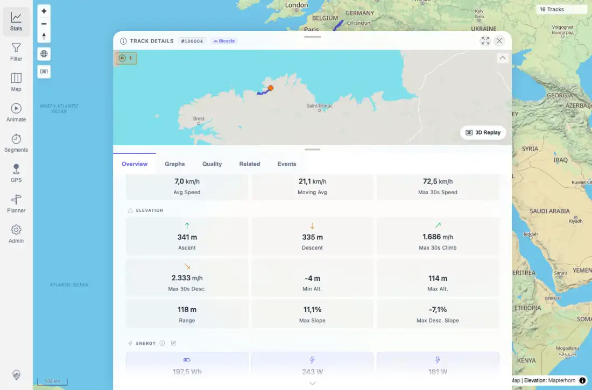

# Packet: LOC_04

## Scope

- Coverage source: `documentation/testing/frontend-regression-test-plan.md`
- Coverage ID or run packet: LOC_04
- In scope: Boundary formatting for zero/small values, large totals, negative values, and null-like API fields.
- Out of scope: Importing new boundary fixtures.

## Prerequisites

- Required previous coverage IDs or run packets: LOC_03.
- Required app/data state: Current indexed dataset from the full regression run.
- Required browser context: Desktop Chromium context with `de-DE` active during the boundary check.

## Allowed Mutations

- Allowed: Search tracks, open Track Details, inspect authenticated API data, and restore format locale to `en-GB`.
- Not allowed: Import, delete, or alter track data.

## Actions And Results

| Coverage ID | Action | Expected result | Actual result | Status | Evidence |
|---|---|---|---|---|---|
| LOC_04 | Checked Stats/Tracks samples for large totals and zero-duration rows, opened Lannion track details for negative elevation/slope values, scanned API fields for null-like values, and searched sampled UI text for bad formatting tokens. | Boundary values render sensibly, not as `NaN` or blank. | Large totals rendered as `1.036 km` / `6.053 Wh`; the synthetic row rendered `1,11 km` and `0m 00s`; Lannion rendered `-4 m` Min Alt. and `-7,1%` Max Desc. Slope; current tracks had no null min/max elevation, but null aggregate ascent/descent API fields did not leak as blank/NaN. Sample scan found no `NaN`, `undefined`, or `null` UI tokens. Locale was restored to `en-GB`. | PASS | [assets/LOC-locale-results.txt](../assets/LOC-locale-results.txt); [assets/LOC_04-zero-duration-row.webp](../assets/LOC_04-zero-duration-row.webp); [assets/LOC_04-lannion-negative-altitude.webp](../assets/LOC_04-lannion-negative-altitude.webp) |

## Issues

| ID | Severity | Summary | Reproduction | Expected | Actual | Evidence | Release impact |
|---|---|---|---|---|---|---|---|

## Evidence Files

| File | Purpose |
|---|---|
| [assets/LOC-locale-results.txt](../assets/LOC-locale-results.txt) | Boundary text summary, API facts, null-field scan, and cleanup state. |
| [assets/LOC_04-zero-duration-row.webp](../assets/LOC_04-zero-duration-row.webp) | Zero/small synthetic row in `de-DE` formatting. |
| [assets/LOC_04-lannion-negative-altitude.webp](../assets/LOC_04-lannion-negative-altitude.webp) | Lannion detail with negative min altitude and negative slope rendered sensibly. |

## Screenshot Evidence

## Timings

| Step | Timing |
|---|---:|
| LOC_04 boundary capture | 45.0 s cumulative |
| Locale restore | 48.6 s cumulative |

## Handoff Notes

- Completed: LOC_04 passed with available boundary-value evidence and null-field scan.
- Remaining unfinished coverage: MOB_01 onward.
- Blocked or not applicable: No current track had null min/max elevation; this was recorded as a dataset fact, not a blocker, because aggregate null fields and rendered UI were still checked.
- State left for the next packet: Format locale restored to `en-GB`; track data unchanged; app count remains 16 visible tracks with 17 authenticated tracks in API scan.
