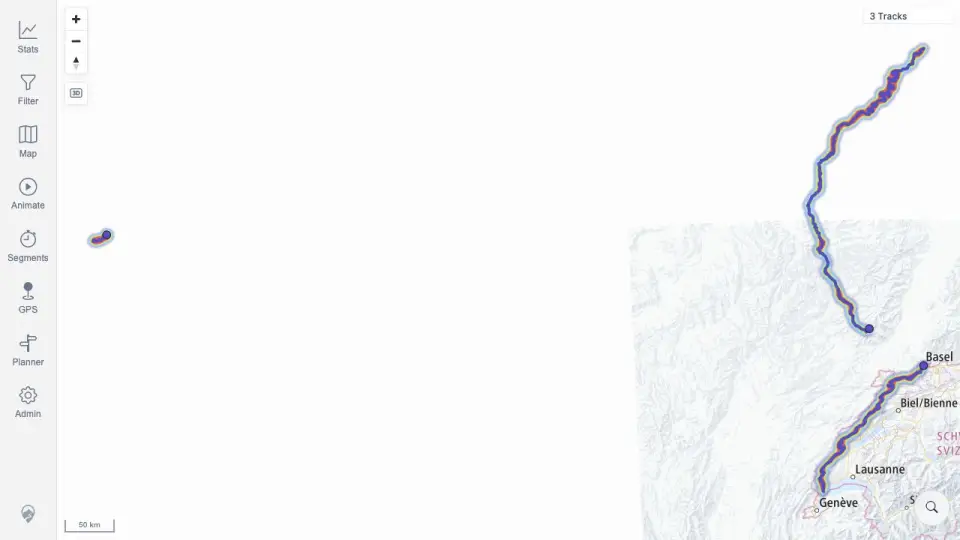

# Packet: MAP_04

## Scope

- Coverage source: `documentation/testing/frontend-regression-test-plan.md`
- Coverage ID or run packet: MAP_04
- In scope: Verify deleted tracks from the required data-change flow disappear from map sources, selection lists, and popups/user-facing surfaces.
- Out of scope: Deleting additional current files.

## Prerequisites

- Required previous coverage IDs or run packets: DEL_03.
- Required app/data state: Two GPX source files removed and delete processing settled.
- Required browser context: authenticated desktop browser context from deletion flow.

## Allowed Mutations

- Allowed: Reuse completed DEL_03 direct deletion evidence from this run.
- Not allowed: Delete more files or alter current 11-track post-format dataset.

## Actions And Results

| Coverage ID | Action | Expected result | Actual result | Status | Evidence |
|---|---|---|---|---|---|
| MAP_04 | Reused completed DEL_03 action: after deletion processing, checked map/heatmap, browser search, filter, stats, and related-track responses for deleted IDs 100000/100001. | Deleted tracks disappear from map sources, selection lists, and user-facing popup/detail surfaces. | Deleted tracks were absent: map/heatmap showed 3 Tracks at that stage, deleted name/file searches returned no rows, remaining searches worked, and related responses did not include deleted IDs. | PASS | [assets/DEL_03-deletion-surfaces.txt](../assets/DEL_03-deletion-surfaces.txt); [assets/DEL_03-map-after-delete.webp](../assets/DEL_03-map-after-delete.webp); [assets/DEL_03-browser-search-results.txt](../assets/DEL_03-browser-search-results.txt) |

## Issues

| ID | Severity | Summary | Reproduction | Expected | Actual | Evidence | Release impact |
|---|---|---|---|---|---|---|---|

## Evidence Files

| File | Purpose |
|---|---|
| [assets/DEL_03-deletion-surfaces.txt](../assets/DEL_03-deletion-surfaces.txt) | Deletion surface summary across map, heatmap, stats, filter, browser, and related responses. |
| [assets/DEL_03-browser-search-results.txt](../assets/DEL_03-browser-search-results.txt) | Deleted-vs-remaining browser search evidence. |
| [assets/DEL_03-map-after-delete.webp](../assets/DEL_03-map-after-delete.webp) | Map/heatmap after deletion. |

## Screenshot Evidence

## Timings

| Step | Timing |
|---|---:|
| Deleted-track map/surface verification | Covered in DEL_03 (~3 min) |

## Handoff Notes

- Completed: MAP_04.
- Remaining unfinished coverage: MAP_05 onward.
- Blocked or not applicable: none.
- State left for the next packet: Current dataset remains 11 tracks after later FIT/FMT imports; MAP_04 evidence comes from the earlier deletion flow packet.
