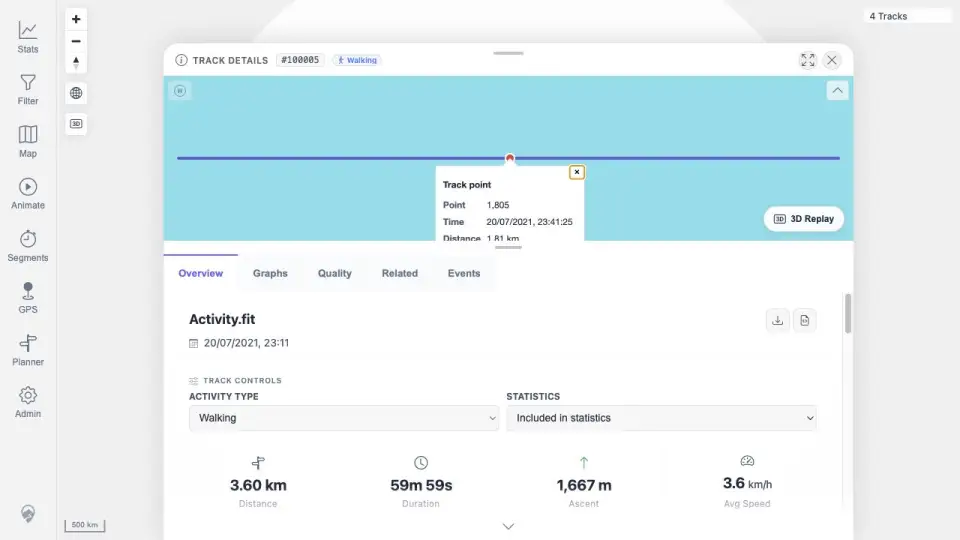

# Packet: MAP_11

## Scope

- Coverage source: `documentation/testing/frontend-regression-test-plan.md`
- Coverage ID or run packet: MAP_11
- In scope: Verify clicking a rendered track-point marker shows a popup with expected metrics.
- Out of scope: Connecting-line click popups unless they are clearly marker clicks.

## Prerequisites

- Required previous coverage IDs or run packets: MAP_07 and FIT_03.
- Required app/data state: Track Points & Direction available; a track with visible in-viewport point markers.
- Required browser context: desktop map tab with working marker hit targeting.

## Allowed Mutations

- Allowed: Use map/detail navigation and click point markers.
- Not allowed: Change data or server state.

## Actions And Results

| Coverage ID | Action | Expected result | Actual result | Status | Evidence |
|---|---|---|---|---|---|
| MAP_11 | Reviewed completed FIT_03 point-popup evidence and MAP_07 marker visibility attempt. | Clicking an actual direction-arrow/point marker opens a popup with time, speed, elevation, and related metrics. | FIT_03 proves popup content appears after a mini-map line click, but the required direct marker click could not be targeted or visually verified because marker rendering is inside the canvas and screenshot/canvas inspection is unavailable. | BLOCKED | [assets/MAP_11-point-marker-blocked.txt](../assets/MAP_11-point-marker-blocked.txt); [assets/FIT_03-detail-summary.txt](../assets/FIT_03-detail-summary.txt); [assets/FIT_03-point-popup.webp](../assets/FIT_03-point-popup.webp) |

## Issues

| ID | Severity | Summary | Reproduction | Expected | Actual | Evidence | Release impact |
|---|---|---|---|---|---|---|---|

## Evidence Files

| File | Purpose |
|---|---|
| [assets/MAP_11-point-marker-blocked.txt](../assets/MAP_11-point-marker-blocked.txt) | Marker-click blocking rationale and existing popup evidence summary. |
| [assets/FIT_03-detail-summary.txt](../assets/FIT_03-detail-summary.txt) | FIT popup/content evidence from completed packet. |
| [assets/FIT_03-point-popup.webp](../assets/FIT_03-point-popup.webp) | Existing point-popup screenshot after mini-map click. |

## Screenshot Evidence

## Timings

| Step | Timing |
|---|---:|
| Marker-click evidence review | <1 min |

## Handoff Notes

- Completed: MAP_11 as terminal BLOCKED.
- Remaining unfinished coverage: MAP_12 onward.
- Blocked or not applicable: Direct marker click requires working screenshot/canvas inspection or manual/instrumented map marker targeting.
- State left for the next packet: Dataset remains 14 API tracks / 13 visible simplified tracks after MAP_09 imports.
