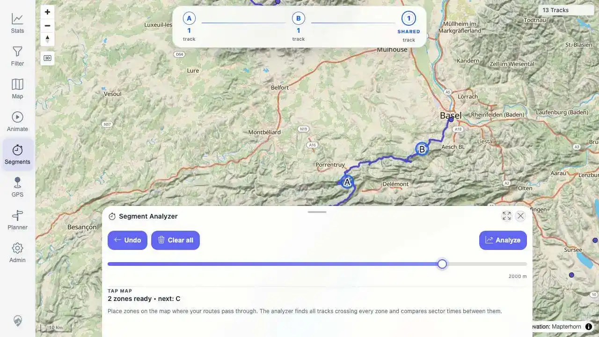
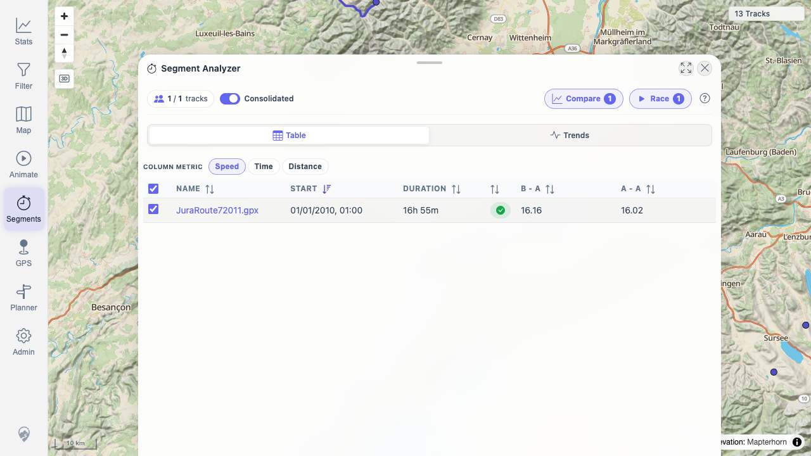

# Packet: MCT_01

## Scope

- Coverage source: `documentation/testing/frontend-regression-test-plan.md`
- Coverage ID or run packet: MCT_01
- In scope: Start Segment Analyzer, place measure zones, analyze crossing tracks, verify speed/time/distance result metrics.
- Out of scope: Opening result details, cleanup, and comparison charts covered by later MCT IDs.

## Prerequisites

- Required previous coverage IDs or run packets: Planner coverage through PLN_11
- Required app/data state: Imported/synthetic tracks visible on the map.
- Required browser context: Desktop isolated Playwright browser at `http://188.245.169.80:18080/mtl/segments`.

## Allowed Mutations

- Allowed: Activate Segment Analyzer, zoom map, place temporary measure zones, and analyze results.
- Not allowed: Delete tracks or mutate imported data.

## Actions And Results

| Coverage ID | Action | Expected result | Actual result | Status | Evidence |
|---|---|---|---|---|---|
| MCT_01 | Opened Segment Analyzer, retoggled it after map readiness, zoomed to a visible blue track, placed zones A and B on the track, clicked Analyze, and switched result metrics across speed/time/distance. | Result list of crossing tracks appears with speed, time, and distance metrics. | Zones A and B each found 1 track with 1 shared track; Analyze opened a result table with `1 / 1 tracks`, row `JuraRoute72011.gpx`, speed values `16.16 / 16.02`, time values `02:32:27 / 00:28:11`, and distance values `41,070 / 7,527`. | PASS | [assets/MCT_01-results.txt](../assets/MCT_01-results.txt); [assets/MCT_01-zones-placed-retry.webp](../assets/MCT_01-zones-placed-retry.webp); [assets/MCT_01-results-list.jpg](../assets/MCT_01-results-list.jpg); [assets/MCT_01-results-distance-metric.jpg](../assets/MCT_01-results-distance-metric.jpg) |

## Issues

| ID | Severity | Summary | Reproduction | Expected | Actual | Evidence | Release impact |
|---|---|---|---|---|---|---|---|

## Evidence Files

| File | Purpose |
|---|---|
| [assets/MCT_01-results.txt](../assets/MCT_01-results.txt) | Zone placement and result metric summary. |
| [assets/MCT_01-zones-placed-retry.webp](../assets/MCT_01-zones-placed-retry.webp) | Zones A/B placed with shared crossing count. |
| [assets/MCT_01-results-list.jpg](../assets/MCT_01-results-list.jpg) | Crossing result table with speed metric. |
| [assets/MCT_01-results-distance-metric.jpg](../assets/MCT_01-results-distance-metric.jpg) | Result table after switching metric to distance. |

## Screenshot Evidence

## Timings

| Step | Timing |
|---|---:|
| Zoom/activate/place zones | ~14 s |
| Analyze and switch metrics | ~3 s |

## Handoff Notes

- Completed: Segment Analyzer started, zones placed, crossing result table opened, and speed/time/distance metrics were verified.
- Remaining unfinished coverage: MCT_02 onward.
- Blocked or not applicable: None.
- State left for the next packet: Segment Analyzer results table remains open on the distance metric with row `JuraRoute72011.gpx`.
