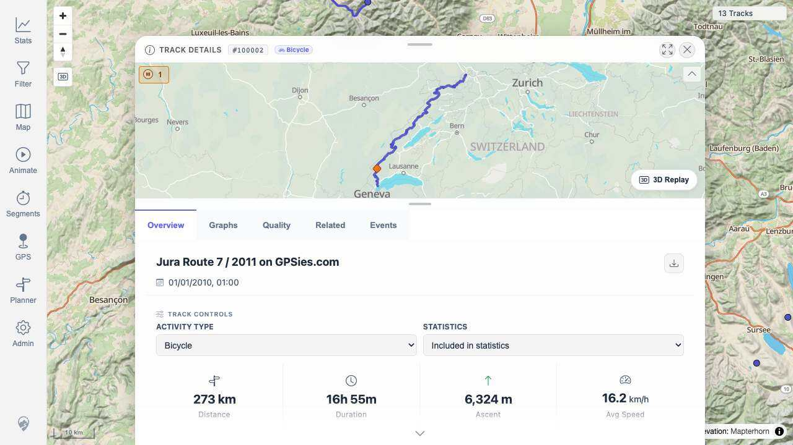

# Packet: MCT_02

## Scope

- Coverage source: `documentation/testing/frontend-regression-test-plan.md`
- Coverage ID or run packet: MCT_02
- In scope: Clicking a Segment Analyzer result opens the corresponding track details or segment view.
- Out of scope: Stopping/cleanup and comparison charts covered by later MCT IDs.

## Prerequisites

- Required previous coverage IDs or run packets: MCT_01
- Required app/data state: Segment Analyzer result table open with `JuraRoute72011.gpx` row.
- Required browser context: Desktop isolated Playwright browser at `http://188.245.169.80:18080/mtl/segments`.

## Allowed Mutations

- Allowed: Click the result row link and open track details.
- Not allowed: Modify track details.

## Actions And Results

| Coverage ID | Action | Expected result | Actual result | Status | Evidence |
|---|---|---|---|---|---|
| MCT_02 | Clicked the `JuraRoute72011.gpx` result link in the Segment Analyzer table. | Track details or segment detail view opens for the result track. | URL changed from `/mtl/segments` to `/mtl/track/100002`; Track Details sheet opened for `#100002` with `Jura Route 7 / 2011 on GPSies.com`, `273 km`, `16h 55m`, `6,324 m` ascent. | PASS | [assets/MCT_02-result-navigation.txt](../assets/MCT_02-result-navigation.txt); [assets/MCT_02-before-row-click.jpg](../assets/MCT_02-before-row-click.jpg); [assets/MCT_02-track-details-opened.jpg](../assets/MCT_02-track-details-opened.jpg) |

## Issues

| ID | Severity | Summary | Reproduction | Expected | Actual | Evidence | Release impact |
|---|---|---|---|---|---|---|---|

## Evidence Files

| File | Purpose |
|---|---|
| [assets/MCT_02-result-navigation.txt](../assets/MCT_02-result-navigation.txt) | Before/after URL and detail state. |
| [assets/MCT_02-before-row-click.jpg](../assets/MCT_02-before-row-click.jpg) | Segment Analyzer result table before clicking row. |
| [assets/MCT_02-track-details-opened.jpg](../assets/MCT_02-track-details-opened.jpg) | Track Details opened after row click. |

## Screenshot Evidence

## Timings

| Step | Timing |
|---|---:|
| Result link click to Track Details display | ~3.5 s |

## Handoff Notes

- Completed: Result link navigation opened Track Details for track `100002`.
- Remaining unfinished coverage: MCT_03 onward.
- Blocked or not applicable: None.
- State left for the next packet: Track Details and Segment Analyzer result sheets are open on `/mtl/track/100002`.
