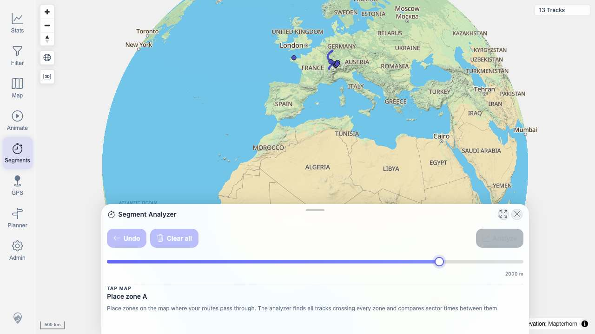
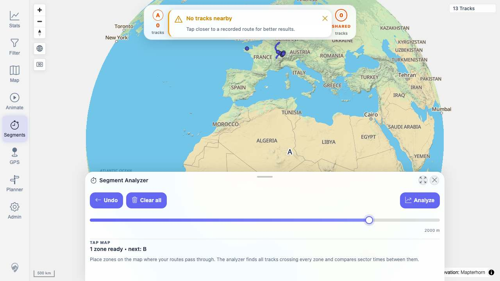
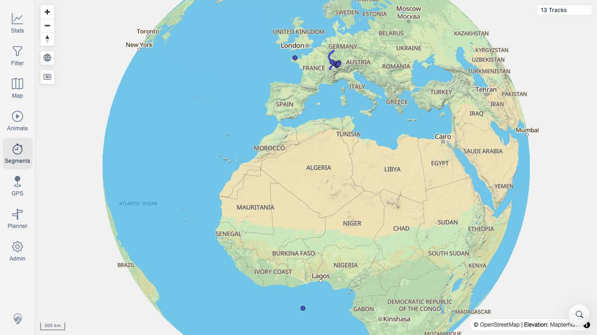
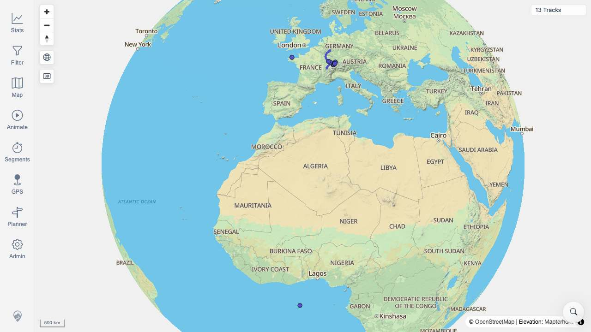

# Packet: MCT_03

## Scope

- Coverage source: `documentation/testing/frontend-regression-test-plan.md`
- Coverage ID or run packet: MCT_03
- In scope: Stop the Segment Analyzer measure tool and verify temporary UI markers/listeners are cleaned up.
- Out of scope: Result comparison charts and measured segment extraction covered by later MCT IDs.

## Prerequisites

- Required previous coverage IDs or run packets: MCT_01, MCT_02
- Required app/data state: Beta stack running with imported regression data and map available at `http://188.245.169.80:18080/mtl/`.
- Required browser context: Desktop Playwright Chrome context, authenticated as the local quick-start user.

## Allowed Mutations

- Allowed: Open/close Segment Analyzer and place temporary measure zones.
- Not allowed: Modify imported tracks or persisted application data.

## Actions And Results

| Coverage ID | Action | Expected result | Actual result | Status | Evidence |
|---|---|---|---|---|---|
| MCT_03 | Opened Segment Analyzer, placed one temporary zone on the map, toggled Segments off, then clicked the map again while the tool was stopped. | Temporary measure markers/overlay disappear, Segments is no longer active, and subsequent map clicks do not add new measure markers/listener effects. | Zone A created an active `.measure-map-overlay` and enabled Undo/Clear/Analyze. After toggling Segments off, the visible Segment Analyzer sheet count went to zero, overlay count went to zero, Segments was no longer active, and a post-stop map click did not recreate the overlay or sheet. | PASS | [assets/MCT_03-cleanup-results.txt](../assets/MCT_03-cleanup-results.txt); [assets/MCT_03-zone-a-active.jpg](../assets/MCT_03-zone-a-active.jpg); [assets/MCT_03-stopped-clean.jpg](../assets/MCT_03-stopped-clean.jpg); [assets/MCT_03-post-stop-map-click.jpg](../assets/MCT_03-post-stop-map-click.jpg) |

## Issues

| ID | Severity | Summary | Reproduction | Expected | Actual | Evidence | Release impact |
|---|---|---|---|---|---|---|---|

## Evidence Files

| File | Purpose |
|---|---|
| [assets/MCT_03-cleanup-results.txt](../assets/MCT_03-cleanup-results.txt) | DOM state log for open, active zone, stop, and post-stop click checks. |
| [assets/MCT_03-segments-open-empty.jpg](../assets/MCT_03-segments-open-empty.jpg) | Segment Analyzer open before placing a zone. |
| [assets/MCT_03-zone-a-active.jpg](../assets/MCT_03-zone-a-active.jpg) | Temporary zone overlay visible while Segments is active. |
| [assets/MCT_03-stopped-clean.jpg](../assets/MCT_03-stopped-clean.jpg) | Tool stopped with no visible Segment Analyzer sheet/overlay. |
| [assets/MCT_03-post-stop-map-click.jpg](../assets/MCT_03-post-stop-map-click.jpg) | Post-stop map click did not recreate temporary measure UI. |

## Screenshot Evidence

## Timings

| Step | Timing |
|---|---:|
| Open Segment Analyzer | ~1.0 s |
| Place zone and wait for zone count | ~2.5 s |
| Stop tool and verify cleanup | ~1.0 s |
| Post-stop click verification | ~1.2 s |

## Handoff Notes

- Completed: Segment Analyzer stop cleanup verified.
- Remaining unfinished coverage: MCT_04 onward.
- Blocked or not applicable: None.
- State left for the next packet: Map is open at `/mtl/` with Segment Analyzer stopped and no temporary measure overlay visible.
