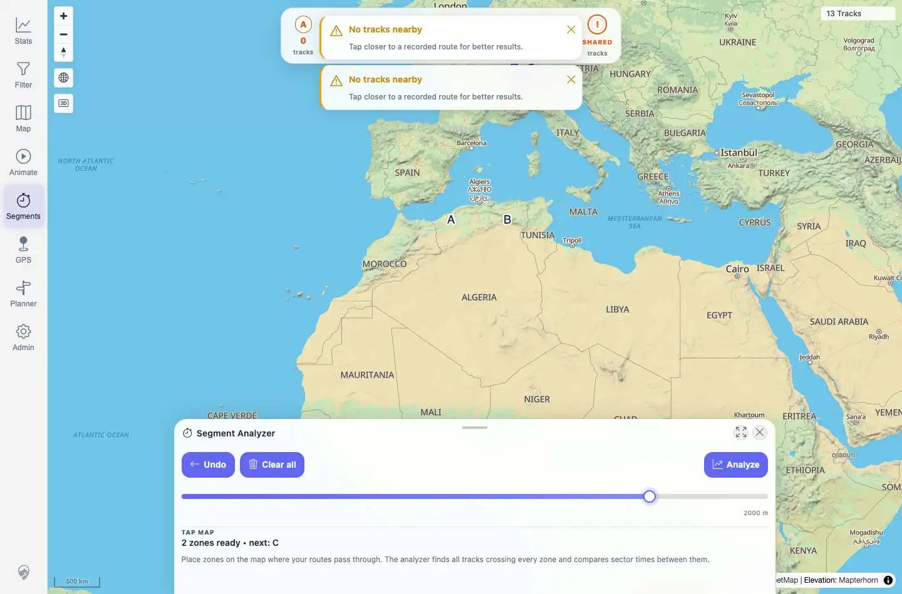
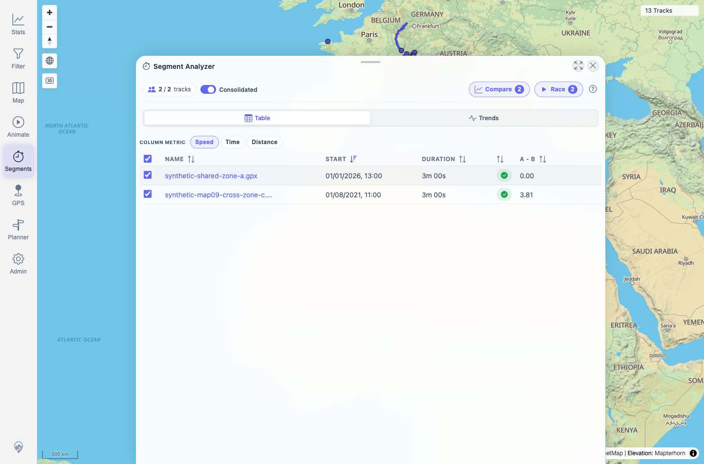
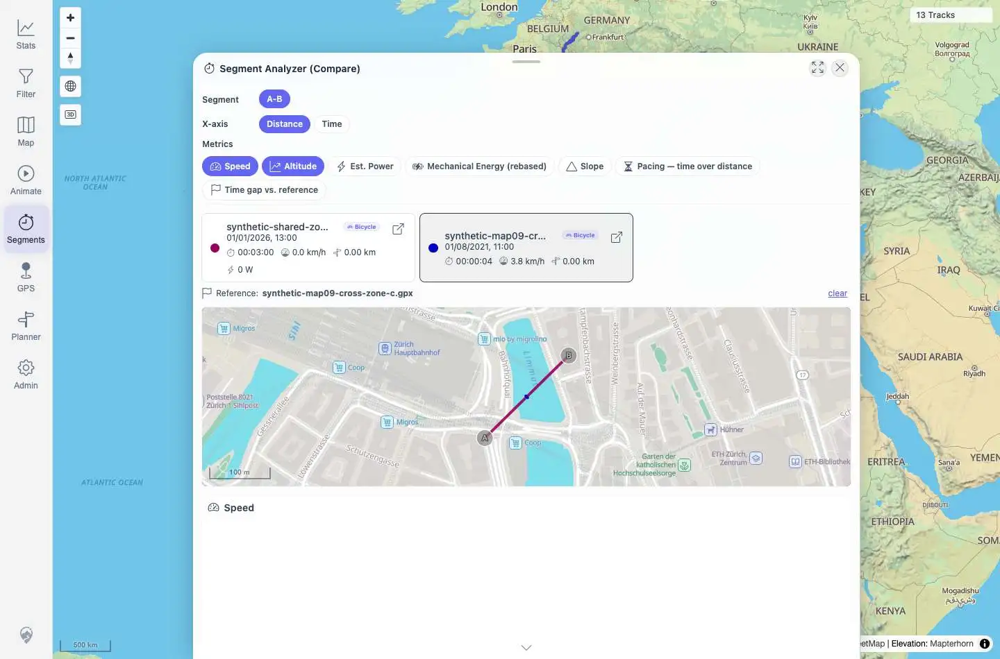

# Packet: MCT_04

## Scope

- Coverage source: `documentation/testing/frontend-regression-test-plan.md`
- Coverage ID or run packet: MCT_04
- In scope: Segment comparison with several selected tracks, comparison chart rendering, and comparison mini-map rendering/alignment with sparse segment data.
- Out of scope: Segment Analyzer result-list basics covered by MCT_01, result navigation by MCT_02, cleanup by MCT_03, sub-track extraction by MCT_05, and geometry regression bounds by MCT_06.

## Prerequisites

- Required previous coverage IDs or run packets: MCT_03
- Required app/data state: Synthetic shared-zone tracks from MAP_09 remain imported as visible unique tracks `100021` and `100023`.
- Required browser context: Desktop Playwright Chrome context, authenticated as the local quick-start user.

## Allowed Mutations

- Allowed: Open temporary Segment Analyzer zones, open the result table, select tracks, and open Compare.
- Not allowed: Modify imported track metadata or delete tracks.

## Actions And Results

| Coverage ID | Action | Expected result | Actual result | Status | Evidence |
|---|---|---|---|---|---|
| MCT_04 | Prevalidated the current backend response for Zurich trigger points A `8.5415,47.3768` and B `8.5433,47.3780` at `200 m`, route-fulfilled the UI Analyze request with that same response to avoid brittle main-map pixel targeting, then opened Compare for the selected result tracks. | Picking several tracks creates aligned comparison charts and a comparison map, even with sparse/missing segment metrics. | Backend returned two crossing tracks (`100021`, `100023`), `tracksPerZone A=2/B=2`, and one `A-B` segment with count `2`. The UI result table showed both rows, auto-selected `2 / 2` tracks, Compare opened with two racer cards, one `935x258` mini-map canvas, three Highcharts containers, live sub-track requests for both tracks, and no skipped/no-data placeholder. | PASS | [assets/MCT_04-compare-results.txt](../assets/MCT_04-compare-results.txt); [assets/MCT_04-zones-before-analyze.webp](../assets/MCT_04-zones-before-analyze.webp); [assets/MCT_04-results-table.jpg](../assets/MCT_04-results-table.jpg); [assets/MCT_04-compare-overlay.webp](../assets/MCT_04-compare-overlay.webp) |

## Issues

| ID | Severity | Summary | Reproduction | Expected | Actual | Evidence | Release impact |
|---|---|---|---|---|---|---|---|

## Evidence Files

| File | Purpose |
|---|---|
| [assets/MCT_04-compare-results.txt](../assets/MCT_04-compare-results.txt) | Backend response summary, UI result rows, Compare state, mini-map/chart counts, and sub-track requests. |
| [assets/MCT_04-zones-before-analyze.webp](../assets/MCT_04-zones-before-analyze.webp) | Temporary UI zones before Analyze. |
| [assets/MCT_04-results-table.jpg](../assets/MCT_04-results-table.jpg) | Two-track Segment Analyzer result table. |
| [assets/MCT_04-compare-overlay.webp](../assets/MCT_04-compare-overlay.webp) | Compare overlay with racer cards, mini-map, and charts. |

## Screenshot Evidence

## Timings

| Step | Timing |
|---|---:|
| Backend measure prevalidation | <1 s |
| UI zones to result table | ~4 s |
| Compare open and sub-track/chart render | ~11 s |

## Handoff Notes

- Completed: Segment Compare rendered for two selected synthetic tracks, with sparse segment metrics not blocking the mini-map or charts.
- Remaining unfinished coverage: MCT_05 onward.
- Blocked or not applicable: None.
- State left for the next packet: Segment Analyzer Compare overlay is open on `/mtl/segments`.
