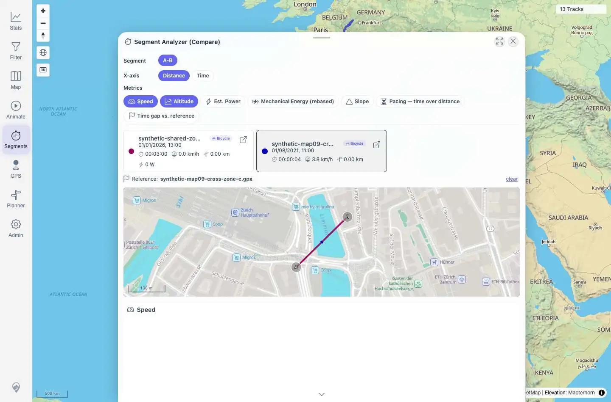

# Packet: MCT_06

## Scope

- Coverage source: `documentation/testing/frontend-regression-test-plan.md`
- Coverage ID or run packet: MCT_06
- In scope: Geometry sanity for the selected measured segment in Segment Compare.
- Out of scope: General Compare rendering covered by MCT_04 and sub-track extraction endpoint correctness covered by MCT_05.

## Prerequisites

- Required previous coverage IDs or run packets: MCT_04, MCT_05
- Required app/data state: Segment Analyzer Compare is open for the synthetic Zurich A-B segment.
- Required browser context: Authenticated desktop Playwright context.

## Allowed Mutations

- Allowed: Re-read sub-track slices and capture the open Compare mini-map.
- Not allowed: Modify imported tracks or persisted application data.

## Actions And Results

| Coverage ID | Action | Expected result | Actual result | Status | Evidence |
|---|---|---|---|---|---|
| MCT_06 | Re-fetched the A-B sub-track slices for tracks `100021` and `100023`, computed combined bounds/step sizes, and inspected the open Compare mini-map. | The comparison map line stays within the selected tracks' real local bounds, with no straight global line, `[0,0]` jump, or off-continent segment. | Combined bounds were local Zurich coordinates `lng 8.541500001454787..8.543299998442606`, `lat 47.37680000096986..47.377999998961734`. Both slices had at least two points, max step `0.0007211176159515061` degrees, zero `[0,0]`-like coordinates, zero off-continent/South-Africa-like coordinates, and the Compare mini-map canvas rendered at `935x258`. | PASS | [assets/MCT_06-geometry-sanity.txt](../assets/MCT_06-geometry-sanity.txt); [assets/MCT_06-compare-geometry.webp](../assets/MCT_06-compare-geometry.webp) |

## Issues

| ID | Severity | Summary | Reproduction | Expected | Actual | Evidence | Release impact |
|---|---|---|---|---|---|---|---|

## Evidence Files

| File | Purpose |
|---|---|
| [assets/MCT_06-geometry-sanity.txt](../assets/MCT_06-geometry-sanity.txt) | Combined bounds, per-track slice bounds, step sizes, and geometry assertions. |
| [assets/MCT_06-compare-geometry.webp](../assets/MCT_06-compare-geometry.webp) | Open Compare mini-map and charts for the measured A-B segment. |

## Screenshot Evidence

## Timings

| Step | Timing |
|---|---:|
| Geometry fetch and validation | <1 s |
| Screenshot capture/compression | <1 min |

## Handoff Notes

- Completed: Segment Compare geometry stayed in local Zurich bounds with no global/off-continent artifacts.
- Remaining unfinished coverage: AVR_01 onward.
- Blocked or not applicable: None.
- State left for the next packet: Segment Analyzer Compare overlay remains open on `/mtl/segments`.
