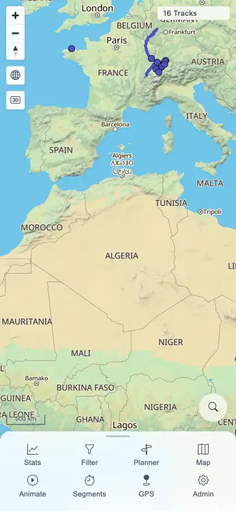

# Packet: MOB_01

## Scope

- Coverage source: `documentation/testing/frontend-regression-test-plan.md`
- Coverage ID or run packet: MOB_01
- In scope: Narrow mobile viewport with touch input enabled.
- Out of scope: Sheet dragging, responsive tables/charts, planner touch, and post-tool gestures covered by MOB_02 through MOB_05.

## Prerequisites

- Required previous coverage IDs or run packets: LOC_04.
- Required app/data state: Locale restored to `en-GB`; current beta stack running.
- Required browser context: Fresh Chromium mobile context, 390x844 viewport, `isMobile=true`, `hasTouch=true`, `deviceScaleFactor=2`.

## Allowed Mutations

- Allowed: Open a temporary mobile context and authenticate.
- Not allowed: Change server-side data.

## Actions And Results

| Coverage ID | Action | Expected result | Actual result | Status | Evidence |
|---|---|---|---|---|---|
| MOB_01 | Loaded MTL Explorer in a 390x844 touch-enabled context and inspected the initial map/nav state. | App uses mobile layout, touch context is active, and the map remains usable. | Viewport reported 390x844, DPR 2, `maxTouchPoints=1`; map canvas rendered with `16 Tracks`; mobile nav sheet showed Stats, Filter, Planner, Map, Animate, Segments, GPS, and Admin. | PASS | [assets/MOB-mobile-results.txt](../assets/MOB-mobile-results.txt); [assets/MOB_01-mobile-map.webp](../assets/MOB_01-mobile-map.webp) |

## Issues

| ID | Severity | Summary | Reproduction | Expected | Actual | Evidence | Release impact |
|---|---|---|---|---|---|---|---|

## Evidence Files

| File | Purpose |
|---|---|
| [assets/MOB-mobile-results.txt](../assets/MOB-mobile-results.txt) | Mobile sweep text summary. |
| [assets/MOB_01-mobile-map.webp](../assets/MOB_01-mobile-map.webp) | Initial mobile map and nav sheet. |

## Screenshot Evidence

## Timings

| Step | Timing |
|---|---:|
| Mobile map ready | 4.7 s |

## Handoff Notes

- Completed: MOB_01 passed.
- Remaining unfinished coverage: MOB_02 onward at packet creation time.
- Blocked or not applicable: None.
- State left for the next packet: Temporary mobile context continued into MOB_02 checks, then closed.
