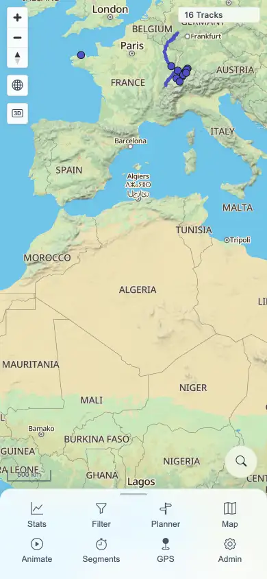
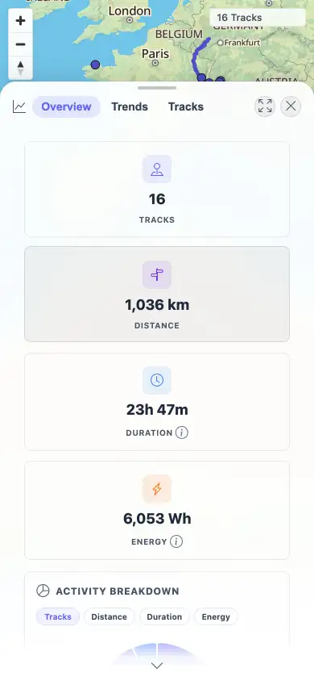

# Packet: MOB_02

## Scope

- Coverage source: `documentation/testing/frontend-regression-test-plan.md`
- Coverage ID or run packet: MOB_02
- In scope: Mobile navigation sheet collapse/expand and bottom sheet drag/snap/close behavior.
- Out of scope: Mobile chart/table usability and map gestures, covered by MOB_03 and MOB_05.

## Prerequisites

- Required previous coverage IDs or run packets: MOB_01.
- Required app/data state: Authenticated mobile context on the map.
- Required browser context: 390x844 touch-enabled context.

## Allowed Mutations

- Allowed: Drag/collapse/expand sheets and open/close Stats.
- Not allowed: Change server-side data.

## Actions And Results

| Coverage ID | Action | Expected result | Actual result | Status | Evidence |
|---|---|---|---|---|---|
| MOB_02 | Dragged the mobile navigation sheet down and reopened it, opened Stats, dragged the Stats bottom sheet upward, then closed it. | Bottom sheets and navigation sheet drag, snap, and close correctly. | Nav sheet height changed 132px -> 46px collapsed -> 132px expanded. Stats sheet changed from y/h 338/506 to y/h 101/743 after drag, then Close returned to `/mtl/` with zero active sheets and map still visible. | PASS | [assets/MOB-mobile-results.txt](../assets/MOB-mobile-results.txt); [assets/MOB_02-nav-expanded.webp](../assets/MOB_02-nav-expanded.webp); [assets/MOB_02-stats-dragged.webp](../assets/MOB_02-stats-dragged.webp); [assets/MOB_02-stats-closed.webp](../assets/MOB_02-stats-closed.webp) |

## Issues

| ID | Severity | Summary | Reproduction | Expected | Actual | Evidence | Release impact |
|---|---|---|---|---|---|---|---|

## Evidence Files

| File | Purpose |
|---|---|
| [assets/MOB-mobile-results.txt](../assets/MOB-mobile-results.txt) | Sheet dimensions and close state. |
| [assets/MOB_02-nav-expanded.webp](../assets/MOB_02-nav-expanded.webp) | Navigation sheet expanded after collapse/reopen. |
| [assets/MOB_02-stats-dragged.webp](../assets/MOB_02-stats-dragged.webp) | Stats bottom sheet after upward drag. |
| [assets/MOB_02-stats-closed.webp](../assets/MOB_02-stats-closed.webp) | Map after Stats sheet closed. |

## Screenshot Evidence

## Timings

| Step | Timing |
|---|---:|
| Sheet checks complete | 10.2 s cumulative |

## Handoff Notes

- Completed: MOB_02 passed.
- Remaining unfinished coverage: MOB_03 onward at packet creation time.
- Blocked or not applicable: None.
- State left for the next packet: Mobile context continued into MOB_03 checks, then closed.
