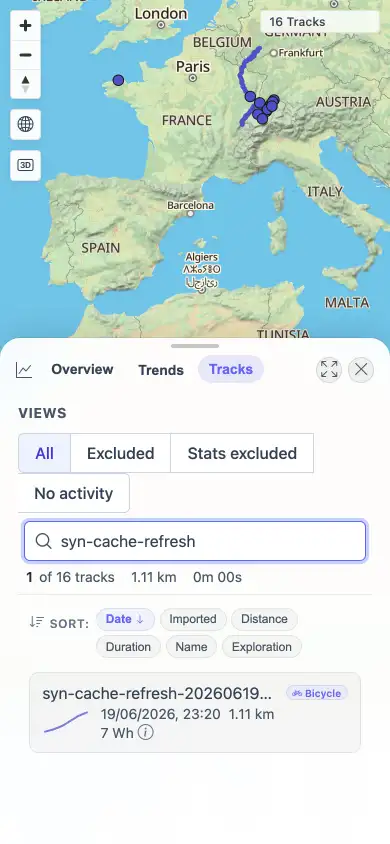
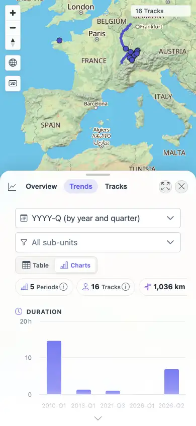

# Packet: MOB_03

## Scope

- Coverage source: `documentation/testing/frontend-regression-test-plan.md`
- Coverage ID or run packet: MOB_03
- In scope: Mobile tables/cards, charts, map controls, and visible text fit.
- Out of scope: Planner-specific touch behavior and post-tool gesture checks.

## Prerequisites

- Required previous coverage IDs or run packets: MOB_02.
- Required app/data state: Authenticated mobile context.
- Required browser context: 390x844 touch-enabled context.

## Allowed Mutations

- Allowed: Open Stats Tracks/Trends, search for a track, use map zoom controls.
- Not allowed: Change server-side data.

## Actions And Results

| Coverage ID | Action | Expected result | Actual result | Status | Evidence |
|---|---|---|---|---|---|
| MOB_03 | Opened Stats > Tracks on mobile and searched `syn-cache-refresh`, opened Stats > Trends charts, scanned for text overflow, then used map zoom controls after closing sheets. | Tables, charts, and map controls stay usable; no incoherent text overflow. | Tracks rendered a mobile card with date, distance, and energy; Trends rendered chart controls and 16 Highcharts/SVG chart nodes; zoom controls changed scale 500 km -> 300 km -> 500 km. Overflow scan found only expected ellipsis on the long synthetic track name and the intentionally horizontal Stats summary strip; screenshots showed no text escaping or overlap. | PASS | [assets/MOB-mobile-results.txt](../assets/MOB-mobile-results.txt); [assets/MOB_03-tracks-table.webp](../assets/MOB_03-tracks-table.webp); [assets/MOB_03-trends-charts.webp](../assets/MOB_03-trends-charts.webp) |

## Issues

| ID | Severity | Summary | Reproduction | Expected | Actual | Evidence | Release impact |
|---|---|---|---|---|---|---|---|

## Evidence Files

| File | Purpose |
|---|---|
| [assets/MOB-mobile-results.txt](../assets/MOB-mobile-results.txt) | Mobile responsive text, chart, overflow, and map-control summary. |
| [assets/MOB_03-tracks-table.webp](../assets/MOB_03-tracks-table.webp) | Mobile Tracks card/table surface. |
| [assets/MOB_03-trends-charts.webp](../assets/MOB_03-trends-charts.webp) | Mobile Trends chart surface. |

## Screenshot Evidence

## Timings

| Step | Timing |
|---|---:|
| Responsive surfaces complete | 18.9 s cumulative |

## Handoff Notes

- Completed: MOB_03 passed.
- Remaining unfinished coverage: MOB_04 onward at packet creation time.
- Blocked or not applicable: None.
- State left for the next packet: Mobile context continued into MOB_05 gesture checks; planner-specific touch evidence is in PLN_11.
