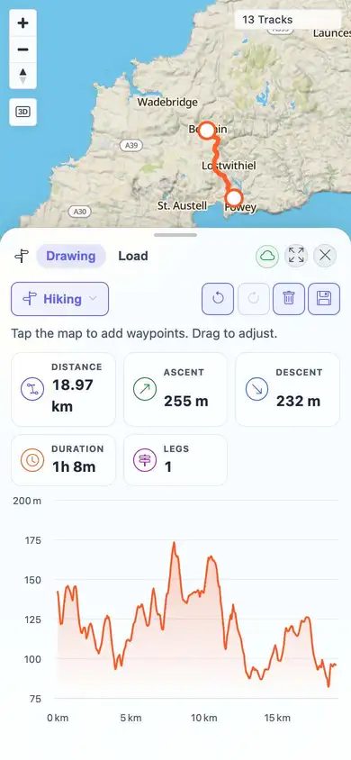
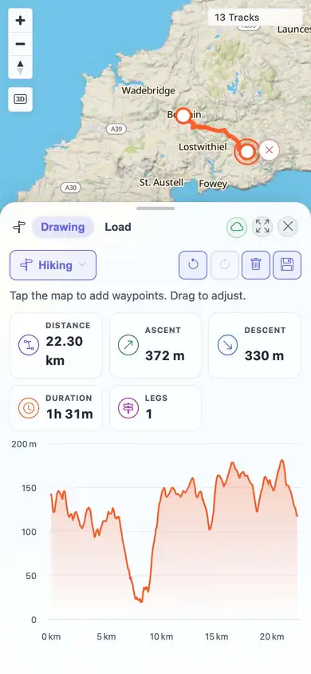

# Packet: MOB_04

## Scope

- Coverage source: `documentation/testing/frontend-regression-test-plan.md`
- Coverage ID or run packet: MOB_04
- In scope: Planner waypoint touch tap placement and touch dragging.
- Out of scope: Desktop planner behavior, covered by PLN_01 through PLN_10.

## Prerequisites

- Required previous coverage IDs or run packets: PLN_11.
- Required app/data state: BRouter and planner route calculation available in the beta stack.
- Required browser context: Temporary mobile Playwright context from PLN_11, 390x844, `isMobile=true`, `hasTouch=true`.

## Allowed Mutations

- Allowed: Reuse direct PLN_11 mobile planner evidence from this same run.
- Not allowed: Create persistent saved plans for this packet.

## Actions And Results

| Coverage ID | Action | Expected result | Actual result | Status | Evidence |
|---|---|---|---|---|---|
| MOB_04 | Reused completed PLN_11 direct mobile Planner test: touched the mobile map to place two waypoints, then dragged the lower waypoint with CDP touch events. | Planner waypoints can be tapped, dragged, and inserted with touch. | PLN_11 recorded touch taps at `(230,145)` and `(260,220)` computing an 18.97 km one-leg route, then touch drag `(260,220)` -> `(310,190)` recomputed the route to 22.30 km with changed chart points. No persistent plan was saved. | PASS | [assets/PLN_11-touch-results.txt](../assets/PLN_11-touch-results.txt); [assets/PLN_11-mobile-touch-route.webp](../assets/PLN_11-mobile-touch-route.webp); [assets/PLN_11-mobile-waypoint-dragged.webp](../assets/PLN_11-mobile-waypoint-dragged.webp); [assets/MOB-mobile-results.txt](../assets/MOB-mobile-results.txt) |

## Issues

| ID | Severity | Summary | Reproduction | Expected | Actual | Evidence | Release impact |
|---|---|---|---|---|---|---|---|

## Evidence Files

| File | Purpose |
|---|---|
| [assets/PLN_11-touch-results.txt](../assets/PLN_11-touch-results.txt) | Direct mobile planner touch results from this run. |
| [assets/PLN_11-mobile-touch-route.webp](../assets/PLN_11-mobile-touch-route.webp) | Route after touch waypoint placement. |
| [assets/PLN_11-mobile-waypoint-dragged.webp](../assets/PLN_11-mobile-waypoint-dragged.webp) | Route after touch waypoint drag and recompute. |
| [assets/MOB-mobile-results.txt](../assets/MOB-mobile-results.txt) | Current MOB sweep notes and Planner post-tool gesture retry. |

## Screenshot Evidence

## Timings

| Step | Timing |
|---|---:|
| Reused direct PLN_11 mobile placement and drag evidence | ~18 s |

## Handoff Notes

- Completed: MOB_04 passed using direct prior packet evidence from this run.
- Remaining unfinished coverage: MOB_05 at packet creation time.
- Blocked or not applicable: None.
- State left for the next packet: No persistent planner route saved; temporary PLN_11 mobile context was closed.
