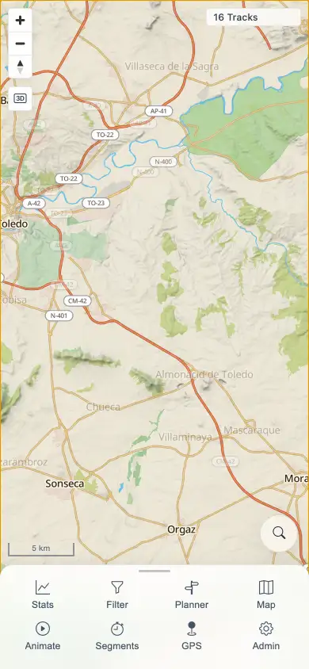

# Packet: MOB_05

## Scope

- Coverage source: `documentation/testing/frontend-regression-test-plan.md`
- Coverage ID or run packet: MOB_05
- In scope: Mobile map drag, double-tap, and pinch gestures after using each main tool.
- Out of scope: Tool-specific feature validation already covered by earlier packets.

## Prerequisites

- Required previous coverage IDs or run packets: MOB_01 through MOB_04.
- Required app/data state: Authenticated mobile context with map loaded.
- Required browser context: 390x844 touch-enabled context using CDP touch events.

## Allowed Mutations

- Allowed: Open and close tools, perform map gestures, and change only transient map viewport.
- Not allowed: Change server-side data.

## Actions And Results

| Coverage ID | Action | Expected result | Actual result | Status | Evidence |
|---|---|---|---|---|---|
| MOB_05 | For Stats, Filter, Map, Animate, Segments, GPS, Planner, and Admin, opened the tool, closed sheets, then dispatched touch drag, double-tap, and pinch gestures on the map. Added a focused Planner retry because the first loop's rounded scale label stayed unchanged after Planner. | Map gestures work after using each tool. | Gesture loop kept the canvas visible and `16 Tracks` present after every tool. Scale changed after Stats, Filter, Map, Animate, Segments, GPS, and Admin; the focused Planner retry opened `/mtl/plan`, then post-close gestures changed scale 500 km -> 100 km with canvas visible. Final map was usable at 5 km scale with no active sheets. | PASS | [assets/MOB-mobile-results.txt](../assets/MOB-mobile-results.txt); [assets/MOB_05-map-after-gestures.webp](../assets/MOB_05-map-after-gestures.webp) |

## Issues

| ID | Severity | Summary | Reproduction | Expected | Actual | Evidence | Release impact |
|---|---|---|---|---|---|---|---|

## Evidence Files

| File | Purpose |
|---|---|
| [assets/MOB-mobile-results.txt](../assets/MOB-mobile-results.txt) | Gesture loop details and Planner retry. |
| [assets/MOB_05-map-after-gestures.webp](../assets/MOB_05-map-after-gestures.webp) | Final map after tool/gesture loop. |

## Screenshot Evidence

## Timings

| Step | Timing |
|---|---:|
| Tool/gesture loop complete | 134.2 s cumulative |

## Handoff Notes

- Completed: MOB_05 passed.
- Remaining unfinished coverage: NET_01 onward.
- Blocked or not applicable: None.
- State left for the next packet: Temporary mobile contexts closed; server-side data unchanged.
