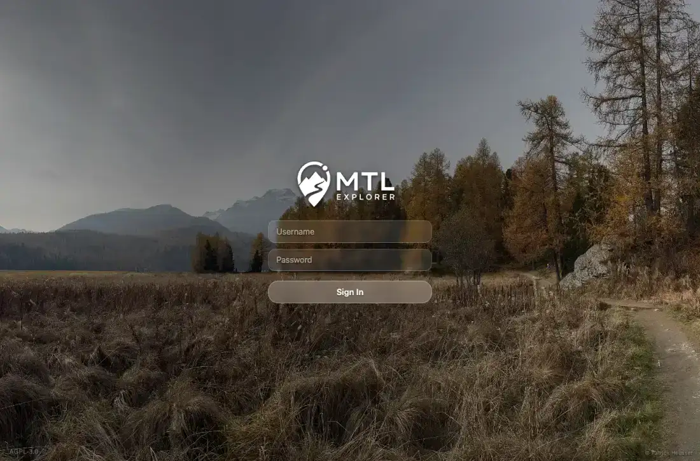

# Packet: NET_03

## Scope

- Coverage source: `documentation/testing/frontend-regression-test-plan.md`
- Coverage ID or run packet: NET_03
- In scope: 401/403 or expired-session recovery to login.
- Out of scope: Invalid password messaging, already covered by SGN_03.

## Prerequisites

- Required previous coverage IDs or run packets: NET_02.
- Required app/data state: Authenticated isolated browser context.
- Required browser context: Desktop Chromium context.

## Allowed Mutations

- Allowed: Replace local JWT with an invalid token in an isolated browser context.
- Not allowed: Change server-side data.

## Actions And Results

| Coverage ID | Action | Expected result | Actual result | Status | Evidence |
|---|---|---|---|---|---|
| NET_03 | Logged in, replaced `mtl.jwt` with `invalid-token-for-net-03`, and reloaded `/mtl/`. | 401/403 from the server redirects to login. | The app redirected to `/mtl/login?reason=expired`, displayed the login form, and cleared the invalid token. | PASS | [assets/NET_03-auth-redirect.txt](../assets/NET_03-auth-redirect.txt); [assets/NET_03-auth-redirect.webp](../assets/NET_03-auth-redirect.webp) |

## Issues

| ID | Severity | Summary | Reproduction | Expected | Actual | Evidence | Release impact |
|---|---|---|---|---|---|---|---|

## Evidence Files

| File | Purpose |
|---|---|
| [assets/NET_03-auth-redirect.txt](../assets/NET_03-auth-redirect.txt) | Invalid-token action and redirect state. |
| [assets/NET_03-auth-redirect.webp](../assets/NET_03-auth-redirect.webp) | Login screen after expired/invalid token. |

## Screenshot Evidence

## Timings

| Step | Timing |
|---|---:|
| Invalid-token redirect capture | 23.6 s cumulative |

## Handoff Notes

- Completed: NET_03 passed.
- Remaining unfinished coverage: NET_04 at packet creation time.
- Blocked or not applicable: None.
- State left for the next packet: Isolated auth context closed; server-side data unchanged.
