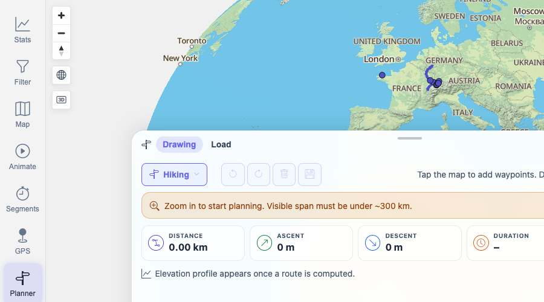
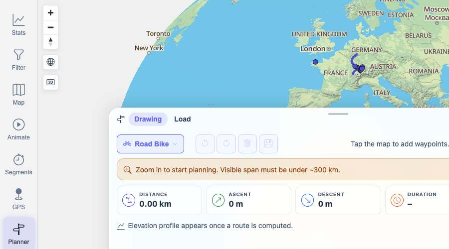

# Packet: PLN_01

## Scope

- Coverage source: `documentation/testing/frontend-regression-test-plan.md`
- Coverage ID or run packet: PLN_01
- In scope: Opening the planner and selecting a routing profile.
- Out of scope: Creating and editing routes; covered by PLN_02 onward.

## Prerequisites

- Required previous coverage IDs or run packets: TBS_12.
- Required app/data state: App authenticated and map/planner services available.
- Required browser context: clean isolated Chrome context.

## Allowed Mutations

- Allowed: Open Planner and change the active routing profile.
- Not allowed: Save or import planned routes.

## Actions And Results

| Coverage ID | Action | Expected result | Actual result | Status | Evidence |
|---|---|---|---|---|---|
| PLN_01 | Opened Planner, inspected Drawing/Load tabs and profile controls, opened the profile menu, and selected `Road Bike`. | Planner opens and a routing profile such as hike or bike can be selected. | Planner opened at `/mtl/plan` with Drawing active, Load available, routing/status markers present, and the profile changed from `Hiking` to `Road Bike`. | PASS | [assets/PLN_01-planner-profile-results.txt](../assets/PLN_01-planner-profile-results.txt); [assets/PLN_01-planner-opened.jpg](../assets/PLN_01-planner-opened.jpg); [assets/PLN_01-profile-selected.jpg](../assets/PLN_01-profile-selected.jpg) |

## Issues

| ID | Severity | Summary | Reproduction | Expected | Actual | Evidence | Release impact |
|---|---|---|---|---|---|---|---|

## Evidence Files

| File | Purpose |
|---|---|
| [assets/PLN_01-planner-profile-results.txt](../assets/PLN_01-planner-profile-results.txt) | Planner state and profile menu details. |
| [assets/PLN_01-planner-opened.jpg](../assets/PLN_01-planner-opened.jpg) | Planner opened with default profile. |
| [assets/PLN_01-profile-selected.jpg](../assets/PLN_01-profile-selected.jpg) | Planner after selecting Road Bike. |

## Screenshot Evidence

## Timings

| Step | Timing |
|---|---:|
| Planner open/profile selection | ~5 min |

## Handoff Notes

- Completed: PLN_01.
- Remaining unfinished coverage: PLN_02 onward.
- Blocked or not applicable: none.
- State left for the next packet: Browser on `/mtl/plan`, Drawing tab active, Road Bike profile selected.
