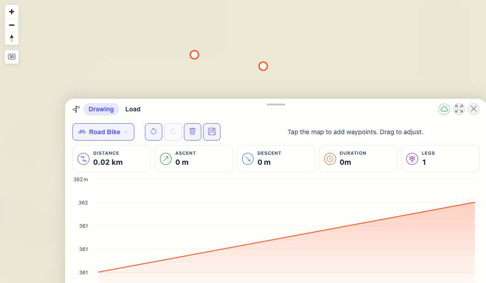

# Packet: PLN_02

## Scope

- Coverage source: `documentation/testing/frontend-regression-test-plan.md`
- Coverage ID or run packet: PLN_02
- In scope: Adding waypoints on the map and verifying a computed/drawn route.
- Out of scope: Dragging/inserting waypoints; covered by PLN_03.

## Prerequisites

- Required previous coverage IDs or run packets: PLN_01.
- Required app/data state: Planner open, Drawing tab active, Road Bike profile selected.
- Required browser context: clean isolated Chrome context.

## Allowed Mutations

- Allowed: Zoom map and add temporary planner waypoints.
- Not allowed: Save planned routes or modify imported tracks.

## Actions And Results

| Coverage ID | Action | Expected result | Actual result | Status | Evidence |
|---|---|---|---|---|---|
| PLN_02 | Zoomed the map until the planner allowed input, clicked two map points, and waited for route computation. | Waypoint clicks compute and draw a route. | The zoom prompt cleared; the second waypoint produced a computed route with `Distance 0.02 km`, `Duration 0m`, `Legs 1`, and an elevation chart with two data points. | PASS | [assets/PLN_02-route-results.txt](../assets/PLN_02-route-results.txt); [assets/PLN_02-route-computed.jpg](../assets/PLN_02-route-computed.jpg) |

## Issues

| ID | Severity | Summary | Reproduction | Expected | Actual | Evidence | Release impact |
|---|---|---|---|---|---|---|---|

## Evidence Files

| File | Purpose |
|---|---|
| [assets/PLN_02-route-results.txt](../assets/PLN_02-route-results.txt) | Waypoint placement and computed stats. |
| [assets/PLN_02-route-computed.jpg](../assets/PLN_02-route-computed.jpg) | Planner route/elevation state after two waypoints. |

## Screenshot Evidence

## Timings

| Step | Timing |
|---|---:|
| Zoom, waypoint placement, route wait | ~10 min |

## Handoff Notes

- Completed: PLN_02.
- Remaining unfinished coverage: PLN_03 onward.
- Blocked or not applicable: none.
- State left for the next packet: Browser on `/mtl/plan`, Road Bike route present with two waypoints and one leg.
