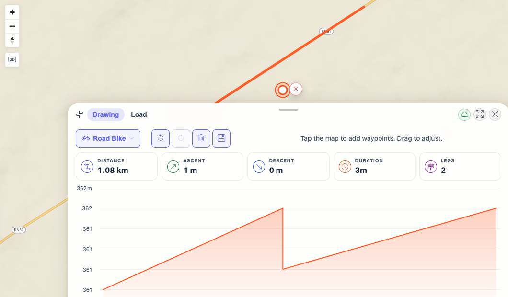

# Packet: PLN_03

## Scope

- Coverage source: `documentation/testing/frontend-regression-test-plan.md`
- Coverage ID or run packet: PLN_03
- In scope: Insert a waypoint on an existing planner route leg by dragging the route.
- Out of scope: Moving/deleting existing waypoints, undo/redo/clear behavior, saving/downloading plans.

## Prerequisites

- Required previous coverage IDs or run packets: PLN_01, PLN_02
- Required app/data state: Planner open in Drawing mode with Road Bike profile and a computed one-leg route.
- Required browser context: Desktop isolated Playwright browser at `http://188.245.169.80:18080/mtl/plan`.

## Allowed Mutations

- Allowed: Drag an existing route leg to insert a waypoint and leave the resulting route for PLN_04.
- Not allowed: Save or delete planned routes.

## Actions And Results

| Coverage ID | Action | Expected result | Actual result | Status | Evidence |
|---|---|---|---|---|---|
| PLN_03 | Built a one-leg Road Bike route, selected a visible route-line point from screenshot pixels at page `(666,124)`, then dragged the route to `(666,188)`. | Existing route leg accepts the drag and inserts a waypoint, increasing the route from one leg to two legs without breaking live stats/elevation rendering. | Route stats changed from `Legs 1` to `Legs 2`; distance/ascent/duration stayed rendered, and the elevation chart changed from 2 data points to 4 data points. | PASS | [assets/PLN_03-route-drag-results.txt](../assets/PLN_03-route-drag-results.txt); [assets/PLN_03-before-exact-route-drag.jpg](../assets/PLN_03-before-exact-route-drag.jpg); [assets/PLN_03-after-exact-route-drag.jpg](../assets/PLN_03-after-exact-route-drag.jpg) |

## Issues

| ID | Severity | Summary | Reproduction | Expected | Actual | Evidence | Release impact |
|---|---|---|---|---|---|---|---|

## Evidence Files

| File | Purpose |
|---|---|
| [assets/PLN_03-route-drag-results.txt](../assets/PLN_03-route-drag-results.txt) | Planner stats before and after route-line drag insertion. |
| [assets/PLN_03-before-exact-route-drag.jpg](../assets/PLN_03-before-exact-route-drag.jpg) | One-leg route before exact route-line drag. |
| [assets/PLN_03-after-exact-route-drag.jpg](../assets/PLN_03-after-exact-route-drag.jpg) | Two-leg route after exact route-line drag inserted a waypoint. |

## Screenshot Evidence

## Timings

| Step | Timing |
|---|---:|
| Exact route-line drag and route recompute wait | ~4 s |

## Handoff Notes

- Completed: Verified route-leg drag insertion by targeting the visible route line; leg count changed from 1 to 2.
- Remaining unfinished coverage: PLN_04 onward.
- Blocked or not applicable: None.
- State left for the next packet: Planner is open in Drawing mode with Road Bike profile and a two-leg route containing an inserted waypoint.
